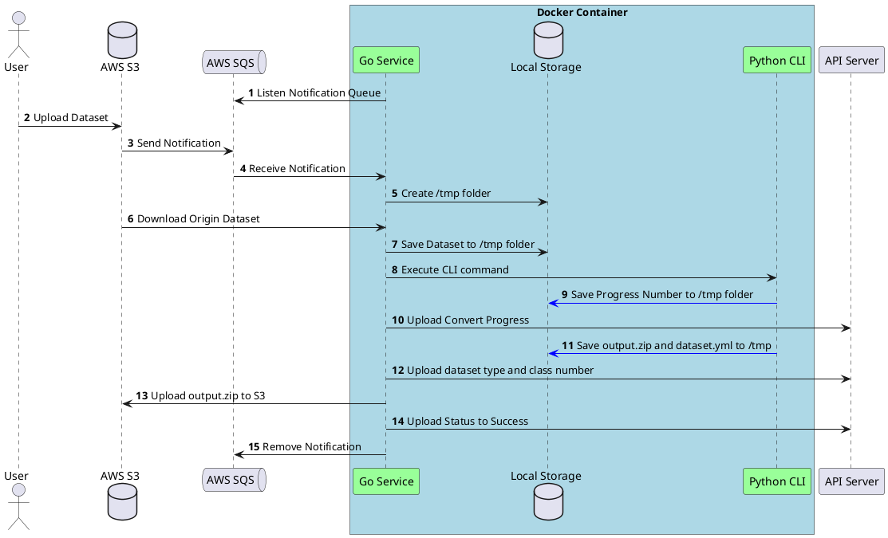

不管是長官還是同事甚至下屬，在公司無時無刻都需要跨團隊進行溝通，當系統架構或流程越來越複雜的時候，如果沒有按照當下情況記錄下來，對於未來接手的同事，或者是自己都會不小心忘記，而在記憶最清楚的當下用文字或流程圖記錄下來，對團隊及自己是有相當大的幫助。而有沒有工具可以快速畫出系統架構或流程圖？我們可以分幾種情境來討論。

<!--more-->

第一種是程式碼架構流程圖，跟開發團隊一起開發功能時，開發者可以先將程式的流程圖先畫出來，跟團隊進行第一輪討論，避免實作下去時，考慮太少，多與團隊進行溝通，對自己是非常有幫助的。

第二種是專案剛開始，或發展到一定程度，需要將全部系統架構整理下來，團隊可能用了 [AWS](https://aws.amazon.com/) 或 [GCP](https://cloud.google.com/) 等服務，有一個全貌的系統架構圖，可以協助團隊釐清專案到底使用了哪些工具？讓剛加入的同事可以透過此架構圖快速了解並進入狀況。底下來介紹三套我個人蠻推薦的三種繪製工具。

## 教學影片



```sh
00:00 為什麼需要畫系統架構圖
00:49 第一種情境
01:28 第二種情境
02:07 第一套好用工具 PlantUML
05:50 第二套 Diagrams
07:40 第三套 Excalidraw
09:08 使用時機
```

其他線上課程請參考如下

* [Docker 容器實戰](https://blog.wu-boy.com/docker-course/)
* [Go 語言課程](https://blog.wu-boy.com/golang-online-course/)

## PlantUML

[PlantUML](https://plantuml.com/) 是可以用純文本語言繪製圖表的[開源軟體](https://github.com/plantuml/plantuml)，由於是純文字語言，所以可以搭配版本控制做紀錄，非常適合團隊或跨團隊合作溝通，尤其是架構初期，會需要常常修改，所以用 PlantUML 非常適合，跟同事進行快速討論迭代修正。

強大的 PlantUML 有提供線上版本進行撰寫，叫做 [PlantText](https://www.planttext.com/)，除了線上版本讓大家可以測試之外，開發者也可以透過 VSCode 的 PlantUML 套件進行整合，一邊撰寫流程，一邊預覽，如下圖


拿一個實際案例來看看



產生的圖如下，或[線上編輯測試看看](https://www.planttext.com/?text=bLJVRzem47xtNt4AptHqZ0VGD7M3CLL27MrKxM6Qa76kr5fYP_QPbVtrlHX3WD9AorCIV_VzkBlaofDq5AeInjQiqH4w6C-knP-00G6oppzoo6_p341wsBwqhc3G-vwGYgo3xDwZovhZm3VfzB8d2aboAJqcZdw4-Fx2Sv5SxMWk1w9c0rhfMXfYxFmQSdJhH2bhlV3nCU47FI6MzWcoYLM_6w_MaDIcWNTcUlL8Nyg0nvJVR6JK2YFboYvKgHDTlmUTuN0w7GwFQ-ORUhIcwKIigUFZGTs7jgxDERDAbf1lyyMwidbpahW_46WAu112o43MX6g9JYHRtK_RBezWfZsXWHjB-a4hIPhzt3P78lQPWMqpHt1VbrOMC64p7YcDxsFt29CtkeTyEr769T4xLAZNU1R5YaTvHZ1sA0dX7LKrFDYoQ6ESA4_iNnFzVNTwfStUvglCkMGJ2GLapqbmKJkM4NnzGXNO38yCbAqgQGfnCBRkpqwFh-dqrtcjkRChXzx3JHp7wvhjHkwRdhwSFSV_wDf0TQ2BVxe6TWp5DlB5XZ_8PE5jxMBNeqsDaK6LabEyMAepkt8WpL9v_ssXd2G57v51gIRbYuszmygUxiuLxnp_NSGp)


從上圖就可以知道透過 CLI 工具上傳 Dataset 到 AWS S3 會經過哪些步驟跟流程。假設沒有先把流程圖畫出來，其實很難想像跨團隊要怎麼合作。

## Diagrams

上面的 PlantUML 協助團隊釐清開發流程圖，假設您需要更多工具或圖形介面來描述整體的系統架構圖，也或者是需要對上對下報告有一個更完整的全貌，推薦大家使用 [Diagrams](https://www.diagrams.net/)，裡面有完整的圖庫跟功能，也支援[離線桌面版](https://github.com/jgraph/drawio-desktop)或[線上修改](https://app.diagrams.net/)。可以把檔案放在 GitHub 內由線上版讀取。來看看底下可以教學影片體驗 Diagrams 的強大



繪製完成後，可以輸出任何檔案格式。底下看看一張系統架構圖


## Excalidraw

除了上述兩套工具外，如果你想要快速畫出一個流程圖，又不想裝一大堆工具，強烈推薦 [Excalidraw](https://excalidraw.com/) 這套線上流程圖軟體，它也是[開源軟體](https://github.com/excalidraw/excalidraw)。底下看看實際案例，我放在 [redisdb-stream](https://github.com/golang-queue/redisdb-stream) 專案內的架構圖。


另外可以參考 [Signoz](https://signoz.io) 公開的文件：[Logs Overview](https://signoz.io/docs/userguide/logs/)，裡面大量用到 Excalidraw 畫出來的流程圖。

## 心得結論

上面有三套好用的畫圖工具，我個人使用的時機不盡相同，如果是簡易的流程圖，我都直接用 [Excalidraw](https://excalidraw.com/) 快速搞定，不想花太多時間進行繪製，尤其是時間很趕的時候。跨團隊或內部開發溝通時，我就會用 [PlantUML](https://plantuml.com/)，將開發流程描述清楚，避免在合作上面出現差錯，讓其他開發同仁產生誤會。到專案中期或後期，整體架構比較確定後，我會在用 [Diagrams](https://www.diagrams.net/) 繪製系統流程，讓團隊或長官可以更加了解專案的全貌。
