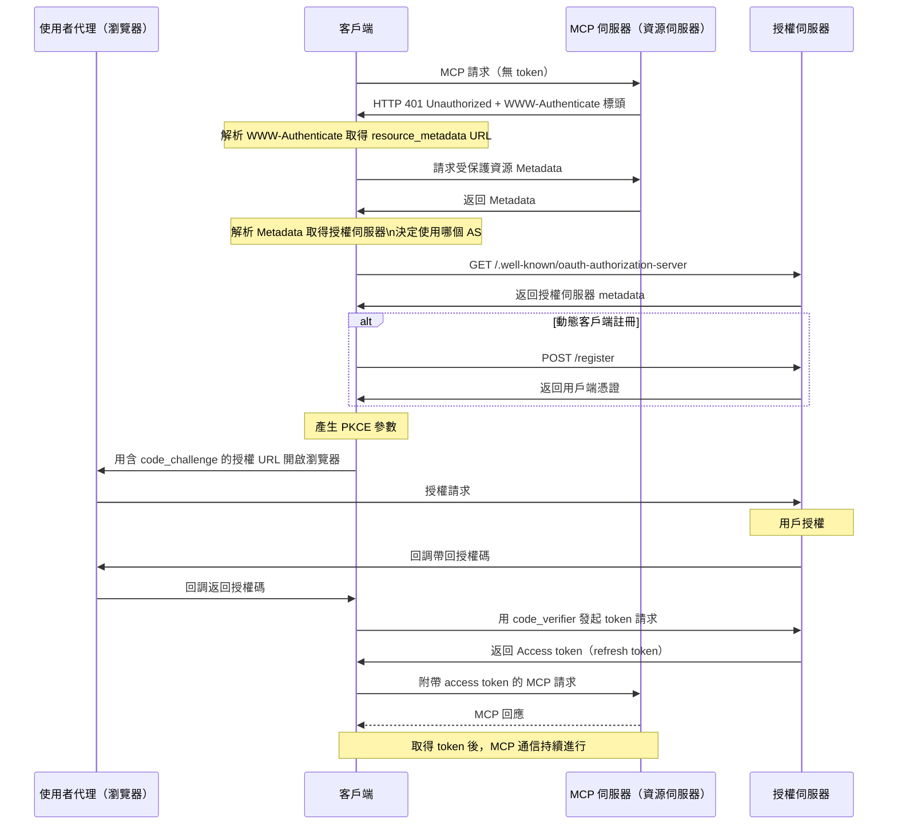

2025 年在台北 [iThome 臺灣雲端大會][2] (CloudSummit) 給一場 Workshop，主題是「**一步步學會用 [Golang][4] 開發 MCP 伺服器與客戶端** ([Model Context Protocol][1])」。這次的工作坊旨在幫助開發者了解如何使用 Golang 實現 MCP 協議，並提供實際的程式碼範例和操作指南。我已經先將 Workshop 的內容整理成一個 GitHub Repo，您可以在 [go-training/mcp-workshop](https://github.com/go-training/mcp-workshop) 找到相關資源。詳細 Workshop 內容，請[參考此連結][3]。

[1]: https://modelcontextprotocol.io/introduction
[2]: https://cloudsummit.ithome.com.tw/2025/
[3]: https://cloudsummit.ithome.com.tw/2025/lab-page/3721
[4]: https://go.dev/

<!--more-->

## 課程內容

本工作坊由一系列實作模組組成，每個模組展現如何在 Go 中構建 MCP（Model Context Protocol）伺服器及相關基礎架構。

- **[01. 基礎 MCP 伺服器](https://github.com/go-training/mcp-workshop/tree/main/01-basic-mcp/):**
  - 提供支援 stdio 及 HTTP 的極簡 MCP 伺服器實作，採用 Gin。示範伺服器設置、工具註冊、以及日誌與錯誤處理最佳實踐。
  - _重點特色：_ stdio/HTTP 雙通道、Gin 整合、可擴充工具註冊
- **[02. 基礎 Token 傳遞](https://github.com/go-training/mcp-workshop/tree/main/02-basic-token-passthrough/):**
  - 支援 HTTP 與 stdio 的透明認證 token 傳遞，說明 context 注入與帶認證請求的工具開發。
  - _重點特色：_ Token 傳遞、context 注入、認證工具範例
- **[03. OAuth MCP 伺服器](https://github.com/go-training/mcp-workshop/tree/main/03-oauth-mcp/):**
  - 具備 OAuth 2.0 保護的 MCP 伺服器，展示授權、token 與資源 metadata 端點，包含 context token 處理及 API 認證用工具。
  - _重點特色：_ OAuth 2.0 流程、受保護端點、context token 傳播、demo 工具
- **[04. 可觀測性](https://github.com/go-training/mcp-workshop/tree/main/04-observability/):**
  - MCP 伺服器的可觀測性與追蹤，整合 OpenTelemetry 及結構化日誌，包含指標、詳細追蹤與錯誤回報。
  - _重點特色：_ 追蹤、結構化日誌、可觀測中介、錯誤報告
- **[05. MCP Proxy](https://github.com/go-training/mcp-workshop/tree/main/05-mcp-proxy/):**
  - 聚合多個 MCP 伺服器於單一端點的 Proxy 伺服器。支援即時串流、集中設定與安全。
  - _重點特色：_ 統一入口、SSE/HTTP 串流、彈性設定、提升安全性

## 投影片



這次工作坊的投影片已經上傳到 Speaker Deck，您可以在 [這裡查看](https://speakerdeck.com/appleboy/building-mcp-model-context-protocol-with-golang)。在 90 分鐘的工作坊，完全沒有時間讓大家練習，原因是在 [MCP 的 OAuth][11] 流程比較複雜，所以花了蠻多時間在講解這一部分，會再寫另一篇文章來介紹如何在 Golang 中實作 OAuth 流程。

[11]: https://modelcontextprotocol.io/specification/2025-06-18/basic/authorization

完整 OAuth token 流程詳見 [MCP 規範][11]。簡易流程如下：

## 相關資源

- [MCP 官方網站](https://modelcontextprotocol.io/)
- [Let's fix OAuth in MCP](https://aaronparecki.com/2025/04/03/15/oauth-for-model-context-protocol)
