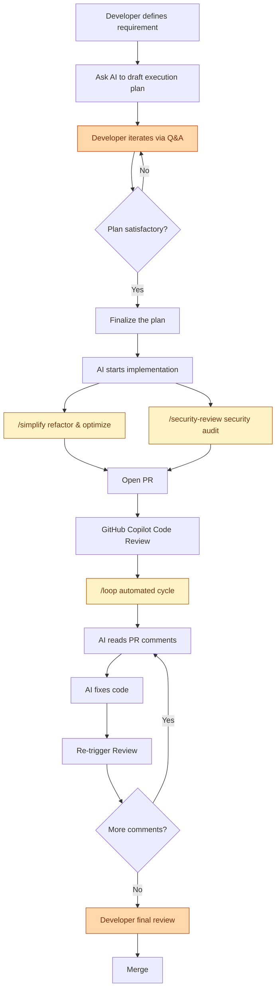

As a developer who maintains multiple open-source projects on [GitHub](https://github.com/), my daily work goes far beyond writing code. I also deal with a constant stream of issues, PR reviews, releases, and other tasks that are tedious but critical. As projects grow, this workload quickly exceeds what one person can handle efficiently.

Over the past few months, I've integrated [Claude Code][1] and [GitHub Copilot Review][2] into my daily development workflow, and the results have been remarkable — tasks that used to take half a day now often get done in 1-2 hours. This post shares my complete workflow and explains why I believe **the developer's own technical ability is the key to using AI tools effectively**.

[1]: https://docs.anthropic.com/en/docs/claude-code
[2]: https://docs.github.com/en/copilot/how-tos/use-copilot-agents/request-a-code-review/use-code-review

<!--more-->

## Tools Overview

This post focuses on the practical workflow, setting aside the extensible [Skill][3] system for now. By leveraging just the built-in features of these two tools, you can dramatically improve development efficiency. Here are the two core tools I use:

[3]: 

### Claude Code

[Claude Code][1] is a CLI development tool built by Anthropic that runs directly in your terminal. It understands the full context of your project and can help with coding, refactoring, debugging, writing tests, and more. Unlike a typical AI chat, Claude Code can read and write your files and execute commands — it's a tool that's truly embedded in your development workflow.

### GitHub Copilot Review

[GitHub Copilot Review][2] is GitHub's built-in AI code review feature. When you open a PR, you can assign Copilot as a reviewer, and it will automatically analyze the code changes and leave specific review comments on potential issues, style inconsistencies, performance concerns, and more.

The combination of these two tools forms the core of my current development workflow.

## AI-Driven Development Workflow

Here is the complete workflow I actually use, from requirement to merge. The steps highlighted in **orange** are the only two that require the developer's direct involvement — everything else can be handled by AI automatically:

> **Orange** steps require developer involvement. **Yellow** steps are Claude Code's built-in Slash Commands.

### Planning Phase: Align Direction Before Writing Code

This is the most important step. I never ask AI to write code directly. Instead, I first ask it to **draft a concrete execution plan**.

Claude Code has a built-in [Plan Mode][4] that analyzes your requirements and existing codebase, then produces a detailed implementation plan — which files to modify, what architecture to use, expected behavior, and more.

[4]: https://code.claude.com/docs/en/common-workflows

What follows is an **iterative Q&A process**. I challenge anything in the plan that seems unreasonable and ask for adjustments. This back-and-forth may happen several times until I confirm the plan is heading in the right direction.

The value of this step: **ensure the direction is correct before writing a single line of code**.

### Implementation Phase: Let AI Do the Work

Once the plan is confirmed, I ask AI to start implementing. Claude Code follows the previously aligned plan, directly modifying files and adding code. During this phase, the developer primarily monitors and intervenes when adjustments are needed.

### Optimization Phase: /simplify + /security-review in Parallel

After implementation, I run two of Claude Code's built-in commands simultaneously:

- **`/simplify`**: Reviews code for duplication, quality, and efficiency, then automatically refactors and optimizes
- **`/security-review`**: Checks for security vulnerabilities such as injection attacks, sensitive data exposure, etc.

Both are built-in [Slash Commands][5] in Claude Code.

[5]: https://code.claude.com/docs/en/slash-commands

These two commands can run in parallel — no need to wait for one to finish before starting the other.

### Review Loop: /loop Automated Iteration

This is the biggest time-saver in the entire workflow. After opening a PR:

1. Assign **GitHub Copilot** as a reviewer for the first round of automated code review
2. Use Claude Code's **`/loop`** command to set up an [automated cycle][6]
3. AI automatically reads review comments on the PR, fixes the code based on feedback, pushes updates, and re-triggers the review

[6]: https://code.claude.com/docs/en/slash-commands
4. This cycle continues until there are no new review comments

The developer **doesn't need to watch the entire process** — just come back when the loop finishes for the final review. Here's an example of AI-summarized [review PR](https://github.com/go-authgate/authgate/issues/118) comments across iterations:

| Round | Comments | Key Fixes |
| ----- | -------- | --------- |
| 1 | 16 | Wrong `type` claim value (`access_token` → `access`), missing revocation tradeoff warning, imprecise HS256 JWKS description, OIDC discovery example hardcoded RS256 |
| 2 | 6 | Invalid `//` comments in JSON blocks, misleading zero-downtime wording, broken SECURITY.md anchor, unchecked Go type assertions, unused imports |
| 3 | 8 | Missing algorithm whitelist in Go/Node.js examples (`WithValidMethods`/`algorithms`), `client_credentials` synthetic subject documentation |
| 4 | 3 | `user_id` is synthetic (not absent) in client_credentials, Go example switched to `sub` claim, `id_token_signing_alg` may be omitted |
| 5 | 1 | Second broken SECURITY.md anchor |
| 6 | 4 | Python `cache_jwk_set` → `cache_keys`, navbar hardcoded OR list → `IsDocsActive()` helper |
| 7 | 1 | Use `strings.HasPrefix` instead of manual slice, update `ActiveLink` field comment |
| 8 | 1 | Outdated comment on already-fixed code (no action needed) |
| 9 | 1 | Remove key rotation zero-downtime promise; clarify single-key JWKS limitation |
| 10 | **0** | **No new comments — all clear** |

### Final Review: Human Eyes on the Code

After all automated loops complete, the **developer does one final review**. Confirm the logic is correct, the architecture is sound, and nothing is missing — only then hit merge.

This step cannot and should not be skipped.

## Real-World Benefits

The most noticeable improvements after adopting this workflow:

- **Dramatically faster development**: Feature work that used to take half a day now often finishes in 1-2 hours
- **Better code review quality**: AI filters out most basic issues before human review, so humans can focus on architecture and business logic
- **Solo developers get a review process**: Maintaining open-source projects alone used to mean code review was a luxury. Now GitHub Copilot serves as a first line of defense, providing a baseline quality guarantee
- **Lower context-switching cost**: AI handles tedious implementation details, freeing your mental energy for decisions that actually require thinking

## Core Principle: You Are the Decision Maker

After all these benefits of AI tools, I must emphasize one thing:

> **Developers must have solid technical architecture skills to truly leverage these tools.**

AI is an accelerator, not a navigator. **You need to know the destination first — AI just helps you get there faster.** If you don't know how a system should be designed or what technology to choose, you simply can't judge whether AI's output is right or wrong.

In my actual usage, I frequently encounter these situations:

- AI suggests an architecture direction that conflicts with the project's long-term plans — I reject it outright and provide the correct direction
- AI produces code that runs fine but uses a design pattern unsuitable for the current context — I adjust manually
- AI introduces unnecessary complexity to solve a problem — I ask it to simplify

People without technical judgment who use AI tools tend to produce code that **looks correct but is architecturally wrong**. It might not cause problems short-term, but it will inevitably become technical debt.

## Lessons Learned and Caveats

- **AI output still requires human judgment**: Never blindly trust every line of AI output, especially for business logic and security-sensitive code
- **Prompt quality determines output quality**: The clearer your instructions and the more context you provide, the better the output. Vague requirements yield vague results
- **Good fit**: Refactoring, writing tests, generating boilerplate, handling repetitive tasks, code review
- **Poor fit**: Greenfield system architecture design (AI can suggest, but humans must decide), core modules involving complex business logic

## Conclusion

The core value of this workflow: **let developers focus on "making decisions" rather than "blindly accepting AI output"**.

AI handles plan drafting, code implementation, refactoring, and code review iterations — the execution layer. As a developer, you're responsible for direction judgment, architecture decisions, and final approval.

But the prerequisite is — **you must first become a developer capable of making those decisions before AI can truly accelerate your work**.

It's worth noting that every feature discussed in this post — Plan Mode, `/simplify`, `/security-review`, `/loop` — **is built into Claude Code out of the box, requiring no additional packages or plugins**. Just install Claude Code, pair it with GitHub Copilot Review, and you can automate over 90% of your software development workflow. And GitHub Copilot Review is **completely free** for open-source projects — that's zero-cost AI code review.

If you're maintaining open-source projects or looking to boost your personal development efficiency, I highly recommend trying this Claude Code + GitHub Copilot Review combination.
