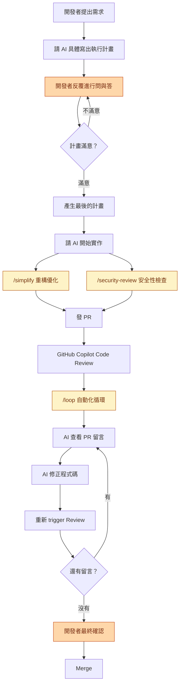

身為一個在 [GitHub](https://github.com/) 上長期維護多個開源專案的開發者，我每天面對的不只是寫程式，還有大量的 Issue 處理、PR Review、版本發佈等瑣碎但重要的工作。隨著專案規模成長，這些工作量已經遠超一個人能高效處理的範圍。

過去一段時間，我開始將 [Claude Code][1] 和 [GitHub Copilot Review][2] 整合進我的日常開發流程，結果讓我非常驚艷——原本需要半天的工作，現在經常在 1-2 小時內就能完成。這篇文章將分享我的完整流程，以及為什麼我認為**開發者本身的技術能力，才是善用 AI 工具的關鍵**。

[1]: https://docs.anthropic.com/en/docs/claude-code
[2]: https://docs.github.com/en/copilot/how-tos/use-copilot-agents/request-a-code-review/use-code-review

<!--more-->

## 工具介紹

本篇著重在實際的開發流程，先不講工具可以外掛的 [Skill][3]。只要善用這兩套工具內建的功能，就能大幅提升開發效率。以下是我目前使用的兩個核心工具：

[3]: 

### Claude Code

[Claude Code][1] 是 Anthropic 推出的 CLI 開發工具，直接在終端機中運作。它能理解整個專案的上下文，幫你完成編碼、重構、除錯、撰寫測試等工作。跟一般的 AI Chat 不同，Claude Code 可以直接讀寫你的檔案、執行指令，是真正嵌入開發流程的工具。

### GitHub Copilot Review

[GitHub Copilot Review][2] 是 GitHub 內建的 AI Code Review 功能。當你發 PR 時，可以指派 Copilot 作為 Reviewer，它會自動分析程式碼變更，針對潛在問題、風格一致性、效能疑慮等留下具體的 Review 意見。

這兩個工具的組合，就是我目前的核心開發流程。

## AI 驅動開發流程

以下是我目前實際在用的開發流程，從需求到 Merge 的完整循環。流程圖中標記為**橘色**的步驟，是整個流程中唯二需要開發者親自介入的環節——其餘步驟都可以交給 AI 自動完成：

> 圖中**橘色**為需要開發者親自介入的步驟，**黃色**為 Claude Code 內建的 Slash Commands。

### 計畫階段：先對齊方向，再動手

這是最重要的一步。我不會直接叫 AI 寫程式，而是先請它**寫出具體的執行計畫**。

Claude Code 內建了 [Plan Mode][4]，啟動後 AI 會先分析你的需求和目前的程式碼，產出一份詳細的實作計畫，包含要修改哪些檔案、採用什麼架構、預期的行為等。

[4]: https://code.claude.com/docs/en/common-workflows

接下來就是**反覆的問與答**。我會針對計畫中不合理的地方提出質疑，要求調整方向。這個過程可能來回好幾次，直到我確認計畫的方向是正確的。

這一步的價值在於：**在寫任何一行程式碼之前，先確保方向不會偏**。

### 實作階段：讓 AI 動手

計畫確認後，請 AI 開始實作。Claude Code 會根據先前對齊好的計畫，直接修改檔案、新增程式碼。這個階段開發者主要是監督和適時介入調整。

### 優化階段：/simplify + /security-review 並行

實作完成後，我會同時執行兩個 Claude Code 的內建指令：

- **`/simplify`**：檢查程式碼的重複性、品質和效率，自動重構優化
- **`/security-review`**：檢查安全性漏洞，例如注入攻擊、敏感資訊外洩等

這兩個都是 Claude Code 內建的 [Slash Commands][5]。

[5]: https://code.claude.com/docs/en/slash-commands

這兩個指令可以同時並行執行，不需要等一個跑完再跑另一個。

### Review 循環：/loop 自動化迭代

這是整個流程中最省時間的部分。發 PR 之後：

1. 指派 **GitHub Copilot** 作為 Reviewer，自動進行第一輪 Code Review
2. 使用 Claude Code 的 **`/loop`** 指令，設定[自動化循環][6]
3. AI 會自動讀取 PR 上的 Review 留言，根據意見修正程式碼，Push 更新後重新 trigger Review

[6]: https://code.claude.com/docs/en/slash-commands
4. 這個循環會持續進行，直到沒有新的 Review 意見為止

整個過程**開發者不需要一直盯著**，等循環跑完再回來做最終確認就好。可以參考底下 AI 整理的 [Review PR](https://github.com/go-authgate/authgate/issues/118) 留言範例：

| 輪次 | 留言數 | 主要修正                                                                                                                               |
| ---- | ------ | -------------------------------------------------------------------------------------------------------------------------------------- |
| 1    | 16     | `type` claim 值錯誤 (`access_token` → `access`)、缺少 revocation tradeoff 警告、HS256 JWKS 描述不精確、OIDC discovery 範例硬編碼 RS256 |
| 2    | 6      | JSON 區塊中無效的 `//` 註解、zero-downtime 措辭誤導、broken SECURITY.md anchor、Go 範例 unchecked type assertions、unused imports      |
| 3    | 8      | Go/Node.js 範例缺少演算法白名單 (`WithValidMethods`/`algorithms`)、`client_credentials` synthetic subject 文件說明                     |
| 4    | 3      | `user_id` 在 client_credentials 是 synthetic（非 absent）、Go 範例改用 `sub` claim、`id_token_signing_alg` 可能被省略                  |
| 5    | 1      | 第二處 broken SECURITY.md anchor                                                                                                       |
| 6    | 4      | Python `cache_jwk_set` → `cache_keys`、navbar hardcoded OR list → `IsDocsActive()` helper                                              |
| 7    | 1      | 改用 `strings.HasPrefix` 取代手動 slice、更新 `ActiveLink` 欄位註解                                                                    |
| 8    | 1      | 針對已修正程式碼的 outdated comment（無需動作）                                                                                        |
| 9    | 1      | 移除 key rotation zero-downtime 承諾；釐清 single-key JWKS 限制                                                                        |
| 10   | **0**  | **無新留言 — 全部通過**                                                                                                                |

### 最終確認：人眼把關

所有自動化循環結束後，**開發者做最後一次審閱**。確認邏輯正確、架構合理、沒有遺漏，才按下 Merge。

這一步不能省略，也不應該省略。

## 實際效益

導入這套流程後，我最明顯感受到的改變：

- **開發速度大幅提升**：原本需要半天的功能開發，經常縮短到 1-2 小時完成
- **Code Review 品質更好**：在人工 Review 之前，AI 已經過濾掉大部分基本問題，人工可以專注在架構和業務邏輯層面
- **個人開發者也能有 Review 機制**：以前一個人維護開源專案，Code Review 幾乎是奢望。現在有 GitHub Copilot 當第一道防線，程式碼品質有了基本保障
- **降低上下文切換成本**：AI 幫你處理瑣碎的實作細節，你的腦力可以留給真正需要思考的決策

## 核心觀念：你才是架構的決策者

講了這麼多 AI 工具的好處，但我必須強調一件事：

> **開發者本身必須具備技術架構能力，才能真正善用這些工具。**

AI 是加速器，不是導航。**你要先知道目的地在哪裡，AI 才能幫你更快到達**。如果你自己不清楚系統該怎麼設計、技術選型該怎麼做，那 AI 產出的東西你根本無法判斷對錯。

我在實際使用中，經常遇到這些情況：

- AI 建議的架構方向不符合專案的長期規劃，我會直接否決並給出正確方向
- AI 產出的程式碼看起來能跑，但設計模式不適合當前場景，需要手動調整
- AI 為了解決當前問題而引入不必要的複雜度，我會要求簡化

沒有技術判斷力的人使用 AI 工具，很容易產出**看起來正確但架構錯誤**的程式碼。短期內可能不會出事，但長期一定會變成技術債。

## 使用心得與注意事項

- **AI 產出仍需人工判斷**：不能盲目信任 AI 的每一行輸出，特別是涉及業務邏輯和安全性的部分
- **Prompt 品質決定產出品質**：你給 AI 的指令越清楚、上下文越充足，產出就越好。模糊的需求只會得到模糊的結果
- **適合的場景**：重構、寫測試、產生樣板程式碼、處理重複性工作、Code Review
- **不適合的場景**：全新的系統架構設計（AI 可以給建議，但決策必須是人）、涉及複雜業務邏輯的核心模組

## 總結

這套流程的核心價值是：**讓開發者專注在「決策」而非「照單全收 AI 的產出」**。

AI 幫你處理計畫撰寫、程式碼實作、重構優化、Code Review 迭代這些執行層面的工作。而你作為開發者，負責的是方向判斷、架構決策、最終把關。

但前提是——**你必須先成為一個有能力做決策的開發者，AI 才能真正幫你加速**。

值得一提的是，本篇所介紹的所有功能——Plan Mode、`/simplify`、`/security-review`、`/loop`——**全部都是 Claude Code 的內建功能，不需要額外安裝任何套件或外掛**。只要裝好 Claude Code，搭配 GitHub Copilot Review，就能完成 90% 以上的軟體自動化開發流程。而且 GitHub Copilot Review 對開源專案是**完全免費**的，等於零成本就能擁有 AI Code Review 機制。

如果你也在維護開源專案，或是想提升個人的開發效率，非常推薦試試這套 Claude Code + GitHub Copilot Review 的組合。
