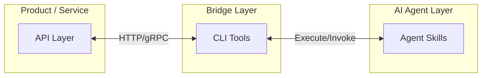

In previous posts, I introduced the [concept of Agent Skills][1] and showed [how to build an AI-driven development workflow with Claude Code + GitHub Copilot Review][2]. As more products and teams embrace AI Agents, a clear architectural pattern is emerging: **API + CLI + Skills**. This isn't a framework or protocol — it's a pragmatic three-layer architecture that enables any product to become "agent-friendly" quickly.

[1]: 
[2]: 

<!--more-->

## Basecamp's Pivot: Making Products Agent-Accessible

Recently, [DHH announced on his blog][3] that Basecamp has officially become an "agent-accessible" product. Interestingly, 37signals didn't choose to build AI features into Basecamp itself. Instead, they invested in enabling external AI Agents to operate Basecamp seamlessly. They did three things:

[3]: https://world.hey.com/dhh/basecamp-becomes-agent-accessible-3ae6b949

1. **Revamped their API**: Making all features accessible via API
2. **Built a brand-new CLI tool**: Enabling Agents to operate Basecamp from the terminal
3. **Wrote Agent Skills**: Teaching Agents how to use these tools most effectively

DHH highlighted a key insight: integrating with other services via API "was possible... but it was cumbersome, slow, and expensive, so most people just didn't." AI Agents eliminate this friction entirely — Agents can automatically browse all content in Basecamp, generate summaries, create to-do lists, post updates, upload files, and schedule projects. Tasks that previously required manual work or expensive custom integrations can now be handled by Agents.

What's particularly noteworthy is DHH's strategic judgment: rather than developing built-in AI features that may go unused, make your product friendly to mainstream AI platforms like ChatGPT, Gemini, and Claude. As these platforms rapidly add Agent capabilities, whether your product is agent-accessible becomes a core competitive advantage.

## Google Takes the Same Path: Open-Sourcing Workspace CLI

It's not just Basecamp. Google is heading down the same road. [Google recently open-sourced its Workspace CLI][12], a command-line tool that lets users and AI Agents operate Gmail, Google Calendar, Google Drive, Google Sheets, and other cloud productivity apps directly from the terminal.

[12]: https://www.ithome.com.tw/news/174225

The project is [written in Rust][13], emphasizing performance and safety. Its design perfectly embodies the API + CLI + Skills architecture:

[13]: https://github.com/googleworkspace/cli

- **API Layer**: Dynamically reads Workspace APIs via Google Discovery Service, automatically generating corresponding command interfaces
- **CLI Layer**: Provides auto-completion, resource explanation prompts, dry-run mode, automatic pagination, and structured JSON output compatible with tools like `jq`
- **Skills Layer**: Includes over **100 pre-written Agent Skills** and 50 automated workflow examples, plus a native MCP Server that exposes Workspace APIs as structured tools for Claude Desktop, Gemini CLI, VS Code, and other clients

Users can simply say "list files," "retrieve emails," or "create a calendar event" in natural language, and the Agent can complete the operation through the CLI without complex intermediary development.

Worth mentioning: Google also integrated **Google Cloud Model Armor** into the CLI, sanitizing API responses before AI analysis to protect against prompt injection attacks from external email sources. This reminds us that when Agents start operating on real-world data, security cannot be an afterthought.

From Basecamp to Google Workspace, from startups to tech giants, the industry is rapidly converging on the same pattern.

## The API + CLI + Skills Three-Layer Architecture

Basecamp and Google's approaches are no coincidence. [Cliff Brake distilled this architectural pattern in his article][4], naming it **API + CLI + Skills**. Each layer plays a distinct role:

[4]: https://www.linkedin.com/posts/cliffbrake_api-cli-skills-the-future-of-ai-activity-7443034750656901120-3BYy/



- **API Layer (Data & Action Layer)**: All product functionality is exposed through APIs. This is the foundation — whether for human developers, frontend applications, or AI Agents, the API is the essential first layer.
- **CLI Tools (Bridge Layer)**: Wraps API calls into individual command-line commands, each with clear inputs, outputs, and error codes. CLI tools can also mix in local operations (file I/O, Git operations, etc.), serving as the bridge between remote services and the local environment.
- **Agent Skills (Intelligence Layer)**: Teaches AI Agents how to effectively combine and use CLI tools to complete complex tasks. Skills don't duplicate CLI logic — they encode workflow knowledge: "when to use it, how to use it, and what to do next."

## Why CLI Is the Critical Middle Layer

In this architecture, CLI is the most critical piece. Why not let Agents call APIs directly? Why not use MCP Servers? Cliff Brake offers several compelling arguments in his article. Let's use [Gitea's][10] official CLI tool [tea][11] to illustrate — tea is a Go-based command-line tool that lets users operate the Gitea platform directly from the terminal, perfectly embodying the CLI layer's role in the API + CLI + Skills architecture.

[10]: https://gitea.com/
[11]: https://gitea.com/gitea/tea

### 1. Deterministic Execution Loop

Every CLI invocation is an atomic operation: it has an exit code, stdout, and stderr. This is exactly the deterministic loop Agents need for self-correction — if the exit code isn't 0, the Agent knows something went wrong and can read stderr to understand why.

```bash
# Agent attempts to create an Issue
$ tea issues create --title "Fix login bug" --description "Login fails on Safari"
# Success: exit code 0, stdout returns Issue number
#3 Fix login bug

# Agent attempts to operate on a nonexistent repo
$ tea issues --repo nonexistent/repo
# Failure: exit code 1, stderr returns error message
Error: GetUserByName
$ # Agent reads stderr, understands the problem, decides next step
```

### 2. Zero Integration Overhead

No MCP Server needed, no special client libraries, no protocol negotiation. An Agent just needs to run `--help` to discover all available functionality:

```bash
$ tea --help
NAME:
   tea - command line tool to interact with Gitea

USAGE:
   tea [global options] [command [command options]]

VERSION:
   Version: 0.12.0+5-gc797624  golang: 1.26.0  go-sdk: v0.23.2

DESCRIPTION:
   tea is a productivity helper for Gitea. It can be used to manage most entities on
   one or multiple Gitea instances & provides local helpers like 'tea pr checkout'.

   tea tries to make use of context provided by the repository in $PWD if available.
   tea works best in a upstream/fork workflow, when the local main branch tracks the
   upstream repo. tea assumes that local git state is published on the remote before
   doing operations with tea.    Configuration is persisted in $XDG_CONFIG_HOME/tea.


COMMANDS:
   help, h  Shows a list of commands or help for one command

   ENTITIES:
     issues, issue, i                  List, create and update issues
     pulls, pull, pr                   Manage and checkout pull requests
     labels, label                     Manage issue labels
     milestones, milestone, ms         List and create milestones
     releases, release, r              Manage releases
     times, time, t                    Operate on tracked times of a repository's issues & pulls
     organizations, organization, org  List, create, delete organizations
     repos, repo                       Show repository details
     branches, branch, b               Consult branches
     actions, action                   Manage repository actions
     webhooks, webhook, hooks, hook    Manage webhooks
     comment, c                        Add a comment to an issue / pr

   HELPERS:
     open, o                         Open something of the repository in web browser
     notifications, notification, n  Show notifications
     clone, C                        Clone a repository locally
     api                             Make an authenticated API request

   MISCELLANEOUS:
     whoami    Show current logged in user
     admin, a  Operations requiring admin access on the Gitea instance

   SETUP:
     logins, login  Log in to a Gitea server
     logout         Log out from a Gitea server

GLOBAL OPTIONS:
   --debug, --vvv  Enable debug mode
   --help, -h      show help
   --version, -v   print the version
```

That's all the information an Agent needs — no schema registration, no manifest files. Note the `--output json` flag in particular, which lets the Agent get structured output for programmatic parsing.

### 3. Natural Composability

CLI tools compose naturally through pipes, redirection, and shell scripts. This composability requires no additional frameworks or SDKs:

```bash
# Agent lists all open issues, filtering for those with the bug label
tea issues list --state open --output json | jq '.[] | select(.labels | split(" ") | any(. == "kind/bug"))'

# Agent automatically checks out a PR locally for review
tea pulls checkout 42

# Agent combines multiple operations: create a release and upload a binary
tea releases create --tag v1.2.0 --title "Release v1.2.0" \
  --asset ./dist/app-linux-amd64
```

### 4. Hybrid Local and Remote Operations

`tea` is a perfect example of hybrid operations. It reads local Git repository information (remote URL, current branch) and combines it with remote Gitea API data, seamlessly switching between local and remote:

```bash
# tea auto-detects the Gitea project from the local repo, lists PRs
$ cd my-project && tea pulls
# tea reads .git/config → infers Gitea remote → calls API → displays results

# Hybrid operation: checkout a PR to a local branch
$ tea pulls checkout 15
# tea calls Gitea API for PR info → local git fetch → local git checkout
```

This is exactly the kind of hybrid operation Agents need daily, and pure API calls can't achieve it. `tea` serves as the CLI bridge layer, connecting Gitea API (remote) and Git operations (local) — the Agent only needs a single command to get it done.

### 5. MCP vs CLI: A Pragmatic Comparison

[Peter Steinberger][5] (author of OpenClaw) once said: **"every MCP would be better as a CLI."** While deliberately provocative, it highlights a real truth:

[5]: https://x.com/steipete

| Aspect           | MCP Server                                   | CLI Tool                     |
| ---------------- | -------------------------------------------- | ---------------------------- |
| Deployment       | Requires dedicated server or sidecar process | Single binary, runs directly |
| Discovery        | Requires MCP client support                  | `--help` is enough           |
| Error Handling   | Requires protocol-level error handling       | exit code + stderr           |
| Composability    | Requires code-level chaining                 | pipe + shell script          |
| Debugging        | Requires MCP inspector tools                 | Test directly in terminal    |
| Barrier to Entry | Must understand MCP protocol                 | Standard CLI development     |

This isn't to say MCP has no value — in certain scenarios (such as real-time bidirectional communication or browser-based Agents), MCP has irreplaceable advantages. But for most "let Agents operate your product" needs, CLI is the simpler, more universal, and easier-to-maintain choice.

## Building CLI Tools with Golang

In the API + CLI + Skills architecture, CLI tools need several qualities: fast startup, easy distribution, cross-platform support, and reliability. More than one language can meet these requirements — the Google Workspace CLI mentioned earlier chose Rust, while Gitea's tea, GitHub's gh, Docker CLI, and many other tools chose [Golang][6]. Both compile to a single binary, support cross-platform builds, and start up quickly, but in terms of CLI development ecosystem maturity and ease of adoption, Go remains the most mainstream choice.

[6]: https://go.dev/

### Go's Advantages as a CLI Development Language

- **Single Binary**: `go build` produces a statically linked executable with zero runtime dependencies. Agents don't need to install Node.js, Python, or any other runtime first.
- **Cross-Platform Compilation**: `GOOS=linux GOARCH=amd64 go build` produces a Linux binary. One build in CI/CD, all platforms covered.
- **Blazing Fast Startup**: Go binaries start almost instantly. For Agents, every CLI invocation is a new process, and startup speed directly impacts overall efficiency.
- **Rich CLI Ecosystem**: Mature CLI frameworks like [cobra][7], [urfave/cli][8], and [bubbletea][9] make building feature-complete command-line tools straightforward.

[7]: https://github.com/spf13/cobra
[8]: https://github.com/urfave/cli
[9]: https://github.com/charmbracelet/bubbletea

### A Minimal Go CLI Example

Here's a simple deployment tool built with `urfave/cli`:

```go
package main

import (
    "fmt"
    "os"

    "github.com/urfave/cli/v2"
)

func main() {
    app := &cli.App{
        Name:  "deploy",
        Usage: "Deploy application to target environment",
        Flags: []cli.Flag{
            &cli.StringFlag{
                Name:     "env",
                Usage:    "target environment (staging, production)",
                Required: true,
            },
            &cli.BoolFlag{
                Name:  "json",
                Usage: "output result in JSON format",
            },
        },
        Action: func(c *cli.Context) error {
            env := c.String("env")
            // Call APIs, perform local operations...
            fmt.Printf("Successfully deployed to %s\n", env)
            return nil
        },
    }

    if err := app.Run(os.Args); err != nil {
        fmt.Fprintf(os.Stderr, "Error: %v\n", err)
        os.Exit(1)
    }
}
```

When an Agent runs `deploy --help`, it sees:

```text
NAME:
   deploy - Deploy application to target environment

USAGE:
   deploy [global options] [arguments...]

GLOBAL OPTIONS:
   --env value  target environment (staging, production)
   --json       output result in JSON format (default: false)
   --help, -h   show help
```

That's all the information an Agent needs. No protocol negotiation, no schema registration — a single `--help` lets the Agent understand the tool's full capabilities. Add a `--json` flag for structured output, and the Agent can reliably parse the results.

## The Thread Across Three Posts

Looking back at these three posts, they form a complete evolution of understanding:

**[Post One (3/14): What Is Agent Skill?][1]** Introduced the concept of Skills — encapsulating expert knowledge into reusable Markdown modules that let AI Agents perform like experienced professionals in specific contexts.

**[Post Two (3/21): AI-Driven Development Workflow][2]** Demonstrated a working workflow: Claude Code paired with `/commit`, `/copilot-review`, `/simplify`, and other Skills to automate the entire development-to-merge cycle.

**This Post (Today): API + CLI + Skills Architecture** Zooms out to distill architectural-level insights.

Looking back at the second post's development workflow, the reason it works so well is precisely because excellent CLI tools are supporting it underneath: `git` handles version control, `gh` operates the GitHub API, `go` compiles and tests code. What `/commit` and `/copilot-review` Skills do is teach the Agent how to effectively combine these CLI tools.

**Skills don't replace CLIs — they wrap them.** Without good CLI tools underneath, a Skill is just an empty prompt. All three layers of the API + CLI + Skills architecture are indispensable.

## Practical Example: Writing an Agent Skill for an Existing CLI

If you already have a CLI tool written in Go, creating an Agent Skill for it is straightforward. Using the `deploy` tool from earlier as an example, creating a Skill just requires writing a Markdown file:

```markdown
---
name: deploy
description: >-
  Deploy the application to staging or production.
  Use when the user says "deploy", "release",
  or "push to production".
---

# Deploy Application

## Steps

### 1. Check current branch

Run `git branch --show-current` to verify
you're on the correct branch (should be main).

### 2. Run tests

Execute `make test` and verify all tests pass
before deploying.

### 3. Deploy

Run `deploy --env <environment> --json` where
environment is determined from the user's request.
Default to staging if not specified.

### 4. Verify

Run `deploy status --env <environment> --json`
to confirm the deployment succeeded.
Check that all services report healthy status.

### 5. Notify

If deployment succeeded, summarize the result
to the user. If failed, show the error and
suggest next steps.
```

Notice what the Skill does: it doesn't duplicate the `deploy` CLI's logic. Instead, it encodes **workflow knowledge** — check the branch first, run tests, then deploy, then verify. The CLI handles deterministic execution; the Skill handles intelligent judgment and workflow orchestration.

This is also why this architecture is so powerful: each layer focuses on what it does best.

## Advice for Developers

If you're thinking about how to make your product or tools AI Agent-friendly, here's my advice:

### 1. Start with a Good API, Then Build a Good CLI

The API is the foundation of everything. If your product doesn't have an API yet, that's the first priority. Once you have an API, the next step is building a well-designed CLI wrapper — it's valuable for both human developers and AI Agents.

### 2. Design Your CLI to Be Agent-Friendly

A few key design principles:

- Provide a `--json` flag for programmatically parseable output
- Use meaningful exit codes (0 = success, 1 = general error, 2 = argument error...)
- Write clear `--help` descriptions
- Make commands idempotent where possible (repeated execution doesn't cause problems)
- Write error messages to stderr, normal output to stdout

### 3. Skills Are the Last Mile

With a good CLI, writing Skills becomes natural. The barrier is low — it's just a Markdown file — but it elevates the Agent's experience from "can use it" to "uses it well."

### 4. Golang Is the Go-To Language for CLIs

Based on single binary output, cross-platform support, fast startup, and a mature ecosystem, Go is currently the most pragmatic choice for building CLI tools. If you already know Go, you already possess one of the most important skills for the Agent era.

### 5. Don't Rush to Build an MCP Server

Unless your scenario truly requires real-time bidirectional communication (such as browser-based Agents or streaming data), a CLI + Skill combination is simpler, easier to maintain, and more widely adoptable across Agent platforms in most cases.

## Conclusion

The software industry is converging on a clear pattern: **API + CLI + Skills** is the standard architecture for making products AI Agent-friendly. This isn't a passing trend — it reflects Agents' fundamental requirements for tool interfaces: determinism, discoverability, and composability.

For developers already building CLI tools in Go, this is great news: your existing skills map directly to the most critical middle layer of this architecture. The new skill to develop is writing effective Agent Skills for your CLI tools, so Agents can not only "use your tools" but "use them well."

From Basecamp to open-source projects everywhere, more and more teams are heading down this path. Now is the perfect time to start.
