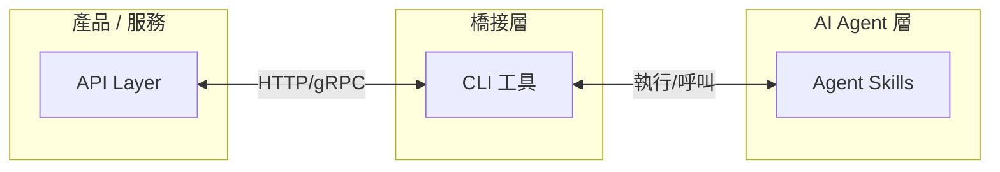

在之前的文章中，我分別介紹了 [Agent Skill 的概念][1]以及[如何用 Claude Code + GitHub Copilot Review 打造 AI 驅動的開發流程][2]。隨著越來越多產品和團隊開始擁抱 AI Agent，一個清晰的架構模式正在浮現：**API + CLI + Skills**。這不是某個框架或協議，而是一種務實的三層架構，讓任何產品都能快速變得「對 Agent 友善」。

[1]: 
[2]: 

<!--more-->

## Basecamp 的轉向：讓產品對 Agent 友善

最近 [DHH 在部落格上宣布][3]，Basecamp 正式成為「agent-accessible」的產品。有趣的是，37signals 並沒有選擇在 Basecamp 內建 AI 功能，而是把力氣花在讓外部 AI Agent 能夠順暢地操作 Basecamp。他們做了三件事：

[3]: https://world.hey.com/dhh/basecamp-becomes-agent-accessible-3ae6b949

1. **翻新了 API**：讓所有功能都能透過 API 存取
2. **打造全新的 CLI 工具**：讓 Agent 可以在終端機中操作 Basecamp
3. **撰寫 Agent Skill**：教 Agent 如何最有效地使用這些工具

DHH 點出了一個關鍵洞察：過去透過 API 整合其他服務「技術上可行，但太麻煩、太慢、成本太高，所以大多數人根本不會去做」。而 AI Agent 徹底消除了這個摩擦——Agent 可以自動瀏覽 Basecamp 中的所有內容、產生摘要、建立待辦清單、發佈更新、上傳檔案、排程專案，這些過去需要人類手動操作或花大錢請工程師寫整合的事情，現在 Agent 都能做到。

更值得注意的是 DHH 的策略判斷：與其開發可能沒人用的內建 AI 功能，不如讓產品對 ChatGPT、Gemini、Claude 這些主流 AI 平台友善。因為這些平台正在快速加入 Agent 能力，當所有人都在用這些平台時，你的產品是否 agent-accessible 就變成了核心競爭力。

## Google 也走上同一條路：開源 Workspace CLI

不只是 Basecamp，連 Google 也在走同一條路。[Google 近期開源了 Workspace CLI][12]，一個命令列工具，讓使用者和 AI Agent 可以直接在終端機中操作 Gmail、Google 日曆、Google 雲端硬碟、Google 試算表等雲端辦公應用。

[12]: https://www.ithome.com.tw/news/174225

這個專案[以 Rust 撰寫][13]，強調效能與安全性。其設計完全體現了 API + CLI + Skills 的架構思維：

[13]: https://github.com/googleworkspace/cli

- **API 層**：底層透過 Google Discovery Service 動態讀取各項 Workspace API，自動產生對應的命令介面
- **CLI 層**：提供自動補全、資源說明提示、模擬執行模式、自動分頁處理，並且輸出結構化 JSON 格式，可搭配 `jq` 等工具使用
- **Skills 層**：內建超過 **100 個預先撰寫的 Agent Skill** 和 50 個自動化工作流程範例，同時提供原生 MCP Server，將 Workspace API 暴露為結構化工具，支援 Claude Desktop、Gemini CLI、VS Code 等客戶端

使用者只要用自然語言說「列出檔案」、「查詢郵件」、「建立日曆事件」，Agent 就能透過 CLI 完成操作，不需要複雜的中間開發。

值得一提的是，Google 還在 CLI 中整合了 **Google Cloud Model Armor**，在 API 回應送給 AI 分析之前先進行消毒處理，防範來自外部郵件的 prompt injection 攻擊。這提醒我們：當 Agent 開始操作真實世界的資料時，安全性是不能忽略的一環。

從 Basecamp 到 Google Workspace，從新創到科技巨頭，產業正在快速收斂到同一個模式。

## API + CLI + Skills 三層架構

Basecamp 和 Google 的做法不是巧合。[Cliff Brake 在他的文章中][4]更進一步提煉出這個架構模式，並命名為 **API + CLI + Skills**。這三層各自扮演明確的角色：

[4]: https://www.linkedin.com/posts/cliffbrake_api-cli-skills-the-future-of-ai-activity-7443034750656901120-3BYy/



- **API Layer（資料與動作層）**：產品的所有功能都透過 API 暴露出來。這是基礎設施，無論是給人類開發者、前端應用程式、還是 AI Agent 使用，API 都是必要的第一層。
- **CLI 工具（橋接層）**：將 API 呼叫包裝成一個個獨立的命令列指令，每個指令都有明確的輸入、輸出和錯誤代碼。CLI 同時也能混合本地操作（讀寫檔案、操作 Git 等），是連結遠端服務和本地環境的橋樑。
- **Agent Skills（智慧層）**：教 AI Agent 如何有效地組合和使用 CLI 工具來完成複雜任務。Skill 不重複 CLI 的邏輯，而是編碼「何時用、怎麼用、用完後做什麼」的工作流程知識。

## 為什麼 CLI 是關鍵的中間層？

在這個架構中，CLI 是最關鍵的一環。為什麼不讓 Agent 直接呼叫 API？為什麼不用 MCP Server？Cliff Brake 在文章中給出了幾個有力的論點。讓我們用 [Gitea][10] 的官方 CLI 工具 [tea][11] 來具體說明——tea 是用 Go 撰寫的命令列工具，讓使用者可以直接在終端機中操作 Gitea 平台，完美體現了 API + CLI + Skills 架構中 CLI 層的角色。

[10]: https://gitea.com/
[11]: https://gitea.com/gitea/tea

### 1. 確定性的執行迴圈

每一次 CLI 呼叫都是一個原子操作：有 exit code、有 stdout、有 stderr。這正是 Agent 進行自我修正所需要的確定性迴圈——如果 exit code 不是 0，Agent 就知道出錯了，讀取 stderr 就能知道為什麼。

```bash
# Agent 嘗試建立 Issue
$ tea issues create --title "Fix login bug" --description "Login fails on Safari"
# 成功：exit code 0，stdout 回傳 Issue 編號
#3 Fix login bug

# Agent 嘗試操作不存在的 repo
$ tea issues --repo nonexistent/repo
# 失敗：exit code 1，stderr 回傳錯誤訊息
Error: GetUserByName
$ # Agent 讀取 stderr，理解問題，決定下一步
```

### 2. 零整合成本

不需要 MCP Server、不需要特殊的客戶端函式庫、不需要協議協商。Agent 只要執行 `--help` 就能發現所有可用的功能：

```bash
$ tea --help
NAME:
   tea - command line tool to interact with Gitea

USAGE:
   tea [global options] [command [command options]]

VERSION:
   Version: 0.12.0+5-gc797624  golang: 1.26.0  go-sdk: v0.23.2

DESCRIPTION:
   tea is a productivity helper for Gitea. It can be used to manage most entities on
   one or multiple Gitea instances & provides local helpers like 'tea pr checkout'.

   tea tries to make use of context provided by the repository in $PWD if available.
   tea works best in a upstream/fork workflow, when the local main branch tracks the
   upstream repo. tea assumes that local git state is published on the remote before
   doing operations with tea.    Configuration is persisted in $XDG_CONFIG_HOME/tea.


COMMANDS:
   help, h  Shows a list of commands or help for one command

   ENTITIES:
     issues, issue, i                  List, create and update issues
     pulls, pull, pr                   Manage and checkout pull requests
     labels, label                     Manage issue labels
     milestones, milestone, ms         List and create milestones
     releases, release, r              Manage releases
     times, time, t                    Operate on tracked times of a repository's issues & pulls
     organizations, organization, org  List, create, delete organizations
     repos, repo                       Show repository details
     branches, branch, b               Consult branches
     actions, action                   Manage repository actions
     webhooks, webhook, hooks, hook    Manage webhooks
     comment, c                        Add a comment to an issue / pr

   HELPERS:
     open, o                         Open something of the repository in web browser
     notifications, notification, n  Show notifications
     clone, C                        Clone a repository locally
     api                             Make an authenticated API request

   MISCELLANEOUS:
     whoami    Show current logged in user
     admin, a  Operations requiring admin access on the Gitea instance

   SETUP:
     logins, login  Log in to a Gitea server
     logout         Log out from a Gitea server

GLOBAL OPTIONS:
   --debug, --vvv  Enable debug mode
   --help, -h      show help
   --version, -v   print the version
```

這就是 Agent 需要的所有資訊——不需要 schema 註冊、不需要 manifest 檔案。特別注意 `--output json` 這個 flag，它讓 Agent 可以取得結構化的輸出，方便程式化解析。

### 3. 天然的組合性

CLI 工具透過 pipe、重導向和 shell script 天然地組合在一起。這種組合性不需要額外的框架或 SDK：

```bash
# Agent 列出所有未處理的 Issue，篩選出 bug 標籤的項目
tea issues list --state open --output json | jq '.[] | select(.labels | split(" ") | any(. == "kind/bug"))'

# Agent 自動 checkout 一個 PR 到本地進行 review
tea pulls checkout 42

# Agent 組合多個操作：建立 release 並上傳 binary
tea releases create --tag v1.2.0 --title "Release v1.2.0" \
  --asset ./dist/app-linux-amd64
```

### 4. 混合本地與遠端操作

`tea` 正是混合操作的最佳範例。它會讀取本地 Git 倉庫的資訊（remote URL、目前的 branch），結合遠端 Gitea API 的資料，在本地與遠端之間無縫切換：

```bash
# tea 自動偵測本地 repo 對應的 Gitea 專案，列出 PR
$ cd my-project && tea pulls
# tea 讀取本地 .git/config → 推算 Gitea remote → 呼叫 API → 顯示結果

# 混合操作：checkout PR 到本地分支
$ tea pulls checkout 15
# tea 呼叫 Gitea API 取得 PR 資訊 → 本地 git fetch → 本地 git checkout
```

這正是 Agent 日常需要做的混合操作，而純 API 呼叫做不到這一點。`tea` 作為 CLI 層的橋梁，把 Gitea API（遠端）和 Git 操作（本地）串接在一起，Agent 只需要一個指令就能完成。

### 5. MCP vs CLI：務實的比較

[Peter Steinberger][5]（OpenClaw 作者）曾說過一句話：**「every MCP would be better as a CLI」**。這話雖然故意挑釁，但確實點出了一個現實：

[5]: https://x.com/steipete

| 面向     | MCP Server                      | CLI 工具              |
| -------- | ------------------------------- | --------------------- |
| 部署需求 | 需要專門的伺服器或 sidecar 程序 | 單一 binary，直接執行 |
| 功能發現 | 需要 MCP 客戶端支援             | `--help` 即可         |
| 錯誤處理 | 需要協議層的錯誤處理            | exit code + stderr    |
| 組合性   | 需要程式碼串接                  | pipe + shell script   |
| 偵錯     | 需要 MCP inspector 等工具       | 直接在終端機測試      |
| 開發門檻 | 需要了解 MCP 協議               | 標準的 CLI 開發       |

這不是說 MCP 沒有價值——在某些場景下（例如即時雙向通訊、瀏覽器內的 Agent），MCP 有其不可取代的優勢。但對於大多數「讓 Agent 操作你的產品」的需求來說，CLI 是更簡單、更通用、更容易維護的選擇。

## 用 Golang 打造 CLI 工具

在 API + CLI + Skills 架構中，CLI 工具需要具備幾個特性：啟動快速、容易分發、跨平台、穩定可靠。能滿足這些條件的語言不只一種——前面提到的 Google Workspace CLI 就選擇了 Rust，而 Gitea 的 tea、GitHub 的 gh、Docker CLI 等大量工具則選擇了 [Golang][6]。兩者都能編譯成單一 binary、跨平台、啟動快速，但在 CLI 開發的生態成熟度和上手門檻上，Go 仍然是目前最主流的選擇。

[6]: https://go.dev/

### Go 作為 CLI 開發語言的優勢

- **單一 Binary**：`go build` 產出一個靜態連結的執行檔，沒有任何 runtime 依賴。Agent 不需要先安裝 Node.js、Python 或任何其他 runtime。
- **跨平台編譯**：`GOOS=linux GOARCH=amd64 go build` 就能產出 Linux binary。CI/CD 中一次編譯，所有平台都能用。
- **啟動速度極快**：Go 的 binary 幾乎是瞬間啟動。對 Agent 來說，每一次 CLI 呼叫都是一個新的 process，啟動速度直接影響整體效率。
- **豐富的 CLI 生態**：[cobra][7]、[urfave/cli][8]、[bubbletea][9] 等成熟的 CLI 框架，讓建構功能完整的命令列工具變得非常簡單。

[7]: https://github.com/spf13/cobra
[8]: https://github.com/urfave/cli
[9]: https://github.com/charmbracelet/bubbletea

### 一個最小的 Go CLI 範例

以下是用 `urfave/cli` 建構的一個簡單部署工具：

```go
package main

import (
    "fmt"
    "os"

    "github.com/urfave/cli/v2"
)

func main() {
    app := &cli.App{
        Name:  "deploy",
        Usage: "Deploy application to target environment",
        Flags: []cli.Flag{
            &cli.StringFlag{
                Name:     "env",
                Usage:    "target environment (staging, production)",
                Required: true,
            },
            &cli.BoolFlag{
                Name:  "json",
                Usage: "output result in JSON format",
            },
        },
        Action: func(c *cli.Context) error {
            env := c.String("env")
            // 呼叫 API、執行本地操作...
            fmt.Printf("Successfully deployed to %s\n", env)
            return nil
        },
    }

    if err := app.Run(os.Args); err != nil {
        fmt.Fprintf(os.Stderr, "Error: %v\n", err)
        os.Exit(1)
    }
}
```

當 Agent 執行 `deploy --help` 時，它會看到：

```text
NAME:
   deploy - Deploy application to target environment

USAGE:
   deploy [global options] [arguments...]

GLOBAL OPTIONS:
   --env value  target environment (staging, production)
   --json       output result in JSON format (default: false)
   --help, -h   show help
```

這就是 Agent 需要的所有資訊。不需要協議協商、不需要 schema 註冊——一個 `--help` 就能讓 Agent 理解工具的所有功能。加上 `--json` flag 讓輸出結構化，Agent 就能可靠地解析結果。

## 三篇文章的脈絡

回顧這三篇文章，其實形成了一個完整的認知演進：

**[第一篇（3/14）：Agent Skill 是什麼？][1]** 介紹了 Skill 的概念——將專業知識封裝成 Markdown 格式的可重複使用模組，讓 AI Agent 在特定情境下表現得像一位經驗豐富的專家。

**[第二篇（3/21）：AI 驅動的開發流程][2]** 展示了實際運作的工作流程：Claude Code 搭配 `/commit`、`/copilot-review`、`/simplify` 等 Skill，自動化整個從開發到 Merge 的流程。

**本篇（今天）：API + CLI + Skills 架構** 把視角拉高，提煉出架構層次的洞察。

回頭看第二篇的開發流程，它之所以運作得這麼好，正是因為底層有優秀的 CLI 工具在支撐：`git` 處理版本控制、`gh` 操作 GitHub API、`go` 編譯和測試程式碼。而 `/commit`、`/copilot-review` 這些 Skill 做的事情，就是教 Agent 如何有效地組合這些 CLI 工具。

**Skill 不是取代 CLI，而是包裝 CLI。** 沒有好的 CLI 工具在底層，Skill 就只是一段空洞的 prompt。API + CLI + Skills 三層架構缺一不可。

## 實際案例：為既有 CLI 撰寫 Agent Skill

如果你已經有一個 Go 寫的 CLI 工具，為它建立 Agent Skill 是非常簡單的事。以前面的 `deploy` 工具為例，建立一個 Skill 只需要寫一個 Markdown 檔案：

```markdown
---
name: deploy
description: >-
  Deploy the application to staging or production.
  Use when the user says "deploy", "release",
  or "push to production".
---

# Deploy Application

## Steps

### 1. Check current branch

Run `git branch --show-current` to verify
you're on the correct branch (should be main).

### 2. Run tests

Execute `make test` and verify all tests pass
before deploying.

### 3. Deploy

Run `deploy --env <environment> --json` where
environment is determined from the user's request.
Default to staging if not specified.

### 4. Verify

Run `deploy status --env <environment> --json`
to confirm the deployment succeeded.
Check that all services report healthy status.

### 5. Notify

If deployment succeeded, summarize the result
to the user. If failed, show the error and
suggest next steps.
```

注意 Skill 做的事情：它不是重複 `deploy` CLI 的邏輯，而是編碼了**工作流程的知識**——先檢查分支、再跑測試、然後部署、最後驗證。CLI 負責確定性的執行，Skill 負責智慧的判斷和流程編排。

這也是為什麼這個架構如此強大：每一層都專注在自己最擅長的事情上。

## 給開發者的建議

如果你正在思考如何讓自己的產品或工具對 AI Agent 友善，以下是我的建議：

### 1. 先有好的 API，再有好的 CLI

API 是一切的基礎。如果你的產品還沒有 API，這是第一優先。有了 API 之後，下一步就是建構一個包裝良好的 CLI 工具——它對人類開發者和 AI Agent 都有價值。

### 2. CLI 設計要 Agent-friendly

幾個關鍵設計原則：

- 提供 `--json` flag 讓輸出可被程式化解析
- 使用有意義的 exit code（0 = 成功，1 = 一般錯誤，2 = 參數錯誤...）
- 撰寫清楚的 `--help` 說明文字
- 盡量讓指令具有冪等性（重複執行不會造成問題）
- 錯誤訊息寫到 stderr，正常輸出寫到 stdout

### 3. Skill 是最後一哩路

有了好的 CLI，寫 Skill 就是水到渠成的事。Skill 的門檻很低——就是一個 Markdown 檔案——但它能讓 Agent 的使用體驗從「可以用」提升到「用得好」。

### 4. Golang 是 CLI 的首選語言

基於單一 binary、跨平台、啟動快速、生態成熟等優勢，Go 是目前建構 CLI 工具最務實的選擇。如果你已經會寫 Go，你已經具備了 Agent 時代最重要的技能之一。

### 5. 不要急著建 MCP Server

除非你的場景真的需要即時雙向通訊（例如瀏覽器內的 Agent、串流資料），否則 CLI + Skill 的組合在大多數情況下更簡單、更好維護、也更容易被各種 Agent 平台採用。

## 總結

軟體產業正在收斂出一個清晰的模式：**API + CLI + Skills** 是讓產品對 AI Agent 友善的標準架構。這不是一時的潮流，而是反映了 Agent 對工具介面的根本需求——確定性、可發現性、可組合性。

對於已經在用 Go 寫 CLI 工具的開發者來說，這是個好消息：你現有的技能正好對應到這個架構中最關鍵的中間層。接下來要培養的新能力，就是為你的 CLI 工具撰寫有效的 Agent Skill，讓 Agent 不只能「用你的工具」，還能「用得好」。

從 Basecamp 到各種開源專案，越來越多的團隊正在走上這條路。現在正是開始的好時機。
