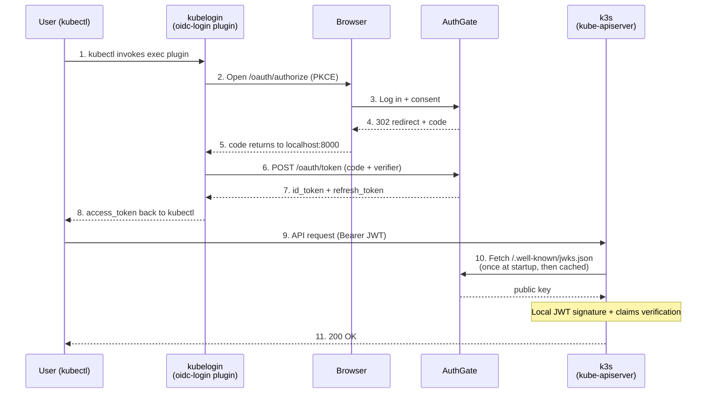

Most teams meet Kubernetes for the first time through a single "superuser" kubeconfig — a file with credentials that can wipe out the entire cluster. It then starts bouncing around Slack, email, and laptops, and nobody can say for sure who still has a copy, or whether the kubeconfig belonging to a former employee is still usable.

This post shows how to use [kubelogin][1] together with [AuthGate][2] to stand up an [OIDC][oidc] login flow on [k3s][3]: the moment a user runs `kubectl get pods`, the browser pops open AuthGate's login page, the tokens land back in the kubeconfig, and the entire cluster no longer needs that shared `admin.kubeconfig`.

[1]: https://github.com/int128/kubelogin
[2]: https://github.com/go-authgate/authgate
[3]: https://k3s.io

<!--more-->

## Why Small Teams Should Use kubelogin

OIDC login is usually pigeonholed as "something only big companies do", but small teams have an even stronger case for adopting it, because they simply don't have the bandwidth to track who is holding which credential. Here are the reasons I think small teams absolutely should use kubelogin:

1. **Former employees can't walk away with a token**: OIDC centralizes identity at the IdP (AuthGate in this case). Disable the account at the IdP and the user's token becomes useless as soon as it expires (one hour by default). Compare that to a static kubeconfig: you have to rotate credentials manually, round up every active colleague to reissue theirs, and you can never be sure the person on the other end actually deleted the old copy.
2. **No more copy-pasting kubeconfigs**: A new hire only needs a `kubeconfig` template (which `exec`s into kubelogin). The first `kubectl` call triggers the OIDC flow — no admin pre-provisioning an account, creating a `ServiceAccount`, or issuing a token.
3. **Audit logs consolidate at the IdP**: Who logged in, when, from which IP, from which laptop — it's all recorded under AuthGate's `/admin/audit`. Handy when ISO 27001, SOC 2, or a PM asking "who touched production?" comes knocking.
4. **Tokens auto-refresh; the UX feels like a static kubeconfig**: kubelogin caches the refresh token in `~/.kube/cache/oidc-login` or the system keyring. As long as the refresh token is still valid, users never notice the rotation.
5. **No extra bastion or VPN required just to manage identity**: The OIDC flow rides the standard browser. You don't have to stand up an in-cluster LDAP bridge or ship a `kubectl` plugin that calls some internal API.

Put simply, kubelogin outsources "who is the user?" to the IdP, and kubectl only needs a near-static kubeconfig template.

## Why Pick AuthGate as the IdP

You need an IdP to run OIDC. [Keycloak][4] is the first name that comes to mind, but for a small team Keycloak is a cloud-hosted "little monster": it wants PostgreSQL, you have to tune JVM memory, and realm migrations during upgrades are easy to blow up. [Dex][5] is lighter but only handles federation — it has no user store of its own.

[AuthGate][2] is a new open-source project (MIT license, written in Go) that landed on GitHub in 2026 and fills the middle ground nicely. Since it only launched this year and features are still shipping quickly, community feedback directly shapes the roadmap — a great moment for teams looking for a lightweight IdP to get involved early:

- **Single static binary + SQLite**: No PostgreSQL, no JVM. `./authgate server` and you're up. Swap in PostgreSQL later when you need horizontal scale.
- **Native support for OIDC Discovery and JWKS**: `/.well-known/openid-configuration` and `/.well-known/jwks.json` are all there. kube-apiserver can pull the public key and verify JWTs locally rather than calling back to the IdP every time.
- **Supports RS256 / ES256**: RS256 is the safest choice for kube-apiserver (HS256 requires a shared secret, which is unsafe in multi-service deployments).
- **Built-in session and authorization self-service pages**: Users can see their own active tokens at `/account/sessions` and `/account/authorizations` and revoke them without admin involvement.
- **Complete audit log**: Logins, token issuance, token revocation, and admin actions are all captured and can be exported as CSV.
- **Admins can force re-auth**: If you suspect a client is compromised, one click forces every user to log in again.

For a small team, AuthGate's biggest value is that "you don't need a dedicated IdP admin". Deploying it feels roughly on par with running Grafana or Prometheus, not Keycloak.

[4]: https://www.keycloak.org/
[5]: https://dexidp.io/

## Architecture Overview

The whole flow involves four roles: the user's `kubectl`, the kubelogin exec plugin, AuthGate (IdP), and k3s's kube-apiserver.



Key design point: kube-apiserver only fetches the JWKS public key at startup (and on key rotation). After that, every token verification happens locally. AuthGate never becomes the hot path for kubectl — even if it goes down, only "new logins" are affected, not "already-authenticated sessions".

## Hands-On Walkthrough

The steps below assume you have a local machine that can run k3s, and that AuthGate is reachable from kube-apiserver over HTTPS. kube-apiserver strictly requires HTTPS for `oidc-issuer-url`, so we generate a local CA certificate with [mkcert][6] and mount it straight onto AuthGate's built-in TLS server, skipping the extra reverse proxy. For k3s, macOS developers can use [colima][7], Linux users can install native k3s — both are demonstrated.

[6]: https://github.com/FiloSottile/mkcert
[7]: https://github.com/abiosoft/colima

### Step 1: Generate TLS Certificates with mkcert

Install mkcert and register the local CA (`-install` adds mkcert's root CA to the macOS Keychain / Linux trust store so that browsers and curl trust it out of the box):

```bash
# macOS
brew install mkcert nss
# Linux (Debian/Ubuntu)
sudo apt install libnss3-tools && brew install mkcert

# Register the local CA
mkcert -install

# Generate a certificate for authgate.local; put your host IP in the SAN too so k3s can connect
mkdir -p ~/authgate-certs && cd ~/authgate-certs
mkcert authgate.local 127.0.0.1 <your host IP>
# Produces two files:
#   authgate.local+2.pem      ← certificate
#   authgate.local+2-key.pem  ← private key

# Note the mkcert root CA path; k3s will need it as --oidc-ca-file later
mkcert -CAROOT
# Usually ~/.local/share/mkcert/ (contains rootCA.pem)
```

Next, bind `authgate.local` to the real IP (**both the k3s host and the developer's machine need this change**, otherwise kube-apiserver inside k3s won't be able to resolve the hostname):

```text
<AuthGate host IP>   authgate.local
```

### Step 2: Run AuthGate (Built-in HTTPS)

AuthGate ships with native TLS support, so you can attach the mkcert certificate directly — no Caddy / nginx required:

```bash
git clone https://github.com/go-authgate/authgate
cd authgate
cp .env.example .env

# Generate an RS256 private key so kube-apiserver can verify JWTs locally
openssl genrsa -out rsa-private.pem 2048
```

**Edit `.env`** and set the values below (these override the `.env.example` defaults rather than appending to them):

```bash
# Public URL: kube-apiserver uses this value as oidc-issuer-url;
# the JWT iss claim, OIDC Discovery, and JWKS URL are all anchored here.
# Note: the port must match SERVER_ADDR.
BASE_URL=https://authgate.local:8080

# Force HTTPS cookies and enable strict security headers
ENVIRONMENT=production

# Have AuthGate serve HTTPS directly on :8080, skipping the reverse proxy
SERVER_ADDR=:8080
TLS_CERT_FILE=/Users/<you>/authgate-certs/authgate.local+2.pem
TLS_KEY_FILE=/Users/<you>/authgate-certs/authgate.local+2-key.pem

# Enable RS256 asymmetric signing so kube-apiserver can verify via JWKS
JWT_SIGNING_ALGORITHM=RS256
JWT_PRIVATE_KEY_PATH=./rsa-private.pem

# Replace the defaults with strong secrets generated by the command below
JWT_SECRET=<output of openssl rand -hex 32>
SESSION_SECRET=<output of openssl rand -hex 32>
```

> `BASE_URL` must match kube-apiserver's `--oidc-issuer-url` **exactly** — scheme, host, **port**, and trailing slash all have to line up character for character. In this post AuthGate runs on `:8080`, so `BASE_URL` is `https://authgate.local:8080`. If you switch to `:443` (which requires `sudo` or `setcap 'cap_net_bind_service=+ep'`), drop the port and write `https://authgate.local` instead.

Start it up:

```bash
make build
./bin/authgate server
```

On the first boot, AuthGate writes the admin account to `authgate-credentials.txt` (permission 0600). Record the admin password inside, then delete the file.

Finally, verify the discovery endpoint is wired up correctly:

```bash
curl -s https://authgate.local:8080/.well-known/openid-configuration | jq .
```

You should see `issuer`, `authorization_endpoint`, `token_endpoint`, `jwks_uri`, and `userinfo_endpoint`. **Copy the returned `issuer` value verbatim** — k3s's `--oidc-issuer-url` has to match it exactly.

Because `mkcert -install` already added the CA to your system trust store, you don't need `--cacert` to verify TLS here. If `issuer` doesn't line up with kube-apiserver's `--oidc-issuer-url` (even a stray trailing slash will break it), logging in will keep throwing `oidc: id token issued by a different provider` — easily the most common landmine.

### Step 3: Create the kubelogin OAuth Client in AuthGate

Log in at `https://authgate.local:8080/admin` with the admin credentials from earlier, navigate to **Admin → OAuth Clients → Create New Client**, and fill in:

| Field         | Value                                                |
| ------------- | ---------------------------------------------------- |
| Name          | `kubelogin`                                          |
| Client Type   | `Public` (kubelogin is a CLI and can't keep secrets) |
| Grant Types   | `Authorization Code Flow (RFC 6749)`                 |
| Redirect URIs | `http://localhost:8000`<br>`http://localhost:18000`  |
| Scopes        | `openid email profile`                               |

Why a public client + PKCE? Because kubelogin runs on the user's machine and can't safely protect a `client_secret`. The OAuth 2.1 idiom is to use PKCE (Proof Key for Code Exchange) in place of the secret, and kubelogin already sends a `code_challenge` by default.

Why register two redirect URIs? kubelogin picks a random local port for its callback listener, commonly `8000` or `18000` (you can pin it via `--oidc-redirect-url-hostname` / `--listen-address`). AuthGate requires an exact redirect URI match, so pre-register both so whichever port the user's machine has free will just work — no need to come back and fix the client later.

Once created, note the `client_id`, for example `b6c1a28f-bf94-4442-999d-5e1a51365180`.

### Step 4: Install kubelogin

Installation is straightforward on every platform:

```bash
# Homebrew (macOS and Linux)
brew install kubelogin

# Krew (macOS, Linux, Windows and ARM)
kubectl krew install oidc-login

# Chocolatey (Windows)
choco install kubelogin
```

Verify the install:

```bash
kubectl oidc-login --help
```

### Step 5: Verify the OIDC Flow with `kubelogin setup` (Before Touching k3s)

This step is especially important: it decouples "kubelogin ↔ AuthGate" from "k3s ↔ AuthGate" so you can debug each side independently. Before configuring OIDC on k3s, run `kubelogin setup` on its own:

```bash
kubectl oidc-login setup \
  --oidc-issuer-url=https://authgate.local:8080 \
  --oidc-client-id=b6c1a28f-bf94-4442-999d-5e1a51365180 \
  --oidc-extra-scope=email \
  --oidc-extra-scope=profile \
  --grant-type=authcode \
  --certificate-authority="$(mkcert -CAROOT)/rootCA.pem"
```

`--certificate-authority` points at mkcert's root CA (on macOS that's `~/Library/Application Support/mkcert/rootCA.pem` by default). Unlike browsers, kubelogin does not consult the system trust store, so you have to tell it explicitly.

After running this, the browser opens AuthGate's login + consent page. Once you approve, the CLI prints the id_token's claims. Check two things:

1. **`iss` is identical to the `--oidc-issuer-url` you passed in** — case, port, and trailing slash must all match exactly. This is the value you'll configure as kube-apiserver's `--oidc-issuer-url` later, so copy it down.
2. **There is at least one claim that uniquely identifies the user** — typically `sub` or `email` — and `aud` equals your `client_id`.

If this step successfully prints claims, "AuthGate's OIDC basics" and "kubelogin + mkcert CA" are both good. From here on, any k3s-side issue can be isolated to that layer, which shrinks the debug surface significantly. If this step fails (TLS errors, redirect URI mismatch, token exchange failures), go back and recheck Step 2 / Step 3 before touching k3s.

### Step 6: Start k3s with OIDC Parameters

#### Option A: macOS with colima (recommended, no Linux VM switching needed)

[colima][7] spins up a lightweight Lima VM with k3s baked in — perfect for macOS developers. The cleanest approach is a YAML config file that declares both k3s arguments and mounts up front, so restarts don't drift:

```bash
brew install colima

# Generate the default config file (first run creates ~/.colima/default/colima.yaml)
colima start --edit
```

In the editor, set the `k3sArgs` and `mounts` sections to:

```yaml
k3sArgs:
  - --disable=traefik
  - --kube-apiserver-arg=oidc-issuer-url=https://authgate.local:8080
  - --kube-apiserver-arg=oidc-client-id=b6c1a28f-bf94-4442-999d-5e1a51365180
  - --kube-apiserver-arg=oidc-username-claim=email
  - "--kube-apiserver-arg=oidc-username-prefix=authgate:"
  - --kube-apiserver-arg=oidc-ca-file=/authgate-certs/rootCA.pem

mounts:
  - location: /Users/appleboy/authgate-certs
    mountPoint: /authgate-certs
    writable: false
```

A few highlights:

- `mounts` makes the macOS folder holding the mkcert certificates available inside the VM at `/authgate-certs`, so `oidc-ca-file` can point straight at the VM path without any extra `cp` or `scp`. `writable: false` keeps the VM from touching the private key on the host.
- `--disable=traefik`: colima bundles traefik by default, which this tutorial doesn't use and which grabs ports 80/443 — turn it off.
- `oidc-client-id` should be replaced with the UUID of the client you created in AuthGate.
- `oidc-username-prefix=authgate:` makes Kubernetes see usernames like `authgate:boyi@example.com` — the prefix clearly marks "this person logged in via OIDC" and prevents name collisions with ServiceAccounts or other static users. Use `-` to disable the prefix entirely, as you prefer. The value contains a colon, so YAML requires double quotes.

Save and exit; colima restarts automatically with the new settings applied.

Next, add `/etc/hosts` inside the VM so kube-apiserver can resolve `authgate.local` to the host IP:

```bash
colima ssh -- "echo '<AuthGate host IP>  authgate.local' | sudo tee -a /etc/hosts"
colima restart
```

colima writes its kubeconfig to `~/.kube/config` with context `colima`, so `kubectl` works out of the box after this.

#### Option B: Native k3s on Linux

First, put mkcert's root CA somewhere k3s can read:

```bash
sudo mkdir -p /etc/rancher/k3s
sudo cp "$(mkcert -CAROOT)/rootCA.pem" /etc/rancher/k3s/authgate-ca.crt
```

Then start k3s:

```bash
curl -sfL https://get.k3s.io | sh -s - server \
  --kube-apiserver-arg=oidc-issuer-url=https://authgate.local:8080 \
  --kube-apiserver-arg=oidc-client-id=b6c1a28f-bf94-4442-999d-5e1a51365180 \
  --kube-apiserver-arg=oidc-username-claim=email \
  --kube-apiserver-arg=oidc-username-prefix=authgate: \
  --kube-apiserver-arg=oidc-ca-file=/etc/rancher/k3s/authgate-ca.crt
```

k3s persists its config to `/etc/systemd/system/k3s.service`, so these flags survive restarts.

#### Flag Reference

- **`oidc-username-claim=email`**: Use the JWT's `email` claim as the Kubernetes username.
- **`oidc-username-prefix=authgate:`**: Kubernetes sees the user as `authgate:boyi@example.com`, which is easier to trace in audit logs and RBAC. Your `--user=` in RBAC bindings below has to include this prefix. If you'd rather use the raw email as the username, set `--oidc-username-prefix=-`.
- **`oidc-ca-file`**: Since mkcert issues a local CA, kube-apiserver doesn't trust it by default and has to be told explicitly. Once you move to Let's Encrypt in production, this flag can come out.
- **groups claim not used yet**: AuthGate hasn't shipped the `groups` claim yet, so RBAC is bound per user (email). Once it ships, switch over to `oidc-groups-claim` for a smooth migration.

### Step 7: Set Up RBAC Bindings

A user authenticated via OIDC at kube-apiserver still needs an explicit ClusterRoleBinding — otherwise login succeeds but the user has no permissions:

```bash
# Operate first with the k3s / colima built-in admin kubeconfig
# Native k3s:
export KUBECONFIG=/etc/rancher/k3s/k3s.yaml
# colima: kubectl config use-context colima

# Bind a specific user to cluster-admin
# Note: --user must include the authgate: prefix configured in Step 6
kubectl create clusterrolebinding oidc-admin-boyi \
  --clusterrole=cluster-admin \
  --user=authgate:boyi@example.com

# Bind another teammate to a smaller role (read-only in the default namespace)
kubectl create rolebinding oidc-viewer-alice \
  --clusterrole=view \
  --user=authgate:alice@example.com \
  --namespace=default
```

Onboarding future members is straightforward: after the admin creates the account in AuthGate, run one more `kubectl create rolebinding/clusterrolebinding` with the user's email and the access is live. Once AuthGate supports the `groups` claim, you can switch to `--group=<name>` — bind once and only change group membership in AuthGate afterward.

### Step 8: Distribute a kubeconfig to Users

Users get a kubeconfig template that looks like this (drop it into the internal wiki for copy-paste):

```yaml
apiVersion: v1
kind: Config
clusters:
  - name: k3s-homelab
    cluster:
      server: https://k3s.local:6443
      certificate-authority-data: <base64 of k3s server CA>
contexts:
  - name: k3s-homelab
    context:
      cluster: k3s-homelab
      user: oidc
users:
  - name: oidc
    user:
      exec:
        apiVersion: client.authentication.k8s.io/v1
        command: kubectl
        args:
          - oidc-login
          - get-token
          - --oidc-issuer-url=https://authgate.local:8080
          - --oidc-client-id=b6c1a28f-bf94-4442-999d-5e1a51365180
          - --oidc-extra-scope=email
          - --oidc-extra-scope=profile
          - --token-cache-storage=keyring
current-context: k3s-homelab
```

If you'd rather not hand-craft the YAML, `kubectl config set-credentials` produces an equivalent user section:

```bash
kubectl config set-credentials oidc \
  --exec-api-version=client.authentication.k8s.io/v1 \
  --exec-interactive-mode=Never \
  --exec-command=kubectl \
  --exec-arg=oidc-login \
  --exec-arg=get-token \
  --exec-arg=--oidc-issuer-url=https://authgate.local:8080 \
  --exec-arg=--oidc-client-id=b6c1a28f-bf94-4442-999d-5e1a51365180 \
  --exec-arg=--oidc-extra-scope=email \
  --exec-arg=--oidc-extra-scope=profile \
  --exec-arg=--grant-type=authcode \
  --exec-arg=--token-cache-storage=keyring
```

If AuthGate is fronted by a self-signed or local CA (such as the mkcert one from Step 1), add one more `--exec-arg` that points at the CA:

```bash
  --exec-arg=--certificate-authority=$(mkcert -CAROOT)/rootCA.pem
```

This command only creates the user entry; the cluster and context are still bound via the usual `kubectl config set-cluster` / `set-context`.

A few details worth noting:

- **`--token-cache-storage=keyring`**: Stashes the refresh token in the system keyring (macOS Keychain, GNOME Keyring, Windows Credential Manager), which is safer than the plaintext file under `~/.kube/cache/oidc-login`.
- **No `client_secret`**: The public client + PKCE design specifically does not need a secret.
- **This kubeconfig carries no user identity**: It's safe to paste into a GitHub wiki or README. Treat it as "connection settings", not "credentials".

### Step 9: First Login

The first time a user runs any kubectl command, the browser automatically opens AuthGate's login page. Because the previous step only added a new user entry via `set-credentials oidc` and didn't rebind the current context to that user, you have to pass `--user=oidc` explicitly for the OIDC flow to actually kick in — otherwise colima / k3s's default admin credentials take over:

```console
$ kubectl --user=oidc get nodes
Open http://localhost:8000 for authentication
# Browser opens AuthGate login → consent → back to the terminal
NAME      STATUS   ROLES                  AGE   VERSION
k3s-01    Ready    control-plane,master   3d    v1.31.0+k3s1
```

If you'd rather skip the `--user=oidc` flag, rebind the existing context onto the oidc user so kubectl uses OIDC without any extra flags:

```bash
# Swap the colima context's user to oidc
kubectl config set-context colima --user=oidc
# Use it directly afterward
kubectl get nodes
```

On the second and subsequent runs, kubelogin uses the refresh token already in the keyring to obtain a new access token, so users don't feel any latency.

## Advanced Tips

### Using Device Code Flow for Headless Environments

A CI runner or a jump host reached over SSH has no browser. Add `--grant-type=device-code` to kubelogin and the flow becomes:

```console
$ kubectl get nodes
Please visit the following URL in your browser: https://authgate.local:8080/device
Please enter the code: XYZB-1234
```

The user opens that URL on any machine with a browser, enters the code, and the local machine receives the token. AuthGate natively supports [RFC 8628 Device Authorization Grant][rfc8628]; no extra configuration needed.

### Forcing Everyone to Re-authenticate

Suspect a developer's laptop was lost, or want to yank the dev cluster back from someone:

1. At AuthGate `/admin/clients/<client_id>/revoke-all`, click "Force re-authentication" — every token issued to this client is invalidated instantly.
2. Or disable the account at `/admin/users/<user_id>/disable` — every token that user holds across every client is revoked immediately, and they can't log back in.

These actions are written to the audit log, so they're traceable later.

### Auditing: Who Touched Production, and When?

AuthGate's `/admin/audit` has a full event stream: you can search by user, by event type, and export to CSV.

On kube-apiserver's side, you can also enable the [Kubernetes Audit Log][8]:

```bash
--kube-apiserver-arg=audit-log-path=/var/log/k3s-audit.log
--kube-apiserver-arg=audit-policy-file=/etc/rancher/k3s/audit-policy.yaml
```

The two logs join on `email` (the username kubelogin hands to k8s), giving you a complete "who logged in → who acted" trail.

[8]: https://kubernetes.io/docs/tasks/debug/debug-cluster/audit/

## Wrap-Up

The biggest obstacle to adopting OIDC at a small team isn't the technology — it's the psychological cost of "now we have to operate another IdP". AuthGate shrinks that cost to roughly the level of running one more Gitea or Prometheus, and kubelogin itself is a pure client plugin that doesn't change how anyone uses kubectl.

Looking back at what this architecture actually buys you:

- The shared kubeconfig is gone; credentials no longer drift through Slack.
- Offboarding is "disable the account in AuthGate"; k8s follows automatically.
- Onboarding doesn't need admin intervention or credential rotation.
- Every login and every token issuance is audited.

A team of three to five can absolutely pull this off — it's worth an afternoon.

[oidc]: https://openid.net/specs/openid-connect-core-1_0.html
[rfc8628]: https://datatracker.ietf.org/doc/html/rfc8628
