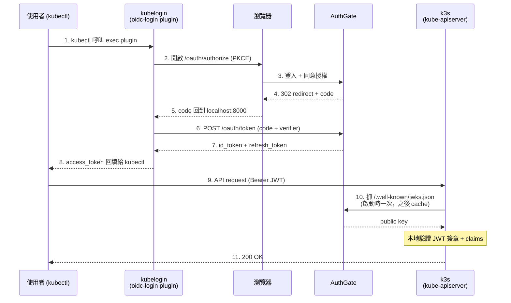

大部分團隊第一次裝 Kubernetes 時，拿到的都是一個「超級使用者」的 kubeconfig，裡面就躺著一組可以幹掉整個叢集的憑證。於是這份檔案開始在 Slack、Email、筆電之間被複製來複製去，沒有人知道目前誰還留著副本、哪個離職員工的 kubeconfig 還能用。

這篇文章要示範如何用 [kubelogin][1] 搭配 [AuthGate][2]，在 [k3s][3] 上建立一條 [OIDC][oidc] 登入流程：使用者打 `kubectl get pods` 的瞬間，瀏覽器自動跳出 AuthGate 的登入頁面，登入完成 token 寫回 kubeconfig，整個叢集不再需要共用那份 `admin.kubeconfig`。

[1]: https://github.com/int128/kubelogin
[2]: https://github.com/go-authgate/authgate
[3]: https://k3s.io

<!--more-->

## 為什麼小團隊也該用 kubelogin？

大家對 OIDC 登入的印象通常是「大公司才做的事」，但實際上小團隊導入的動機更強，因為小團隊的人力沒辦法去追蹤誰手上有什麼憑證。以下是幾個我認為小團隊一定要用 kubelogin 的理由：

1. **離職員工不會帶走 token**：OIDC 的身份集中在 IdP（本例是 AuthGate），只要在 IdP 停用帳號，使用者身上的 token 一過期（預設 1 小時）就完全失效。對比靜態 kubeconfig：你必須手動 rotate、通知所有還活著的同事重發一輪，而且你永遠不確定對方是不是真的刪了舊檔。
2. **不用再複製貼上 kubeconfig**：新人入職只要拿到一份 `kubeconfig` 模板（裡面寫的是 `exec` 到 kubelogin），第一次 `kubectl` 就會觸發 OIDC 登入，完全不需要管理員事先幫他建帳號、建 `ServiceAccount`、或是發 token。
3. **Audit log 集中在 IdP**：誰在幾點登入、從哪個 IP 登入、用哪一台筆電登入，全部記錄在 AuthGate 的 `/admin/audit`。要應付 ISO 27001、SOC 2 或單純是 PM 要求「誰動了 production？」的時候就有現成答案。
4. **Token 自動 refresh，體驗跟靜態 kubeconfig 一樣**：kubelogin 會在 `~/.kube/cache/oidc-login` 或 keyring 裡 cache refresh token，只要 refresh token 沒過期，使用者感覺不到 token 在輪替。
5. **不用額外的 Bastion 或 VPN 才能管理身份**：OIDC 的登入流程走的是標準瀏覽器，不需要在叢集內再架一套 LDAP bridge 或用 `kubectl` 插件去呼叫某個 internal API。

簡單說，kubelogin 把「誰是 User」這件事外包給 IdP，而 kubectl 只需要一份幾乎不會變動的 kubeconfig 模板。

## 為什麼選 AuthGate 當 IdP？

要跑 OIDC 你總得有一台 IdP。[Keycloak][4] 是大家第一個想到的選擇，但對小團隊來說 Keycloak 是一台雲端上的「小怪獸」：需要 PostgreSQL、要調 JVM 記憶體、升級時 realm migration 容易爆炸。[Dex][5] 更輕量但只做 federation，本身沒有 user store。

[AuthGate][2] 是 2026 年才在 GitHub 上釋出的新開源專案（MIT License、Go 寫成），剛好補上這個中間地帶。因為是今年才開張、功能還在快速長出來，社群回饋直接影響 roadmap，對想找輕量 IdP 的團隊來說正是參與早期專案的好時機：

- **單一 static binary + SQLite**：不用 PostgreSQL、不用 JVM，`./authgate server` 就跑起來，需要水平擴展時再換 PostgreSQL。
- **原生支援 OIDC Discovery 與 JWKS**：`/.well-known/openid-configuration`、`/.well-known/jwks.json` 全部齊備，kube-apiserver 可以直接抓公鑰在本地驗證 JWT，不用每次都回呼 IdP。
- **支援 RS256 / ES256**：對 kube-apiserver 來說 RS256 是最穩的選擇（HS256 需要共享密鑰，多服務場景不安全）。
- **內建 Session 與授權自助頁**：`/account/sessions`、`/account/authorizations` 使用者自己就能看到自己有哪些 active token、可以自己 revoke，不用管理員介入。
- **完整的 Audit log**：登入、token 簽發、token revoke、admin 動作全部有記錄，可以 CSV 匯出。
- **Admin 可以強制 re-auth**：懷疑某個 client 有問題時，可以一鍵讓所有使用者重新登入。

對小團隊而言 AuthGate 最大的價值是「不需要一個專職 IdP 管理員」。部署跟 Grafana、Prometheus 這種等級的東西差不多，而不是 Keycloak 那種等級。

[4]: https://www.keycloak.org/
[5]: https://dexidp.io/

## 架構總覽

整個流程分四個角色：使用者的 `kubectl`、kubelogin exec plugin、AuthGate（IdP）、以及 k3s 的 kube-apiserver。



關鍵設計：kube-apiserver 只在啟動時（以及 key rotation 時）抓一次 JWKS 公鑰，之後所有 token 驗證都在本地完成。AuthGate 不會成為 kubectl 的熱路徑瓶頸，掛掉也只影響「新登入」而不影響「已登入的 session」。

## 實戰步驟

以下假設你有一台本機可以跑 k3s，以及 AuthGate 要能被 kube-apiserver 透過 HTTPS 存取。kube-apiserver 對 `oidc-issuer-url` 有強制 HTTPS 要求，這邊用 [mkcert][6] 產地端 CA 憑證，直接掛到 AuthGate 內建的 TLS server 上，省掉額外架反向代理的工。k3s 的部分 macOS 開發者可以用 [colima][7] 啟動、Linux 直接裝原生 k3s，兩種都示範。

[6]: https://github.com/FiloSottile/mkcert
[7]: https://github.com/abiosoft/colima

### Step 1：用 mkcert 產生 TLS 憑證

先裝 mkcert 並註冊本機 CA（`-install` 會把 mkcert 的 root CA 加到 macOS Keychain / Linux trust store，之後瀏覽器與 curl 都直接信任）：

```bash
# macOS
brew install mkcert nss
# Linux (Debian/Ubuntu)
sudo apt install libnss3-tools && brew install mkcert

# 註冊本機 CA
mkcert -install

# 產生 authgate.local 的憑證，SAN 同時放本機 IP 方便 k3s 連
mkdir -p ~/authgate-certs && cd ~/authgate-certs
mkcert authgate.local 127.0.0.1 <你的主機 IP>
# 產出兩個檔案：
#   authgate.local+2.pem      ← 憑證
#   authgate.local+2-key.pem  ← 私鑰

# 記下 mkcert root CA 路徑，後面 k3s 要拿它當 --oidc-ca-file
mkcert -CAROOT
# 通常會是 ~/.local/share/mkcert/（裡面有 rootCA.pem）
```

接著把 `authgate.local` 綁到實際 IP（**k3s host 跟開發者機器兩邊都要改**，否則 k3s 裡的 kube-apiserver 解析不到這個 hostname）：

```text
<authgate 主機 IP>   authgate.local
```

### Step 2：跑起 AuthGate（內建 HTTPS）

AuthGate 支援原生 TLS，直接把 mkcert 憑證掛上去就好，不用 Caddy / nginx：

```bash
git clone https://github.com/go-authgate/authgate
cd authgate
cp .env.example .env

# 產生 RS256 私鑰，給 kube-apiserver 本地驗 JWT
openssl genrsa -out rsa-private.pem 2048
```

**編輯 `.env`**，把以下值寫進去（`.env.example` 預設值需要覆寫，不是追加）：

```bash
# 公開 URL：kube-apiserver 用這個值當 oidc-issuer-url，
# JWT 的 iss claim、OIDC Discovery、JWKS URL 都以此為基準
# 注意 port 要跟 SERVER_ADDR 一致
BASE_URL=https://authgate.local:8080

# 強制 HTTPS cookie、啟用嚴格安全標頭
ENVIRONMENT=production

# 讓 AuthGate 直接在 :8080 對外提供 HTTPS，省掉反向代理
SERVER_ADDR=:8080
TLS_CERT_FILE=/Users/<you>/authgate-certs/authgate.local+2.pem
TLS_KEY_FILE=/Users/<you>/authgate-certs/authgate.local+2-key.pem

# 啟用 RS256 非對稱簽章，讓 kube-apiserver 可透過 JWKS 驗證
JWT_SIGNING_ALGORITHM=RS256
JWT_PRIVATE_KEY_PATH=./rsa-private.pem

# 用下列指令產生強密鑰替換預設值
JWT_SECRET=<openssl rand -hex 32 的輸出>
SESSION_SECRET=<openssl rand -hex 32 的輸出>
```

> `BASE_URL` 必須跟後面 kube-apiserver 的 `--oidc-issuer-url` **完全一致**——scheme、host、**port**、尾斜線全部都要比對。本文讓 AuthGate 直接跑在 `:8080`，所以 `BASE_URL` 就寫 `https://authgate.local:8080`；如果改到 `:443`（需要 `sudo` 或 `setcap 'cap_net_bind_service=+ep'`），則省略 port 寫 `https://authgate.local` 即可。

啟動：

```bash
make build
./bin/authgate server
```

第一次啟動時，AuthGate 會把 admin 帳號寫到 `authgate-credentials.txt`（權限 0600），記下裡面的 admin 密碼並刪掉這個檔案。

最後驗證 discovery endpoint 是不是正確生效：

```bash
curl -s https://authgate.local:8080/.well-known/openid-configuration | jq .
```

應該要看到 `issuer`、`authorization_endpoint`、`token_endpoint`、`jwks_uri`、`userinfo_endpoint`。**把回來的 `issuer` 值原樣抄下來**，後面 k3s 設定 `--oidc-issuer-url` 要跟它完全一致。

因為 `mkcert -install` 已經把 CA 寫進系統 trust store，這邊不用 `--cacert` 也能驗證 TLS。如果 `issuer` 跟後面 kube-apiserver 的 `--oidc-issuer-url` 不一致（多/少一個斜線也不行），登入時會一路噴 `oidc: id token issued by a different provider`，這是最常見的雷。

### Step 3：在 AuthGate 建立 kubelogin 的 OAuth Client

登入 `https://authgate.local:8080/admin`，用剛剛的 admin 帳密進入 **Admin → OAuth Clients → Create New Client**，填入：

| 欄位          | 值                                    |
| ------------- | ------------------------------------- |
| Name          | `kubelogin`                                        |
| Client Type   | `Public`（kubelogin 是 CLI，沒辦法保管 secret）    |
| Grant Types   | `Authorization Code Flow (RFC 6749)`               |
| Redirect URIs | `http://localhost:8000`<br>`http://localhost:18000` |
| Scopes        | `openid email profile`                             |

為什麼選 Public client + PKCE？因為 kubelogin 跑在使用者本機，沒辦法安全保管 `client_secret`。OAuth 2.1 的標準做法是用 PKCE（Proof Key for Code Exchange）取代 secret，kubelogin 預設就會送 `code_challenge`。

為什麼要註冊兩個 redirect URI？kubelogin 會在本機隨機選一個 port 當 callback listener，常見值是 `8000` 或 `18000`（也可以用 `--oidc-redirect-url-hostname` / `--listen-address` 固定）。AuthGate 要求 redirect URI 必須完全匹配，所以提前把常用的兩個都註冊進去，使用者本機哪一個 port 能開就用哪一個，省得出事再回來改 client 設定。

建好之後記下 `client_id`，例如 `b6c1a28f-bf94-4442-999d-5e1a51365180`。

### Step 4：安裝 kubelogin

各平台的安裝方式都很簡單：

```bash
# Homebrew (macOS and Linux)
brew install kubelogin

# Krew (macOS, Linux, Windows and ARM)
kubectl krew install oidc-login

# Chocolatey (Windows)
choco install kubelogin
```

裝完驗證一下：

```bash
kubectl oidc-login --help
```

### Step 5：用 `kubelogin setup` 先驗證 OIDC 流程（不動 k3s）

這一步特別重要，它把「kubelogin ↔ AuthGate」跟「k3s ↔ AuthGate」兩段解耦 debug。在 k3s 還沒配 OIDC 以前，先單獨跑 `kubelogin setup`：

```bash
kubectl oidc-login setup \
  --oidc-issuer-url=https://authgate.local:8080 \
  --oidc-client-id=b6c1a28f-bf94-4442-999d-5e1a51365180 \
  --oidc-extra-scope=email \
  --oidc-extra-scope=profile \
  --grant-type=authcode \
  --certificate-authority="$(mkcert -CAROOT)/rootCA.pem"
```

`--certificate-authority` 指向 mkcert 的 root CA（macOS 預設是 `~/Library/Application Support/mkcert/rootCA.pem`），因為 kubelogin 跟瀏覽器不一樣，不會吃系統 trust store，要顯式告訴它。

跑完後瀏覽器會跳出 AuthGate 的登入 + consent 頁，按同意後 CLI 會印出 id_token 的 claims。這時候要確認兩件事：

1. **`iss` 的值跟你 `--oidc-issuer-url` 傳進去的完全一樣**——大小寫、port、尾斜線都必須一字不差。這就是後面 kube-apiserver 要設的 `--oidc-issuer-url`，抄下來。
2. **至少有一個 claim 能唯一識別使用者**——通常是 `sub`、`email` 其中一個，且 `aud` 等於你的 `client_id`。

只要這步能印出 claims，代表「AuthGate 的 OIDC 基本面」跟「kubelogin + mkcert CA」都通了。之後 k3s 那邊出問題就可以排除這一段，debug 範圍一下縮小很多。如果這步失敗（例如 TLS 錯誤、redirect URI 不匹配、token 換不回來），先回去對 Step 2 / Step 3 的設定，不要急著碰 k3s。

### Step 6：啟動 k3s 並設定 OIDC 參數

#### 選項 A：macOS 用 colima（推薦，免切 Linux VM）

[colima][7] 底層會起一個輕量 Lima VM 內建 k3s，適合 macOS 開發者。推薦用 YAML 設定檔的方式把 k3s 參數跟 mount 一起宣告式地寫清楚，重開也不會跑掉：

```bash
brew install colima

# 先產生預設設定檔（第一次跑會產生 ~/.colima/default/colima.yaml）
colima start --edit
```

在編輯器中把 `k3sArgs` 跟 `mounts` 兩段改成：

```yaml
k3sArgs:
  - --disable=traefik
  - --kube-apiserver-arg=oidc-issuer-url=https://authgate.local:8080
  - --kube-apiserver-arg=oidc-client-id=b6c1a28f-bf94-4442-999d-5e1a51365180
  - --kube-apiserver-arg=oidc-username-claim=email
  - "--kube-apiserver-arg=oidc-username-prefix=authgate:"
  - --kube-apiserver-arg=oidc-ca-file=/authgate-certs/rootCA.pem

mounts:
  - location: /Users/appleboy/authgate-certs
    mountPoint: /authgate-certs
    writable: false
```

幾個重點：

- `mounts` 把 macOS 上放 mkcert 憑證的資料夾掛進 VM 的 `/authgate-certs`，`oidc-ca-file` 就直接指向 VM 裡的路徑，不用額外 `cp` 或 `scp`。用 `writable: false` 讓 VM 沒辦法改到你主機上的私鑰。
- `--disable=traefik`：colima 內建會帶一個 traefik，本教學用不到而且會搶 80/443 port，直接關掉。
- `oidc-client-id` 請改成你自己在 AuthGate 建的 client UUID。
- `oidc-username-prefix=authgate:` 會讓 Kubernetes 看到的 user name 變成 `authgate:boyi@example.com`——加前綴的好處是清楚標示「這個人是從 OIDC 登入的」，跟 ServiceAccount 或其他 static user 不會撞名。用 `-` 可以完全關掉前綴，看個人偏好。值本身有冒號，YAML 要用雙引號包起來。

儲存離開後 colima 會自動帶著新設定重啟。

接著把 `/etc/hosts` 寫進 VM，讓 kube-apiserver 能把 `authgate.local` 解析到你的主機 IP：

```bash
colima ssh -- "echo '<authgate 主機 IP>  authgate.local' | sudo tee -a /etc/hosts"
colima restart
```

colima 會把 kubeconfig 寫到 `~/.kube/config`，context 是 `colima`，後續 `kubectl` 直接就能用。

#### 選項 B：Linux 原生 k3s

先把 mkcert 的 root CA 放到 k3s 讀得到的位置：

```bash
sudo mkdir -p /etc/rancher/k3s
sudo cp "$(mkcert -CAROOT)/rootCA.pem" /etc/rancher/k3s/authgate-ca.crt
```

接著啟動 k3s：

```bash
curl -sfL https://get.k3s.io | sh -s - server \
  --kube-apiserver-arg=oidc-issuer-url=https://authgate.local:8080 \
  --kube-apiserver-arg=oidc-client-id=b6c1a28f-bf94-4442-999d-5e1a51365180 \
  --kube-apiserver-arg=oidc-username-claim=email \
  --kube-apiserver-arg=oidc-username-prefix=authgate: \
  --kube-apiserver-arg=oidc-ca-file=/etc/rancher/k3s/authgate-ca.crt
```

k3s 會把 config 持久化到 `/etc/systemd/system/k3s.service`，之後重啟也會帶著這些參數。

#### 參數說明

- **`oidc-username-claim=email`**：把 JWT 裡的 `email` 當作 Kubernetes 的 user name。
- **`oidc-username-prefix=authgate:`**：Kubernetes 看到的使用者會是 `authgate:boyi@example.com`，對 audit log 跟 RBAC 都比較好辨識來源；下方 RBAC 的 `--user=` 要帶上這個前綴。若想直接用純 email 做 user name，可以改成 `--oidc-username-prefix=-`。
- **`oidc-ca-file`**：因為 mkcert 發的是本機 CA，kube-apiserver 預設不信任，要顯式指定。正式環境換成 Let's Encrypt 後這個參數就可以拔掉。
- **尚未使用 groups claim**：目前 AuthGate 還沒有釋出 `groups` claim，所以 RBAC 先以 user（email）為單位綁定；未來 AuthGate 支援後再加上 `oidc-groups-claim` 即可平滑切換。

### Step 7：建立 RBAC 綁定

kube-apiserver 通過 OIDC 拿到的 user 要手動綁 ClusterRoleBinding，否則登入成功但沒有權限：

```bash
# 先用 k3s / colima 內建的 admin kubeconfig 操作
# 原生 k3s：
export KUBECONFIG=/etc/rancher/k3s/k3s.yaml
# colima：kubectl config use-context colima

# 給特定使用者綁 cluster-admin
# 注意 --user 要帶上 Step 6 設的 authgate: 前綴
kubectl create clusterrolebinding oidc-admin-boyi \
  --clusterrole=cluster-admin \
  --user=authgate:boyi@example.com

# 另一位成員綁較小的權限（只能讀 default namespace）
kubectl create rolebinding oidc-viewer-alice \
  --clusterrole=view \
  --user=authgate:alice@example.com \
  --namespace=default
```

後續新成員入職時，管理員在 AuthGate 建好帳號之後，只要多跑一次 `kubectl create rolebinding/clusterrolebinding` 指定 user email 就能立刻生效。等 AuthGate 未來支援 `groups` claim，就可以改用 `--group=<name>` 綁一次、後續只動 AuthGate 群組成員名單即可。

### Step 8：發一份 kubeconfig 給使用者

使用者拿到的 kubeconfig 模板會長這樣（可以放進內部 Wiki 直接複製）：

```yaml
apiVersion: v1
kind: Config
clusters:
  - name: k3s-homelab
    cluster:
      server: https://k3s.local:6443
      certificate-authority-data: <base64 of k3s server CA>
contexts:
  - name: k3s-homelab
    context:
      cluster: k3s-homelab
      user: oidc
users:
  - name: oidc
    user:
      exec:
        apiVersion: client.authentication.k8s.io/v1
        command: kubectl
        args:
          - oidc-login
          - get-token
          - --oidc-issuer-url=https://authgate.local:8080
          - --oidc-client-id=b6c1a28f-bf94-4442-999d-5e1a51365180
          - --oidc-extra-scope=email
          - --oidc-extra-scope=profile
          - --token-cache-storage=keyring
current-context: k3s-homelab
```

如果不想手刻 YAML，也可以用 `kubectl config set-credentials` 產出等效的 user section：

```bash
kubectl config set-credentials oidc \
  --exec-api-version=client.authentication.k8s.io/v1 \
  --exec-interactive-mode=Never \
  --exec-command=kubectl \
  --exec-arg=oidc-login \
  --exec-arg=get-token \
  --exec-arg=--oidc-issuer-url=https://authgate.local:8080 \
  --exec-arg=--oidc-client-id=b6c1a28f-bf94-4442-999d-5e1a51365180 \
  --exec-arg=--oidc-extra-scope=email \
  --exec-arg=--oidc-extra-scope=profile \
  --exec-arg=--grant-type=authcode \
  --exec-arg=--token-cache-storage=keyring
```

如果 AuthGate 掛的是自簽或本機 CA（例如 Step 1 用 mkcert 產的），再多塞一個 `--exec-arg` 把 CA 路徑帶進去即可：

```bash
  --exec-arg=--certificate-authority=$(mkcert -CAROOT)/rootCA.pem
```

這條指令只建立 user 條目，cluster 與 context 仍用原本的 `kubectl config set-cluster` / `set-context` 綁起來。

幾個小細節：

- **`--token-cache-storage=keyring`**：把 refresh token 放進系統 keyring（macOS Keychain、GNOME Keyring、Windows Credential Manager），比放在 `~/.kube/cache/oidc-login` 的明文檔案更安全。
- **沒有 `client_secret`**：Public client + PKCE 的設計就是不需要 secret。
- **這份 kubeconfig 不含任何使用者身份**：所以可以安全地貼在 GitHub Wiki、README，把它視為「連線設定」而不是「憑證」。

### Step 9：第一次登入

使用者第一次跑任何 kubectl 指令，瀏覽器會自動跳出 AuthGate 的登入頁。因為前一步只用 `set-credentials oidc` 新增一個 user 條目，並沒有把 current-context 綁到這個 user 身上，所以要顯式帶 `--user=oidc` 才會真的走 OIDC 流程，不然 colima / k3s 預設的 admin 憑證還是會被吃掉：

```console
$ kubectl --user=oidc get nodes
Open http://localhost:8000 for authentication
# 瀏覽器跳出 AuthGate 登入 → 同意授權 → 回到 terminal
NAME      STATUS   ROLES                  AGE   VERSION
k3s-01    Ready    control-plane,master   3d    v1.31.0+k3s1
```

如果想省略 `--user=oidc`，可以把現有 context 改綁到 oidc user，後續 kubectl 就走 OIDC 不用再帶旗標：

```bash
# 將 colima 這個 context 的 user 換成 oidc
kubectl config set-context colima --user=oidc
# 之後直接用
kubectl get nodes
```

第二次開始因為 refresh token 還在 keyring 裡，kubelogin 會自動用 refresh token 換新的 access token，感覺不出任何延遲。

## 進階技巧

### 使用 Device Code Flow 支援 headless 環境

CI runner、SSH 過去的跳板機沒有瀏覽器，這時候把 kubelogin 參數加上 `--grant-type=device-code`，流程變成：

```console
$ kubectl get nodes
Please visit the following URL in your browser: https://authgate.local:8080/device
Please enter the code: XYZB-1234
```

使用者在任何一台有瀏覽器的機器打開那個 URL、輸入 code，本機就會拿到 token。AuthGate 原生支援 [RFC 8628 Device Authorization Grant][rfc8628]，不用額外設定。

### 強制所有人重新登入

懷疑某個開發者的筆電掉了、或者想把 dev 叢集從某個人身上收回來：

1. 在 AuthGate `/admin/clients/<client_id>/revoke-all` 按下「Force re-authentication」——所有持有這個 client token 的人瞬間失效。
2. 或在 `/admin/users/<user_id>/disable` 停用帳號——該使用者所有 client 的 token 立刻全部吊銷，且無法再登入。

這個操作會寫到 audit log，之後都追查得到。

### 審計：誰在什麼時候動了 production？

AuthGate 的 `/admin/audit` 有完整事件流，可以搜尋特定使用者、特定事件類型，並匯出成 CSV。

kube-apiserver 那邊也可以開啟 [Kubernetes Audit Log][8]：

```bash
--kube-apiserver-arg=audit-log-path=/var/log/k3s-audit.log
--kube-apiserver-arg=audit-policy-file=/etc/rancher/k3s/audit-policy.yaml
```

兩邊的 log 透過 `email`（kubelogin 給 k8s 的 username）就可以 join 起來，變成完整的「誰登入 → 誰操作」軌跡。

[8]: https://kubernetes.io/docs/tasks/debug/debug-cluster/audit/

## 小結

幫小團隊導入 OIDC 最大的阻力不是技術，而是「要多維運一台 IdP」的心理成本。AuthGate 把這個成本壓到跟多跑一個 Gitea、Prometheus 差不多的等級，而 kubelogin 本身是純 client 插件、完全不改變 kubectl 的使用習慣。

回頭看這個架構帶來的實質好處：

- 共用 kubeconfig 消失了，憑證不再在 Slack 之間流傳。
- 離職流程只要在 AuthGate disable 帳號，k8s 那邊自動跟著斷。
- 新人入職不用管理員介入、不用 rotate 任何東西。
- 每一次登入、每一次 token 簽發都有稽核紀錄。

三、五人的團隊也完全做得起來，推薦花一個下午導入。

[oidc]: https://openid.net/specs/openid-connect-core-1_0.html
[rfc8628]: https://datatracker.ietf.org/doc/html/rfc8628
