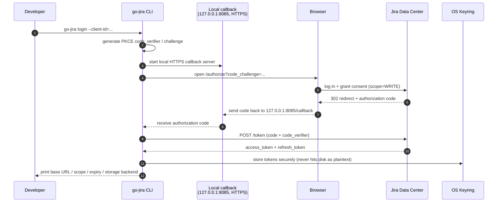
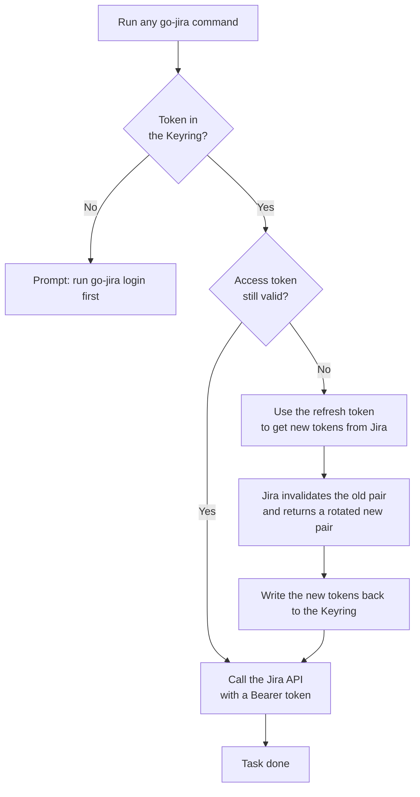
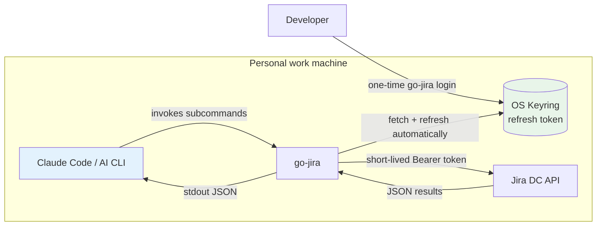
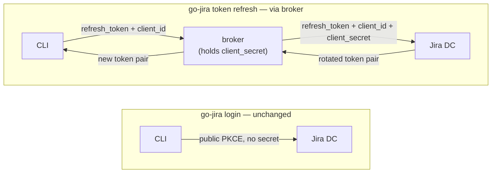

A huge number of developers now write code on their *personal work machines*, and they increasingly let AI CLI tools like [Claude Code][claude] run commands, look things up, and tidy up afterwards. Wiring that AI workflow into [Jira][jira] makes it even more powerful: the AI can look up issues, update statuses, leave comments, and map commit messages back to tickets. But there's a security question that keeps getting underrated — **how does the CLI authenticate to Jira?**

The most common answer historically is a PAT (Personal Access Token). It's simple, but on an AI work machine it carries two very real risks:

1. **The AI can read it by accident.** A PAT usually lives in `.env`, a shell rc file, or some config file. The moment you let an AI agent "freely explore the filesystem" on that machine, this long-lived token — which carries your full account permissions — can get pulled into the context, or even written out into some piece of output.
2. **A file that lives forever is an exposure surface that lives forever.** A PAT doesn't rotate. Once leaked, it stays valid until you manually revoke it. We've all heard the stories: synced to the cloud, swept into a backup, accidentally committed into a repo.

That's why "switching CLI auth from a PAT to Jira OAuth" has been pulled back into the spotlight lately. This post documents how the new [go-jira][gojira] uses **OAuth Login + refresh tokens** to tuck tokens into the operating system's **Keyring**, so developers can obtain a token conveniently and store it safely — and so AI CLIs like Claude Code can interact with Jira in a much safer way.

> Note: go-jira's OAuth only supports **Jira Data Center**, not Jira Cloud (the two use different OAuth flows).

[claude]: https://www.anthropic.com/claude
[jira]: https://www.atlassian.com/software/jira
[gojira]: https://github.com/appleboy/go-jira

<!--more-->

## Why OAuth fits an AI work machine better than a PAT

Let's spell out the core differences first — they're the whole motivation for this approach:

| Aspect                     | PAT (`JIRA_TOKEN`)             | OAuth Login + Refresh Token                                              |
| -------------------------- | ------------------------------ | ------------------------------------------------------------------------ |
| Storage                    | Plaintext file / env var       | OS Keyring (macOS Keychain, Windows Credential Manager, Secret Service)  |
| Lifetime                   | Long-lived, revoke by hand     | Access token short-lived, auto-refreshed before expiry                   |
| Risk of the AI reading it  | High (the file is right there) | Low (never hits disk; the access token is short-lived anyway)            |
| Permission granularity     | Equals your account            | Bounded by scope (READ / WRITE / ADMIN)                                  |
| Damage if leaked           | Valid until revoked            | Refresh token rotates on every use; access token expires quickly         |

The point isn't "OAuth can't leak" — it's that **what leaks is different**:

- The access token is **short-lived**: even if it's read, it expires before long.
- The refresh token lives in the **Keyring**, not a plaintext file, so an AI agent poking around the filesystem can't read it.
- The refresh token **rotates**: Jira DC invalidates the old one and issues a new one on every refresh, so each one effectively dies after a single use.

In other words, OAuth swaps "one account-equivalent, long-lived secret sitting in a file" for "a short-lived access token plus a rotating refresh token in the keyring" — which directly addresses both of the AI work machine's big risks.

## The two OAuth flows go-jira supports

go-jira runs as a public **PKCE client**, so it needs **no client secret** — just a client ID. It offers two flows:

- **Authorization Code + PKCE** — interactive login on a developer's machine. This is the star of this post.
- **Refresh-token injection** — for non-interactive environments like CI/CD (where you have to handle writing the rotated token back yourself).

This post focuses on the one developers use most: `go-jira login`.

## Flow 1: OAuth Login (Authorization Code + PKCE)

On first login, go-jira spins up a local callback server, sends your browser to Jira's authorization page, gets the authorization code back, exchanges it for tokens, and finally tucks them into the Keyring. The whole flow looks like this:



The command itself is dead simple:

```bash
export JIRA_BASE_URL="https://jira.example.com"
go-jira login --client-id="$JIRA_OAUTH_CLIENT_ID"
```

It opens Jira's authorization page in your browser; click approve, the flow finishes, and the token lands in the Keyring. On success, go-jira prints the base URL, scope, expiry, and the storage backend it actually used.

A few design details worth calling out:

- **HTTPS loopback callback by default.** The redirect URI defaults to `https://127.0.0.1:8085/callback`. Many Jira DC instances reject an `http` redirect URI (returning `invalid redirect_uri`), so go-jira uses HTTPS by default.
- **Zero-setup HTTPS callback.** By default (`JIRA_OAUTH_CALLBACK_HTTPS=true`), go-jira mints a self-signed cert for `127.0.0.1` **in memory** at login time — no `mkcert`, no cert files to prepare, which is great when a whole team shares one binary. The trade-off is a one-time browser security warning; on `127.0.0.1` you just click "Proceed" to continue. To avoid the warning entirely, use a `mkcert`-generated cert with `--callback-cert` / `--callback-key`.
- **No client secret needed.** PKCE already protects the authorization flow, the client ID isn't sensitive, and a Jira admin can revoke the client at any time. The client ID can be baked in at build time, injected via `JIRA_OAUTH_CLIENT_ID`, or passed with `--client-id`.

### Scope: use least privilege to bound what the AI can do

OAuth gives you one more thing a PAT can't: **scope**. go-jira requests `WRITE` by default (enough for transitions, comments, and assignment), but you can tighten it with `--scope`:

| Scope          | What it grants                                          |
| -------------- | ------------------------------------------------------- |
| `READ`         | View projects / issues / profile                        |
| `WRITE`        | Create/update issues, comments, transitions (incl. READ) |
| `ADMIN`        | Admin operations (incl. READ, WRITE)                    |
| `SYSTEM_ADMIN` | Full system administration (incl. ADMIN)                |

If you only want the AI to "look up issues and put together a report," give it `READ` — that way even a runaway AI can't touch your tickets. Effective permissions are still bounded by the user's own permissions in Jira.

## Flow 2: Refresh Token + Keyring, making "getting a token" invisible

You log in once. After that, every go-jira run **automatically** pulls the token from the Keyring and, when the access token is about to expire, swaps it for a fresh one using the refresh token — completely transparent to you. That's the key to "getting a token conveniently": you never re-login, and you never manage tokens by hand.



There's one Jira DC behaviour worth burning into memory: **on every refresh, Jira DC invalidates both the old access token and the old refresh token, and returns a brand-new refresh token.** In local-login mode, go-jira writes that new token back to the Keyring automatically, so you never have to think about it. (In CI/CD mode that same rotation becomes a write-back chore you have to handle yourself — which is exactly why a PAT is often recommended for automation.)

### Token storage: prefer the Keyring, fall back to an encrypted file

go-jira has two token storage backends:

| Backend | When it's used                                | Notes                                                              |
| ------- | --------------------------------------------- | ------------------------------------------------------------------ |
| keyring | default, when the OS provides a keyring        | macOS Keychain, Linux Secret Service, Windows Credential Manager   |
| file    | fallback (e.g. headless Linux without D-Bus)  | AES-256-GCM, key derived with PBKDF2-HMAC-SHA256 (600k iterations) |

The default is the keyring, and that's precisely what keeps the token out of the AI's reach — the token no longer lies around as plaintext in a file. Only on a machine without a keyring (e.g. headless Linux without D-Bus) does it fall back to an encrypted file, and that file backend requires a master password via `JIRA_MASTER_PASSWORD`. Tokens are keyed by `sha256(baseURL:clientID)`, so multiple Jira sites and clients coexist without clobbering each other.

### Everyday token-management commands

After logging in, these few commands cover daily needs:

```bash
go-jira whoami                 # who am I + current auth mode
go-jira token status           # expiry, scope, storage backend
go-jira token refresh          # force a refresh right now
go-jira token print --confirm  # print the access token (sensitive, needs confirmation)
go-jira logout                 # delete the stored token for this site
```

## Plugging in Claude Code: how the AI operates Jira safely

Put the two flows above together, and Claude Code's interaction with Jira looks like this:



The key is **separation of duties**:

- The **developer** runs `go-jira login` once, tucking the refresh token into the Keyring.
- **Claude Code** only ever invokes `go-jira` subcommands (e.g. `go-jira search`, `go-jira get`, `go-jira run`). It **never touches the refresh token** and **can't read** the secret in the Keyring.
- go-jira handles fetching and refreshing the access token behind the scenes, and what it hands Jira is always just a **short-lived** Bearer token.

go-jira's subcommands were designed for agent toolchains from the start, which makes them a natural fit for being driven by AI:

- **Results on stdout, diagnostics on stderr.** `go-jira search ... > issues.json` captures only clean JSON, easy for the AI to parse.
- **Machine-readable JSON by default**, or `--output text` for humans.
- **Distinct exit codes:** `0` success, `2` usage error, `3` auth/authorization failure, `4` rate limited — the AI can branch on these without parsing stderr.
- **`--quiet` / `--timeout` / `--no-color`:** give the AI the cleanest possible output, set a time budget, and avoid ANSI color pollution.
- **Control-character safety:** arguments containing control characters are rejected before the command runs (exit code `2`), preventing terminal-escape and log injection.

For a concrete scenario, you could just tell Claude Code:

> "Look up the current status of every issue mentioned in this commit message, and transition the open ones to In Progress."

Claude Code would assemble commands like these behind the scenes:

```bash
# Search (JSON to stdout for the AI to parse)
go-jira search --jql "project = GAIA AND status = Open" --limit 10

# Fetch the summary and status of a single issue
go-jira get --key GAIA-123 --output text

# Map issue keys in the commit message to a transition
git log -1 --format=%B | go-jira run --ref - --to-transition "In Progress"
```

Throughout all of this, the AI only ever sees the JSON go-jira prints. The token that represents your identity stays in the Keyring the whole time, and the access token is only ever a short-lived credential. Even if you let the AI explore boldly on that machine, there's no long-lived secret it can scoop up to impersonate you.

## Advanced: confidential clients and the token refresh broker

Some Jira DC OAuth applications are registered as **confidential clients**. In that case Jira DC **requires `client_secret` on the `grant_type=refresh_token` step** (login still works without a secret; only refresh gets rejected). But a published binary must never embed that secret — anyone could run `strings` on it and read it.

go-jira's answer is a **token refresh broker**: run a server-side broker using **the same binary** (`go-jira broker serve`), keep the `client_secret` on the server, and have it add the secret to the upstream call only on the refresh step. **Login is completely unchanged** — it stays a direct, public PKCE flow; only refresh routes through the broker:



This is exactly what the cover architecture diagram at the top of the post is showing — **login takes the top arc straight to Jira (the broker plays no part)**, only refresh takes the lower ①②③④ path through the broker, and the `client_secret` stays inside the broker the entire time.

Set `JIRA_TOKEN_BROKER_URL` and go-jira routes only the refresh step through the broker; leave it unset and behaviour is identical to today (direct refresh), with the CLI **never** holding the secret. The broker stores no tokens, and it coalesces concurrent refreshes of the same refresh token into a single upstream call (because Jira DC invalidates the old token on every refresh, naïve concurrent calls would race). In practice, run it as the same binary behind an internal-only, TLS ingress, treat the network as the primary access control, and add an optional caller bearer token (`JIRA_BROKER_TOKEN`) for defence in depth. For the full k8s + Vault deployment, request coalescing, and security model, see go-jira's [`docs/oauth-usage.md`][oauth-doc].

## Wrapping up

Switching CLI-to-Jira auth from a PAT to OAuth is, at its core, swapping "one account-equivalent, long-lived secret sitting in a plaintext file" for "a short-lived access token plus a rotating refresh token in the Keyring." For the growing number of developers running AI agents on their personal machines, that swap hits two pain points dead-on:

1. **The AI can't read the token.** The refresh token lives in the Keyring, no longer exposed as a file within the AI's exploration range.
2. **Leak damage shrinks dramatically.** The access token is short-lived, the refresh token rotates on every use, and scope lets you bound what the AI can touch.

go-jira wraps all of this into a handful of commands that are friendly to humans and AIs alike: the developer runs `go-jira login` once, and from then on Claude Code can operate Jira safely through a clean JSON interface — never once touching the secret that represents your identity.

If your team is wiring AI CLIs into the daily development flow but still talking to Jira with a PAT, it's time to give the OAuth path a serious look. The full setup (registering the client in Jira, scopes, storage backends, CI/CD refresh-token rotation, and the broker) is all in [go-jira's OAuth usage guide][oauth-doc].

[oauth-doc]: https://github.com/appleboy/go-jira/blob/main/docs/oauth-usage.md
