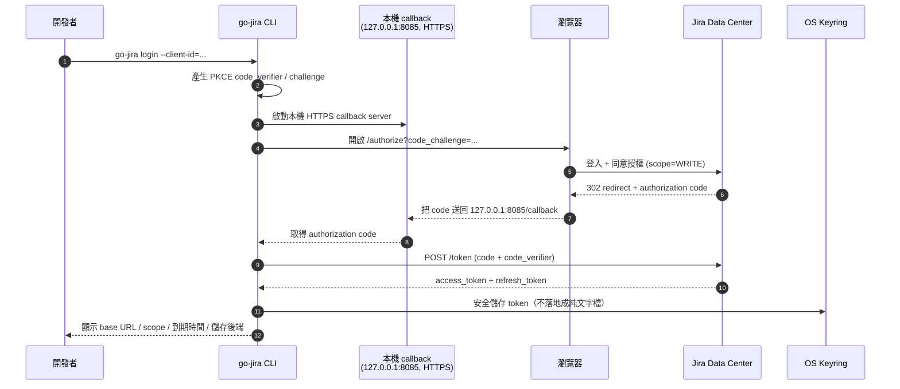
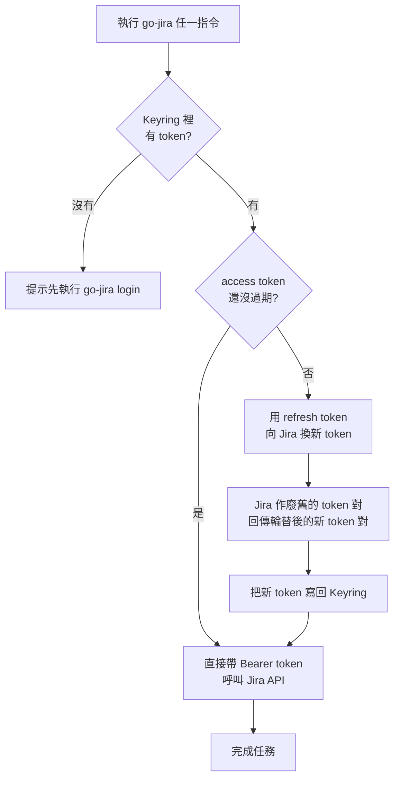
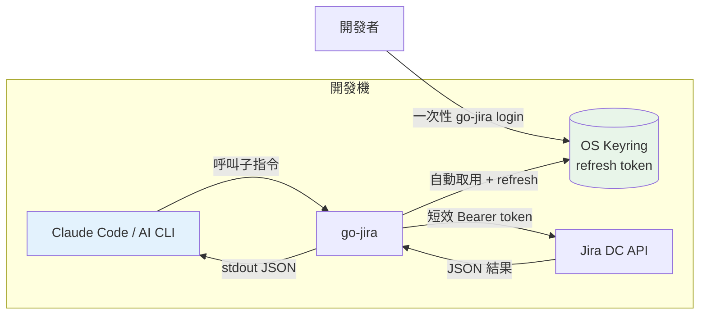
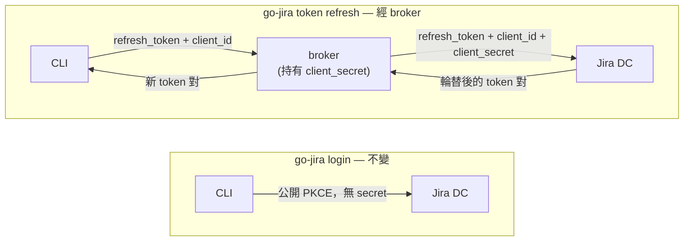

越來越多開發者習慣在自己的開發機上，讓 [Claude Code][claude] 這類 AI CLI 工具幫忙跑指令、查資料、收尾善後。把這條 AI 工作流接到 [Jira][jira] 之後，威力更大：AI 可以幫你查 issue、更新狀態、補留言、把 commit 訊息對應到工單。本文的主角 [go-jira][gojira]（<https://github.com/appleboy/go-jira>）正是為了這個場景打造的 Jira CLI。但這裡有一個一直被低估的安全議題——**CLI 要怎麼跟 Jira 認證？**

過去最常見的做法是 PAT（Personal Access Token）。它確實簡單，但放在 AI 開發機上有兩個很實際的風險：

1. **AI 可能不小心讀到它**：PAT 通常被塞在 `.env`、shell rc、或某個設定檔裡。當你讓 AI agent 在這台機器上「自由探索檔案」時，這顆等同你帳號權限的長期 token 很可能就被讀進 context、甚至被寫進某段輸出裡。
2. **以檔案形式長期存在 = 長期暴露面**：PAT 不會自動輪替，一旦外洩，在你手動撤銷之前它都是有效的。檔案被同步到雲端、被備份、被誤 commit 進 repo 的故事，大家都聽過。

所以「把 CLI 認證從 PAT 換成 Jira OAuth」這件事，最近被重新拉出來重視。這篇文章記錄 [go-jira][gojira] 新版本如何用 **OAuth Login + Refresh Token** 把 token 收進作業系統的 **Keyring**，讓開發者很方便地拿到、並且安全地保存 token，進而讓 Claude Code 等 AI CLI 能以更安全的方式跟 Jira 互動。

> 注意：go-jira 的 OAuth 只支援 **Jira Data Center**，不支援 Jira Cloud（兩者是不同的 OAuth 流程）。

[claude]: https://www.anthropic.com/claude
[jira]: https://www.atlassian.com/software/jira
[gojira]: https://github.com/appleboy/go-jira

<!--more-->

## 為什麼 OAuth 比 PAT 更適合 AI 開發機？

先把核心差異講清楚，這也是整個方案的設計動機：

| 面向             | PAT (`JIRA_TOKEN`)    | OAuth Login + Refresh Token                                              |
| ---------------- | --------------------- | ------------------------------------------------------------------------ |
| 儲存位置         | 純文字檔案 / 環境變數 | OS Keyring（macOS Keychain、Windows Credential Manager、Secret Service） |
| 生命週期         | 長期有效，需手動撤銷  | Access token 短效、到期前自動 refresh                                    |
| 被 AI 讀到的風險 | 高（檔案明擺著）      | 低（不落地成檔，access token 也只是短效）                                |
| 權限粒度         | 等同帳號              | 可用 scope 限制（READ / WRITE / ADMIN）                                  |
| 外洩後的傷害     | 直到撤銷前都有效      | Refresh token 每次使用即輪替，access token 很快過期                      |

重點不是「OAuth 不會外洩」，而是**外洩的東西不一樣**：

- Access token 是**短效**的，就算被讀到，過一陣子就失效。
- Refresh token 收在 **Keyring** 而不是純文字檔，AI agent 在檔案系統裡亂逛時讀不到它。
- Refresh token 採**輪替（rotation）**：Jira DC 每次 refresh 都會作廢舊的、發新的一顆，等於每次使用後舊的就死了。

換句話說，OAuth 把「一顆等同帳號、長期有效、放在檔案裡」的 PAT，換成「短效 access token + 收在 keyring 的輪替 refresh token」，正好對症下藥 AI 開發機的兩大風險。

## go-jira 支援的兩種 OAuth 流程

go-jira 走的是公開的 **PKCE client**，所以**不需要 client secret**，只需要一個 client ID。它提供兩種流程：

- **Authorization Code + PKCE**：給開發者在本機互動式登入用，就是本文的主角。
- **Refresh-token 注入**：給 CI/CD 等非互動式環境用（要自己處理 token 輪替的回寫）。

本文聚焦在開發者最常用的第一種：`go-jira login`。

## 流程一：OAuth Login（Authorization Code + PKCE）

第一次登入時，go-jira 會在本機開一個 callback server、把瀏覽器導去 Jira 授權頁、拿回授權碼、換成 token，最後把 token 收進 Keyring。整個流程如下：



對應的指令很單純：

```bash
export JIRA_BASE_URL="https://jira.example.com"
go-jira login --client-id="$JIRA_OAUTH_CLIENT_ID"
```

執行後瀏覽器會自動跳出 Jira 授權頁，按下同意、流程跑完，token 就進 Keyring 了。成功時 go-jira 會印出 base URL、scope、到期時間，以及實際使用的儲存後端。

幾個值得一提的設計細節：

- **預設走 HTTPS loopback callback**：redirect URI 預設是 `https://127.0.0.1:8085/callback`。很多 Jira DC 實例會拒絕 `http` 的 redirect URI（回 `invalid redirect_uri`），所以 go-jira 預設就用 HTTPS。
- **零設定的 HTTPS callback**：預設（`JIRA_OAUTH_CALLBACK_HTTPS=true`）會在登入當下於**記憶體內**簽一張 `127.0.0.1` 的自簽憑證，不用 `mkcert`、不用準備憑證檔，特別適合「整個團隊共用同一顆 binary」。代價是瀏覽器會跳一次性安全警告，在 `127.0.0.1` 上點「繼續前往」即可。想完全避免警告，可改用 `mkcert` 產生的憑證搭配 `--callback-cert` / `--callback-key`。
- **不需要 client secret**：PKCE 已經保護了授權流程，client ID 本身不是機密，Jira 管理員隨時可撤銷該 client。client ID 可以在 build 時內嵌、用 `JIRA_OAUTH_CLIENT_ID` 注入、或用 `--client-id` 傳入。

### Scope：用最小權限原則限制 AI 能做什麼

OAuth 還有一個 PAT 給不了的好處：**scope**。go-jira 預設請求 `WRITE`（足以做狀態轉換、留言、指派），但你可以用 `--scope` 收緊：

| Scope          | 授予的能力                                  |
| -------------- | ------------------------------------------- |
| `READ`         | 檢視專案 / issue / 個人資料                 |
| `WRITE`        | 建立、更新 issue、留言、狀態轉換（含 READ） |
| `ADMIN`        | 管理操作（含 READ、WRITE）                  |
| `SYSTEM_ADMIN` | 完整系統管理（含 ADMIN）                    |

如果你只是想讓 AI 幫你「查 issue、整理報告」，給 `READ` 就好——這樣即使 AI 失控，它也動不了你的工單。實際權限仍受限於使用者本身在 Jira 的權限。

## 流程二：Refresh Token + Keyring，讓「拿 token」變得無感

登入只做一次。之後每次跑 go-jira，它都會**自動**從 Keyring 取出 token，並在 access token 快過期時用 refresh token 換一顆新的——使用者完全無感。這就是「方便拿到 token」的關鍵：你不用每次都重新登入、也不用手動管理 token。



這裡有一個 Jira DC 的關鍵特性要特別記住：**每次 refresh，Jira DC 會同時作廢舊的 access token 與舊的 refresh token，並回傳一顆全新的 refresh token**。go-jira 在本機登入模式下會自動把新 token 寫回 Keyring，所以你完全不用管。（這個輪替特性在 CI/CD 模式下就變成你要自己處理的回寫工作，這也是為什麼自動化場景反而常建議用 PAT。）

### Token 儲存：優先用 Keyring，沒有才退回加密檔

go-jira 的 token 儲存後端有兩種：

| 後端    | 使用時機                                 | 說明                                                             |
| ------- | ---------------------------------------- | ---------------------------------------------------------------- |
| keyring | 預設，OS 有提供 keyring 時               | macOS Keychain、Linux Secret Service、Windows Credential Manager |
| file    | 退回方案（如無 D-Bus 的 headless Linux） | AES-256-GCM，金鑰用 PBKDF2-HMAC-SHA256（600k 次迭代）派生        |

預設就是 keyring，這正是讓 AI 讀不到 token 的關鍵——token 不再以純文字躺在檔案裡。只有在沒有 keyring 的環境（例如沒有 D-Bus 的 headless Linux）才會退回加密檔，而且檔案後端需要透過 `JIRA_MASTER_PASSWORD` 提供主密碼。token 以 `sha256(baseURL:clientID)` 為 key，因此多個 Jira 站台、多個 client 可以並存而不互相覆蓋。

### 常用的 token 管理指令

登入之後，這幾個指令足以涵蓋日常需求：

```bash
go-jira whoami                 # 我是誰 + 目前的認證模式
go-jira token status           # 到期時間、scope、儲存後端
go-jira token refresh          # 立刻強制 refresh 一次
go-jira token print --confirm  # 印出 access token（敏感，需確認）
go-jira logout                 # 刪掉此站台的 token
```

## 接上 Claude Code：AI 如何安全地操作 Jira

把上面兩段流程串起來，Claude Code 與 Jira 的互動就變成這樣：



關鍵在於**權責分離**：

- **開發者**只做一次 `go-jira login`，把 refresh token 收進 Keyring。
- **Claude Code** 從頭到尾只呼叫 `go-jira` 子指令（例如 `go-jira search`、`go-jira get`、`go-jira run`），它**從不接觸 refresh token**，也**讀不到** Keyring 裡的祕密。
- go-jira 自己在背後處理 access token 取用與 refresh，丟給 Jira 的永遠只是一顆**短效** Bearer token。

go-jira 的子指令本來就是為了 agent toolchain 設計的，這讓它特別適合被 AI 呼叫：

- **結果走 stdout、診斷走 stderr**：`go-jira search ... > issues.json` 只會抓到乾淨的 JSON，方便 AI 解析。
- **預設輸出機器可讀的 JSON**，也可以 `--output text` 給人看。
- **明確的 exit code**：`0` 成功、`2` 用法錯誤、`3` 認證/授權失敗、`4` 被 rate limit——AI 不用去 parse stderr 就能判斷該怎麼處理。
- **`--quiet` / `--timeout` / `--no-color`**：可以讓 AI 收到最乾淨的輸出、設定時間預算、避免 ANSI 色碼污染。
- **control-character 安全防護**：含控制字元的參數會在執行前被擋下（exit code `2`），避免 terminal escape 與 log injection。

舉個實際情境，你可以直接對 Claude Code 說：

> 「幫我把這次 commit 訊息裡提到的 issue 都查出來目前狀態，open 的就轉成 In Progress。」

Claude Code 會在背後組出類似這樣的指令：

```bash
# 查詢（JSON 進 stdout，AI 拿去解析）
go-jira search --jql "project = GAIA AND status = Open" --limit 10

# 取單一 issue 的摘要與狀態
go-jira get --key GAIA-123 --output text

# 把 commit 訊息裡的 issue key 對應到狀態轉換
git log -1 --format=%B | go-jira run --ref - --to-transition "In Progress"
```

整個過程中，AI 看到的只有 go-jira 印出來的 JSON 結果，那顆能代表你身分的 token 始終待在 Keyring 裡，access token 也只是短效憑證。即使你讓 AI 在這台機器上大膽探索，它也撈不到一顆能長期冒充你的祕密。

## 進階：Confidential Client 與 Token Refresh Broker

有些 Jira DC 的 OAuth application 被註冊成 **confidential client**，這種情況下 Jira DC 會**要求在 `grant_type=refresh_token` 這一步帶上 `client_secret`**（login 仍可不帶 secret，只有 refresh 會被拒）。但發佈出去的 binary 絕對不能內嵌這顆 secret——任何人對它跑一次 `strings` 就讀出來了。

go-jira 的解法是 **token refresh broker**：用**同一顆 binary**（`go-jira broker serve`）跑一個 server-side 的 broker，把 `client_secret` 收在伺服器端，只在 refresh 那一步幫 CLI 補上 secret 往上游打。**login 完全不變**，仍是直連的公開 PKCE 流程，只有 refresh 會繞經 broker：



這也正是本文開頭那張封面架構圖在講的事——**login 走上方那條弧線直連 Jira（broker 完全不參與）**，只有 refresh 才走下方經過 broker 的 ①②③④ 路徑，而 `client_secret` 自始至終只待在 broker 裡。

只要設定 `JIRA_TOKEN_BROKER_URL`，go-jira 就會把 refresh 那步導去 broker；不設定時行為跟現在完全一樣（直連 refresh），CLI **永遠不會**持有 secret。broker 自己不儲存任何 token，並會把同一顆 refresh token 的並發 refresh 合併成單一一次上游呼叫（因為 Jira DC 每次 refresh 都會作廢舊 token，naïve 的並發呼叫會 race）。實務上建議把它當成同一顆 binary、跑在內網限定、走 TLS 的 ingress 後面，把網路當成主要存取控制，再用選用的 caller bearer token（`JIRA_BROKER_TOKEN`）做縱深防禦。詳細的 k8s + Vault 部署、request coalescing、安全模型，可參考 go-jira 的 [`docs/oauth-usage.md`][oauth-doc]。

## 小結

把 CLI 對 Jira 的認證從 PAT 換成 OAuth，本質上是把「一顆等同帳號、長期有效、放在純文字檔裡」的祕密，換成「短效 access token + 收在 Keyring 的輪替 refresh token」。對於越來越多在自己的開發機上跑 AI agent 的開發者來說，這個轉換正好命中兩個痛點：

1. **AI 讀不到 token**：refresh token 收在 Keyring，不再以檔案形式暴露在 AI 的探索範圍內。
2. **外洩傷害大幅縮小**：access token 短效、refresh token 每次使用即輪替，還能用 scope 限制 AI 能動的範圍。

而 go-jira 把這一切包成幾個對人、對 AI 都友善的指令：開發者只要 `go-jira login` 一次，Claude Code 之後就能透過乾淨的 JSON 介面安全地操作 Jira，全程碰不到那顆代表你身分的祕密。

如果你的團隊正在把 AI CLI 接進日常開發流程，又還在用 PAT 跟 Jira 互動，是時候把 OAuth 這條路認真評估一下了。完整設定（在 Jira 註冊 client、scope、儲存後端、CI/CD 的 refresh token 輪替、broker）都在 [go-jira 的 OAuth 使用指南][oauth-doc]。

[oauth-doc]: https://github.com/appleboy/go-jira/blob/main/docs/oauth-usage.md
