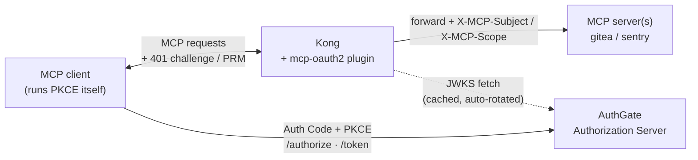
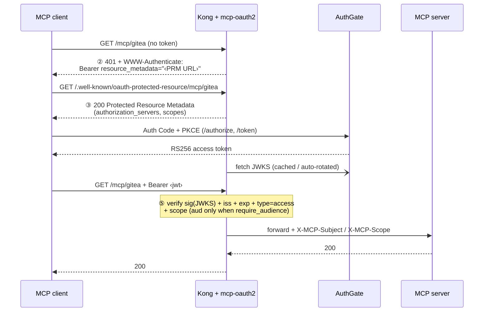

Once [MCP (Model Context Protocol)][mcp] exploded inside the company, almost every team ended up running an MCP server or two of their own: one fronting Gitea, one for Sentry, one for the internal Wiki, one for a database. They're genuinely useful — but there's a question everyone collectively ignored: **how do these MCP servers actually authenticate?**

The answer is usually unsettling: **each one collects its own PAT (Personal Access Token).** Every MCP server defines its own token, stuffs it into an environment variable, and validates it itself. So the company quietly accumulates a pile of static tokens — "long-lived, sitting in a file, equivalent to someone's account" — scattered across dev machines, CI, even pasted into Slack messages. This post is about using [Kong][kong] together with [AuthGate][authgate] to put **a single OAuth2 front door in front of every MCP server** and clean up that PAT sprawl in one move.

The full example code lives in [go-authgate/kong-mcp-oauth2][kong-mcp]. This post walks through the motivation, the architecture, the security considerations, and the actual verification steps.

[mcp]: https://modelcontextprotocol.io
[kong]: https://github.com/Kong/kong
[authgate]: https://github.com/go-authgate/authgate
[kong-mcp]: https://github.com/go-authgate/kong-mcp-oauth2

<!--more-->

## The pain: every MCP server collecting its own PAT — how bad is it really?

Let's lay the pain out plainly first, because that's the whole reason this solution exists. When every MCP server collects its own PAT, you step on all of these landmines at once:

### 1. A pile of long-lived static tokens, scattered everywhere

A PAT is, by nature, "a thing equivalent to account-level permissions, that never expires on its own, and exists as plain text." When you have 5 MCP servers and every developer has to request and keep a token for each, the company conjures up **dozens to hundreds of long-lived credentials** out of nowhere. These tokens:

- Sit in `.env`, shell rc files, and config files — synced to the cloud, backed up, occasionally committed into a repo by accident.
- Are impossible to track: nobody can say "who holds which ones" or "which ones are still alive."
- Stay valid after an employee leaves until you manually revoke each one.

### 2. AI dev machines amplify the exposure surface

MCP's whole use case is being consumed by AI agents like [Claude Code][claude]. The problem: you let an AI agent "freely explore files and run commands" on the dev machine — and those MCP PATs are sitting right there in the filesystem. **A long-lived token equivalent to your account permissions can be read straight into context, or even written into some piece of output.** A PAT's longevity gets brutally amplified into a long-lived exposure surface on an AI dev machine.

### 3. Auth logic copied N times, with uneven security

"Collect its own PAT" means every MCP server has to implement its own validation logic. Whether each one compares correctly, guards against timing attacks, blocks expired tokens, syncs a revocation list… all of it becomes N independent implementations. **Your security equals the weakest MCP server** — and you have no idea which one that is.

### 4. No centralized audit or access control

Another cost of scattered PATs: you can't answer "who accessed which MCP, when, with what permissions?" Each MCP server logs in a different format with different identity fields, making a complete access map nearly impossible to assemble. For teams that need to satisfy ISO 27001, SOC 2, or just answer "who touched production MCP?", that's a hard problem.

> The pain in one line: **every MCP server collecting its own PAT = a pile of long-lived static credentials × N uneven validation implementations × zero centralized audit.** The bigger you scale, the more it hurts — and AI dev machines multiply every factor by an amplification coefficient.

## The solution: one OAuth2 front door covering every MCP

These MCP servers already sit behind [Kong][kong] (almost every internal API gateway is a Kong). So the solution is natural: **attach one plugin to Kong so that every MCP server stops accepting hand-written PATs and instead uniformly requires an AuthGate-issued OAuth2 access token.**

The plugin in the example is called `mcp-oauth2`, written with the [Kong go-pdk][go-pdk]. What it does boils down to one sentence:

> Kong verifies the access token offline, locally, with **RS256 + JWKS** — and only after it passes does it forward the request to the MCP server behind it, adding two headers, `X-MCP-Subject` / `X-MCP-Scope`, to tell the backend "who this is and what permissions they have."

Mapped against the pain points above, this solution treats each symptom directly:

| Pain point               | Each collects its own PAT       | Kong + AuthGate unified OAuth2 front door                                |
| ------------------------ | ------------------------------- | ------------------------------------------------------------------------ |
| Credential lifecycle     | Long-lived, manual revocation   | Short-lived access token, auto-expires                                   |
| Credential storage       | Plain-text files / env vars     | Obtained dynamically via OAuth, no long-lived file                       |
| Validation logic         | One implementation per MCP      | Centralized in the Kong plugin, one config for all                       |
| Identity / scope passing | Custom per vendor               | Uniform `X-MCP-Subject` / `X-MCP-Scope` to backend                       |
| Audit                    | Scattered, inconsistent formats | Identity centralized in AuthGate, access via Kong                        |
| Signing-key exposure     | token = account                 | Gateway only ever sees the public key; private key never leaves AuthGate |

The point isn't "OAuth2 can't leak" — it's that **what leaks is different**: an access token is short-lived, so even if an AI reads it, it expires before long; and the signing private key stays inside AuthGate forever, where Kong can't even touch it.

[go-pdk]: https://github.com/Kong/go-pdk
[claude]: https://www.anthropic.com/claude

## Architecture and handshake

Look at the overall architecture first. Note one key design choice: **Kong does not run the OAuth flow.** It only does two things — _advertise where the flow is_, and _verify the token that comes back_. The actual Auth Code + PKCE is run by the MCP client itself against AuthGate.



This design builds on the 2025-06 MCP authorization spec, with [RFC 9728 Protected Resource Metadata][rfc9728] and [RFC 6750][rfc6750] bearer tokens underneath. The full handshake:



Spelling out the four steps:

| Step | Who               | What happens                                                                                                |
| ---- | ----------------- | ----------------------------------------------------------------------------------------------------------- |
| ②    | Kong → client     | Request with no/invalid token → `401` + `WWW-Authenticate: Bearer resource_metadata="<PRM URL>"`            |
| ③    | Kong → client     | Client fetches `<PRM URL>` → plugin serves Protected Resource Metadata (which AuthGate, which scopes)       |
| —    | client ↔ AuthGate | Client discovers AuthGate from the metadata and runs **Auth Code + PKCE** to get an access token            |
| ⑤    | Kong              | Client retries with `Bearer <jwt>` → plugin verifies **sig + iss + exp + `type=access` + scope** → forwards |

One plugin config covers every MCP server at once — attach it to each service with a different `resource_path`.

[rfc9728]: https://datatracker.ietf.org/doc/html/rfc9728
[rfc6750]: https://datatracker.ietf.org/doc/html/rfc6750

## Why RS256 + JWKS (and not HS256)

This is the security core of the whole solution, worth its own section.

- **No shared secret on the gateway.** With HS256, the gateway would have to hold AuthGate's signing secret — putting a forge-anything key on the edge. With RS256 + JWKS, Kong only ever sees the **public** key; the private key never leaves AuthGate.
- **Zero-touch key rotation.** Rotate keys in AuthGate's JWKS and Kong picks them up automatically (background refresh) — no Kong config change, no restart.
- **Alg-confusion is blocked.** The plugin pins accepted algorithms to `RS256/RS384/RS512` and refuses all `HS*`. This defeats the classic forgery where an attacker signs an HS256 token using the RSA **public** key as the HMAC secret.

The verification engine is [`MicahParks/keyfunc`][keyfunc], which handles JWKS fetch, in-memory cache, background rotation, and rate-limited refetch on an unknown `kid` — exactly the parts that are easy to get wrong by hand in Lua.

[keyfunc]: https://github.com/MicahParks/keyfunc

## Hands-on

### 1. Build the plugin

go-pdk plugins are ordinary executables that speak the pluginserver RPC protocol — no cgo, no `.so`. Run it in the repo root:

```bash
git clone https://github.com/go-authgate/kong-mcp-oauth2.git
cd kong-mcp-oauth2
go mod tidy && go build -o mcp-oauth2 .
```

### 2. Wire it into Kong

Register the plugin and point the pluginserver at the binary (env vars, shown in the example's `docker-compose.yml`):

```bash
KONG_PLUGINS=bundled,mcp-oauth2
KONG_PLUGINSERVER_NAMES=mcp-oauth2
KONG_PLUGINSERVER_MCP_OAUTH2_START_CMD=/usr/local/bin/mcp-oauth2
KONG_PLUGINSERVER_MCP_OAUTH2_QUERY_CMD=/usr/local/bin/mcp-oauth2 -dump
```

### 3. Configuration reference

One plugin instance per MCP resource; the key fields are below (see the example's `kong.yml` for the full set):

| Field              | Required | Description                                                                                                                    |
| ------------------ | -------- | ------------------------------------------------------------------------------------------------------------------------------ |
| `issuer`           | ✅       | AuthGate base URL. Must equal the token's `iss` claim byte-for-byte.                                                           |
| `gateway_origin`   | ✅       | Externally reachable Kong origin, e.g. `https://gw.example.com`. Used to build the PRM URL.                                    |
| `resource_path`    | ✅       | This resource's path, e.g. `/mcp/gitea`.                                                                                       |
| `jwks_uri`         |          | AuthGate JWKS endpoint. Leave empty to auto-discover it from the issuer's AS metadata (RFC 8414, cached 1h).                   |
| `required_scopes`  |          | All listed scopes must be present in the token's `scope`, else `403 insufficient_scope`.                                       |
| `require_audience` |          | Enforce `aud` only when `true`. **All shipped configs enable it** — used to isolate resources and block cross-resource replay. |
| `leeway_seconds`   |          | Clock-skew tolerance for `exp`/`nbf`. Recommend `60`.                                                                          |

Only tokens with `type=access` are accepted; AuthGate refresh tokens are rejected with `401 invalid_token`.

> **Routing gotcha.** Each Kong route must match **both** `resource_path` and its PRM path (`/.well-known/oauth-protected-resource` + `resource_path`). Otherwise Kong has no route to hand the client's step ③ lookup to and the metadata never gets served. See the `paths:` lists in `kong.yml`.
>
> **Cross-resource replay warning.** With `require_audience: false`, `aud` is not checked, so the only thing distinguishing one MCP resource from another is `scope`. A token minted with multiple scopes is accepted at every resource whose scope it carries — and because the raw bearer is forwarded upstream unchanged, a backend could replay it against a sibling resource. This is exactly why every shipped config enables `require_audience`; only turn it off temporarily while debugging token issuance, and turn it back on afterward.

### 4. Run the demo stack and the validation matrix

```bash
docker compose up --build
```

This starts DB-less Kong (proxy on `:8000`) with two stub MCP upstreams. Replace `$GW` with `http://localhost:8000` (or your `gateway_origin`) and exercise the handshake:

| #   | Test                        | Command                                                              | Expect                                                     |
| --- | --------------------------- | -------------------------------------------------------------------- | ---------------------------------------------------------- |
| 1   | Unauthenticated → challenge | `curl -i $GW/mcp/gitea`                                              | `401` + `WWW-Authenticate: Bearer resource_metadata="…"`   |
| 2   | PRM document served         | `curl -s $GW/.well-known/oauth-protected-resource/mcp/gitea`         | JSON with `resource`, `authorization_servers`, `scopes`    |
| 3   | Valid token → forwarded     | `curl -i $GW/mcp/gitea -H "Authorization: Bearer $GOOD"`             | `200` from the MCP upstream                                |
| 4   | Expired token               | `curl -i $GW/mcp/gitea -H "Authorization: Bearer $EXPIRED"`          | `401 invalid_token`                                        |
| 5a  | Missing scope               | token without `required_scopes`                                      | `403 insufficient_scope`                                   |
| 5b  | **Cross-audience**          | token issued for a different resource, with `require_audience: true` | `401 invalid_token` (aud mismatch)                         |
| 5c  | **HS256 forgery**           | forge an HS256 token using the RSA public key as the HMAC secret     | `401 invalid_token` — **must be rejected** (alg confusion) |

Rows **5b** and **5c** are the security-critical ones — run them before going live. Rows 1–2 work against the stub demo as shipped; rows 3 onward need real tokens, so point `issuer` / `jwks_uri` at your real AuthGate first.

## AuthGate-side preflight

Before this works end-to-end, confirm a few things on AuthGate (decode a real **access token**, not just the `id_token`):

1. **JWKS resolves.** `GET <issuer>/.well-known/openid-configuration` → its `jwks_uri` returns a non-empty `keys` array.
2. **Access tokens are RS256.** Decode an actual access token; its header `alg` is `RS256` (not `HS256`) and its `kid` matches a key in the JWKS. AuthGate's default is often `JWT_SECRET` (HS256) — make sure you've moved **access tokens** (not only `id_token`) to asymmetric signing.
3. **Issuer matches.** The token's `iss` equals the plugin's `issuer` config, byte-for-byte (mind the trailing slash).
4. **`aud` binds to the resource.** The shipped configs enforce `aud`, so every token must be requested with [RFC 8707][rfc8707] resource binding: add `<gateway_origin + resource_path>` to the OAuth client's `allowed_resources` in AuthGate, then send `resource=<that URL>` on the token request.

[rfc8707]: https://datatracker.ietf.org/doc/html/rfc8707

## Operational notes

Offline validation is fast and cheap, but keep a few operational angles in mind:

- **The JWKS endpoint must be highly available.** If the initial fetch fails, token requests get `503 temporarily_unavailable` (not `401`, so clients don't re-run OAuth) and it's retried on the next request. Fetch waits are capped at 10s and run under a per-URI lock, so a slow AuthGate can't stall traffic for other resources.
- **Overlap keys during rotation.** Keep the old and new keys in the JWKS together for a window so in-flight tokens aren't killed mid-rotation.
- **Keep access-token TTLs short.** Like any offline validation, a revoked token stays valid until its `exp` — minutes, not hours.
- **The bearer token is forwarded upstream unchanged.** Kong adds `X-MCP-Subject` / `X-MCP-Scope` but does **not** strip or exchange the `Authorization` header, so each MCP backend receives a live, replayable token. Trust your MCP backends accordingly, and keep `require_audience` enabled so a backend can't reuse a token against a sibling resource.
- **Browser-based MCP clients need CORS.** A CORS preflight (`OPTIONS`, no `Authorization`) is answered with the `401` challenge; put Kong's `cors` plugin on the route if web-hosted clients must reach the gateway.

## Wrap-up

Back to the original pain: every MCP server collecting its own PAT piles up a heap of long-lived static credentials, N uneven validation implementations, and zero centralized audit inside the company — and AI dev machines amplify each of those.

This Kong + AuthGate solution cleans them all up in one move:

- **One OAuth2 front door covering every MCP**, with a single plugin config and a different `resource_path` per resource.
- **RS256 + JWKS local offline validation**, where the gateway only ever sees the public key, the private key stays inside AuthGate, and alg-confusion forgeries are blocked along the way.
- **Short-lived access tokens replacing long-lived PATs**, downgrading what leaks from "a long-lived credential equivalent to an account" to "a short-lived token that expires before long."
- **Identity and scope passed to the backend uniformly via headers**, with audit centralized in AuthGate and Kong.

If your company's MCP servers are still each collecting their own PATs, this is a low-cost, standardized upgrade path that clearly improves your security posture. The full example and config files are in [go-authgate/kong-mcp-oauth2][kong-mcp] — clone it and `docker compose up` to experience the whole handshake.
