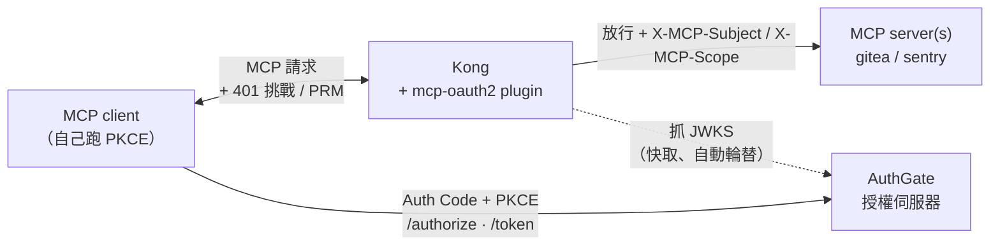
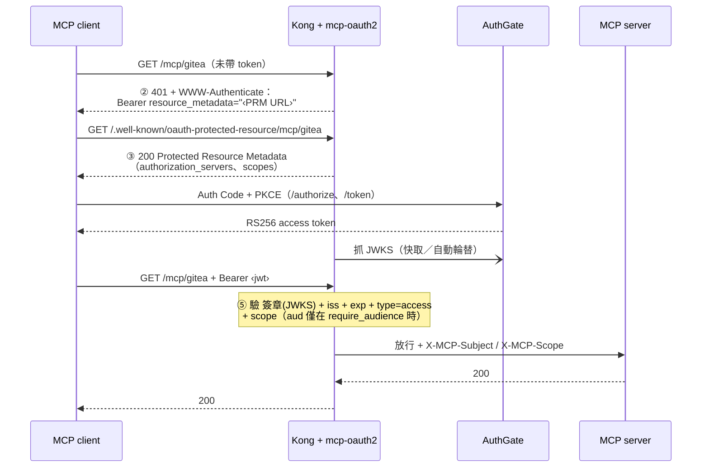

[MCP（Model Context Protocol）][mcp] 在公司內部爆量之後，幾乎每個團隊都自己跑了一兩個 MCP Server：接 Gitea 的、接 Sentry 的、接內部 Wiki 的、接資料庫的。它們很好用，但有一個被集體忽略的問題——**這些 MCP Server 到底是怎麼認證的？**

答案多半令人不安：**各自收各自的 PAT（Personal Access Token）**。每個 MCP Server 自己定義一套 token、自己塞進環境變數、自己驗。於是公司內部出現了一堆「長期有效、放在檔案裡、等同某個帳號權限」的靜態 token，散落在開發機、CI、甚至貼在 Slack 訊息裡。這篇文章要談的，就是怎麼用 [Kong][kong] 搭配 [AuthGate][authgate]，在**所有 MCP Server 前面架起單一的 OAuth2 入口**，把這堆 PAT 一次收掉。

完整的範例程式碼在 [go-authgate/kong-mcp-oauth2][kong-mcp]，本文會帶你走過設計動機、架構、安全考量到實際驗證。

[mcp]: https://modelcontextprotocol.io
[kong]: https://github.com/Kong/kong
[authgate]: https://github.com/go-authgate/authgate
[kong-mcp]: https://github.com/go-authgate/kong-mcp-oauth2

<!--more-->

## 痛點：MCP Server 各自收 PAT，到底有多痛？

先把痛點攤開講清楚，這才是整個方案存在的理由。當每個 MCP Server 都自己收 PAT 時，你實際上同時踩中了下面這幾顆雷：

### 1. 一堆長期有效的靜態 token，散落在到處

PAT 的本質是「一顆等同帳號權限、不會自動過期、以純文字形式存在」的東西。當你有 5 個 MCP Server，每個開發者都得各自申請、各自保管它們的 token，公司內部就憑空多了**幾十上百顆長期憑證**。這些 token：

- 躺在 `.env`、shell rc、設定檔裡，被同步到雲端、被備份、偶爾還被誤 commit 進 repo。
- 沒有人說得清楚現在「誰手上有哪幾顆」、「哪一顆還活著」。
- 離職員工帶走的那幾顆，除非你手動逐一撤銷，否則一直有效。

### 2. AI 開發機讓暴露面被放大

MCP 的使用情境本來就是給 [Claude Code][claude] 這類 AI Agent 用的。問題是，你會讓 AI Agent 在開發機上「自由探索檔案、跑指令」——而那些 MCP 的 PAT 正好就攤在檔案系統裡。**一顆等同你帳號權限的長期 token，很可能就這樣被讀進 context、甚至被寫進某段輸出。** PAT 的長期性，在 AI 開發機的場景下被狠狠放大成長期暴露面。

### 3. 認證邏輯被複製 N 份，安全性參差不齊

「自己收 PAT」意味著每個 MCP Server 都得自己實作一套驗證邏輯。誰有沒有好好比對、有沒有防 timing attack、token 過期了會不會擋、撤銷清單怎麼同步……這些都變成 N 份各自為政的實作。**安全性等於最弱的那一個 MCP Server**，而你根本不知道是哪一個。

### 4. 沒有集中的稽核與權限控管

PAT 散落各處的另一個代價是：你無法回答「誰在什麼時候、用什麼權限、存取了哪個 MCP？」這種問題。每個 MCP Server 的 log 格式不同、身份欄位不同，要拼出一張完整的存取地圖幾乎不可能。對需要應付 ISO 27001、SOC 2，或單純被問「誰動了 production MCP？」的團隊來說，這是硬傷。

> 一句話總結痛點：**MCP Server 各自收 PAT = 一堆長期靜態憑證 × N 份參差不齊的驗證邏輯 × 零集中稽核。** 規模越大越痛，而 AI 開發機把每一項都再乘上一個放大係數。

## 解法概觀：一道 OAuth2 入口，罩住所有 MCP

這些 MCP Server 其實本來就掛在 [Kong][kong] 後面（企業內部 API gateway 幾乎都有一台 Kong）。所以解法很自然：**在 Kong 上掛一個 plugin，讓所有 MCP Server 不再接受各自手填的 PAT，改成統一要求 AuthGate 簽發的 OAuth2 access token。**

範例裡的這個 plugin 叫 `mcp-oauth2`，用 [Kong go-pdk][go-pdk] 寫成。它做的事情可以濃縮成一句話：

> Kong 在本地用 **RS256 + JWKS** 離線驗證 access token，驗過了才把請求往後面的 MCP Server 送，並補上 `X-MCP-Subject` / `X-MCP-Scope` 兩個 header 告訴後端「這是誰、有什麼權限」。

對比前面的痛點，這套解法逐項對症下藥：

| 痛點           | 各自收 PAT            | Kong + AuthGate 統一 OAuth2 入口                |
| -------------- | --------------------- | ----------------------------------------------- |
| 憑證生命週期   | 長期有效，需手動撤銷  | Access token 短效，到期自動失效                 |
| 憑證存放       | 純文字檔案 / 環境變數 | 由 client 走 OAuth 流程動態取得，不落地成長期檔 |
| 驗證邏輯       | 每個 MCP 各寫一份     | 集中在 Kong plugin，一套設定罩住所有 MCP        |
| 身份與權限傳遞 | 各家自訂              | 統一以 `X-MCP-Subject` / `X-MCP-Scope` 傳給後端 |
| 稽核           | 散落各處、格式不一    | 身份集中在 AuthGate，存取集中過 Kong            |
| 金鑰外洩風險   | token = 帳號          | Gateway 只摸得到公鑰，私鑰永遠不出 AuthGate     |

重點不是「OAuth2 不會外洩」，而是**外洩的東西不一樣**：access token 是短效的，就算被 AI 讀到，過一陣子就失效；而簽章私鑰永遠待在 AuthGate，Kong 連碰都碰不到。

[go-pdk]: https://github.com/Kong/go-pdk
[claude]: https://www.anthropic.com/claude

## 架構與握手流程

先看整體架構。注意一個關鍵設計：**Kong 不跑 OAuth 流程**。它只負責兩件事——_告訴 client 流程在哪裡_，以及**驗證跑完流程後拿回來的 token**。真正的 Auth Code + PKCE 是 MCP client 自己對 AuthGate 跑的。



這套設計建構在 2025-06 版 MCP 授權規範之上，底層是 [RFC 9728 Protected Resource Metadata][rfc9728] 與 [RFC 6750][rfc6750] bearer token。完整握手如下：



用文字把這四步講白：

| 步驟 | 由誰              | 發生什麼事                                                                                           |
| ---- | ----------------- | ---------------------------------------------------------------------------------------------------- |
| ②    | Kong → client     | 沒帶 / 帶錯 token 的請求 → `401` + `WWW-Authenticate: Bearer resource_metadata="<PRM URL>"`          |
| ③    | Kong → client     | client 去抓 `<PRM URL>` → plugin 回傳 Protected Resource Metadata（要用哪個 AuthGate、要哪些 scope） |
| —    | client ↔ AuthGate | client 從 metadata 找到 AuthGate，自己跑 **Auth Code + PKCE** 換 access token                        |
| ⑤    | Kong              | client 帶 `Bearer <jwt>` 重試 → plugin 驗 **簽章 + iss + exp + `type=access` + scope** → 放行往後送  |

一套 plugin 設定就能同時罩住所有 MCP Server——對每個 service 掛上去、各自填不同的 `resource_path` 即可。

[rfc9728]: https://datatracker.ietf.org/doc/html/rfc9728
[rfc6750]: https://datatracker.ietf.org/doc/html/rfc6750

## 為什麼選 RS256 + JWKS（而不是 HS256）

這是整個方案的安全核心，值得單獨講。

- **gateway 上不放共享密鑰。** 用 HS256 的話，gateway 得持有 AuthGate 的簽章密鑰——等於把一把「能偽造任何 token」的鑰匙擺在最外緣。RS256 + JWKS 之下，Kong 永遠只摸得到**公鑰**，私鑰從不離開 AuthGate。
- **金鑰輪替零接觸。** 在 AuthGate 的 JWKS 換金鑰，Kong 會自動接手（背景輪替），不用改 Kong 設定、不用重啟。
- **擋掉 alg-confusion 攻擊。** plugin 把接受的演算法鎖死在 `RS256/RS384/RS512`、拒絕所有 `HS*`。這擋掉了最經典的偽造手法：攻擊者拿 RSA **公鑰**當 HMAC 金鑰去簽一顆 HS256 token。

驗證引擎用的是 [`MicahParks/keyfunc`][keyfunc]，它把 JWKS 的抓取、記憶體快取、背景輪替、未知 `kid` 的限流補抓全包好了——這些正是用 Lua 自己刻最容易出錯的部分。

[keyfunc]: https://github.com/MicahParks/keyfunc

## 動手做

### 1. 編譯 plugin

go-pdk plugin 是會講 pluginserver RPC 協定的一般執行檔——不用 cgo、也不是 `.so`。在 repo 根目錄跑：

```bash
git clone https://github.com/go-authgate/kong-mcp-oauth2.git
cd kong-mcp-oauth2
go mod tidy && go build -o mcp-oauth2 .
```

### 2. 接進 Kong

註冊 plugin，並把 pluginserver 指向 binary（環境變數，見範例的 `docker-compose.yml`）：

```bash
KONG_PLUGINS=bundled,mcp-oauth2
KONG_PLUGINSERVER_NAMES=mcp-oauth2
KONG_PLUGINSERVER_MCP_OAUTH2_START_CMD=/usr/local/bin/mcp-oauth2
KONG_PLUGINSERVER_MCP_OAUTH2_QUERY_CMD=/usr/local/bin/mcp-oauth2 -dump
```

### 3. 設定參數

每個 MCP 資源對應一個 plugin 實例，重點參數如下（完整見範例的 `kong.yml`）：

| 參數               | 必填 | 說明                                                                                          |
| ------------------ | ---- | --------------------------------------------------------------------------------------------- |
| `issuer`           | ✅   | AuthGate base URL，必須與 token 的 `iss` claim 逐字元相符。                                   |
| `gateway_origin`   | ✅   | 對外可達的 Kong origin，例如 `https://gw.example.com`，用來組出 PRM URL。                     |
| `resource_path`    | ✅   | 此資源的路徑，例如 `/mcp/gitea`。                                                             |
| `jwks_uri`         |      | AuthGate JWKS endpoint。留空則由 issuer 的 AS metadata 自動發現（RFC 8414，快取 1 小時）。    |
| `required_scopes`  |      | token 的 `scope` 必須包含全部所列項目，否則 `403 insufficient_scope`。                        |
| `require_audience` |      | 設 `true` 才強制檢查 `aud`。**所有隨附設定檔都已開啟**，用來區隔不同 MCP 資源、防跨資源重放。 |
| `leeway_seconds`   |      | `exp`/`nbf` 的時鐘偏移容忍秒數，建議 `60`。                                                   |

只接受 `type=access` 的 token；AuthGate 的 refresh token 會被回 `401 invalid_token` 拒絕。

> **路由陷阱。** 每條 Kong route 必須**同時**匹配 `resource_path` 與其 PRM 路徑（`/.well-known/oauth-protected-resource` + `resource_path`）。否則 client 在步驟 ③ 來抓 metadata 時 Kong 沒有對應 route 可交給 plugin，metadata 就回不出來。請看 `kong.yml` 裡每條 route 的 `paths:` 清單。
>
> **跨資源重放警告。** 在 `require_audience: false` 下不會檢查 `aud`，區分不同 MCP 資源的就只剩 `scope`。一顆帶多個 scope 的 token 會在每個對應資源上都被接受；又因為原始 bearer 會原封不動往後送，後端可能拿去重放到另一個資源。這正是所有隨附設定檔都開啟 `require_audience` 的原因——只有在除錯 token 簽發時才暫時關掉，事後務必改回來。

### 4. 啟動示範環境並跑驗證矩陣

```bash
docker compose up --build
```

這會啟動 DB-less 的 Kong（proxy 在 `:8000`）加兩個假的 MCP upstream。把 `$GW` 換成 `http://localhost:8000`（或你的 `gateway_origin`），實際跑一遍握手：

| #   | 測試項目          | 指令                                                         | 預期結果                                                 |
| --- | ----------------- | ------------------------------------------------------------ | -------------------------------------------------------- |
| 1   | 未認證 → 挑戰     | `curl -i $GW/mcp/gitea`                                      | `401` + `WWW-Authenticate: Bearer resource_metadata="…"` |
| 2   | 回傳 PRM 文件     | `curl -s $GW/.well-known/oauth-protected-resource/mcp/gitea` | JSON 含 `resource`、`authorization_servers`、`scopes`    |
| 3   | 有效 token → 放行 | `curl -i $GW/mcp/gitea -H "Authorization: Bearer $GOOD"`     | MCP upstream 回 `200`                                    |
| 4   | 過期 token        | `curl -i $GW/mcp/gitea -H "Authorization: Bearer $EXPIRED"`  | `401 invalid_token`                                      |
| 5a  | 缺少 scope        | 沒有 `required_scopes` 的 token                              | `403 insufficient_scope`                                 |
| 5b  | **跨 audience**   | 為另一個資源簽發的 token，且 `require_audience: true`        | `401 invalid_token`（aud 不符）                          |
| 5c  | **HS256 偽造**    | 拿 RSA 公鑰當 HMAC 金鑰偽造一顆 HS256 token                  | `401 invalid_token` — **必須被擋**（alg confusion）      |

第 **5b** 與 **5c** 列是安全關鍵——上線前務必跑過。第 1–2 列用內建 stub demo 就能跑；第 3 列以後需要真的 token，要先把 `issuer` / `jwks_uri` 指向你們真正的 AuthGate。

## AuthGate 端動手前確認

要端到端跑通之前，先在 AuthGate 確認這幾件事（解一顆實際的 **access token**，不是只看 `id_token`）：

1. **JWKS 取得出 keys。** `GET <issuer>/.well-known/openid-configuration` → 其 `jwks_uri` 回傳非空的 `keys` 陣列。
2. **access token 是 RS256 簽。** 解一顆實際的 access token，header 的 `alg` 是 `RS256`（不是 `HS256`），且 `kid` 對得到 JWKS 裡某把 key。AuthGate 預設常是 `JWT_SECRET`（HS256）——請確認你們真的已經把 **access token**（不只 `id_token`）切到非對稱簽。
3. **iss 一致。** token 的 `iss` 與 plugin 設定的 `issuer` 逐字元相符（注意結尾斜線）。
4. **`aud` 綁定資源。** 隨附設定都強制檢查 `aud`，所以每顆 token 都要用 [RFC 8707][rfc8707] resource binding 取得：先在 AuthGate 把 `<gateway_origin + resource_path>` 加進該 OAuth client 的 `allowed_resources`，再於 token 請求帶 `resource=<該 URL>`。

[rfc8707]: https://datatracker.ietf.org/doc/html/rfc8707

## 維運注意事項

離線驗證很快、很省，但有幾個運維面向務必放在心上：

- **JWKS endpoint 要高可用。** 初次抓取失敗時，帶 token 的請求會回 `503 temporarily_unavailable`（而不是 `401`，避免 client 誤以為要重跑 OAuth），下一個請求會重試。抓取等待上限 10 秒，且在 per-URI 鎖下進行，慢的 AuthGate 不會卡住其他資源的流量。
- **輪替時讓新舊 key 並存。** 讓舊 key 與新 key 在 JWKS 並存一段 overlap 時間，在途 token 才不會被誤殺。
- **access token TTL 設短。** 跟所有離線驗證一樣，被撤銷的 token 會一直有效到它的 `exp`——以分鐘計、不要以小時計。
- **bearer token 會原封不動往後送。** Kong 會加上 `X-MCP-Subject` / `X-MCP-Scope`，但**不會**移除或換掉 `Authorization` header，所以每個 MCP 後端都會拿到一顆可重放的有效 token。請據此信任你的 MCP 後端，並維持 `require_audience` 開啟，讓後端無法拿 token 去重放到另一個資源。
- **瀏覽器端的 MCP client 需要 CORS。** CORS preflight（`OPTIONS`、不帶 `Authorization`）會被回 `401` 挑戰；若有 web client 要直連 gateway，請在 route 上掛 Kong 的 `cors` plugin。

## 小結

回到最初的痛點：MCP Server 各自收 PAT，等於在公司內部堆出一堆長期靜態憑證、N 份參差不齊的驗證邏輯、以及零集中稽核——而 AI 開發機把每一項都放大。

這套 Kong + AuthGate 的方案把這些一次收掉：

- **一道 OAuth2 入口罩住所有 MCP**，一套 plugin 設定、每個資源換個 `resource_path` 即可。
- **RS256 + JWKS 本地離線驗證**，gateway 只摸得到公鑰、私鑰永遠待在 AuthGate，還順手擋掉 alg-confusion 偽造。
- **短效 access token 取代長期 PAT**，外洩的東西從「等同帳號的長期憑證」降級成「過一陣子就失效的短效 token」。
- **身份與權限統一以 header 傳給後端**，稽核集中在 AuthGate 與 Kong。

如果你們公司內部的 MCP 還在各收各的 PAT，這會是一個低成本、標準化、又明顯改善安全姿態的升級路徑。完整範例與設定檔都在 [go-authgate/kong-mcp-oauth2][kong-mcp]，直接 clone 下來 `docker compose up` 就能體驗整段握手。
