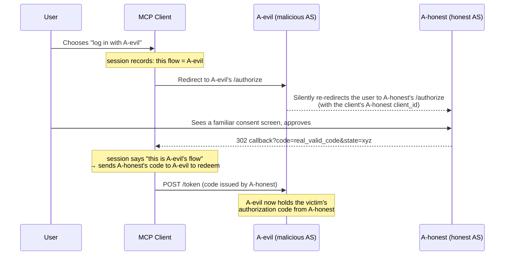

The [MCP (Model Context Protocol)][mcp] [Authorization spec][mcp-auth] rides on standard OAuth 2.1: the MCP Server is the Resource Server, the MCP Client is the OAuth Client, and behind them sits one or more Authorization Servers (AS). The most elegant — and most easily overlooked — property of this design is that **a single MCP Client can talk to multiple authorization servers at once.** The spec says it in black and white: the `authorization_servers` field of the Protected Resource Metadata "can define multiple authorization servers," and "the responsibility for selecting which authorization server to use lies with the MCP client."

Once "one client, many ASes" becomes the norm, an attack that barely exists in the single-AS world surfaces: the **authorization server mix-up attack**. This post walks through how the attack works, why the IETF wrote a dedicated RFC — [RFC 9207][rfc9207] — just for it, and how to implement it in an OAuth 2.0 authorization server (including an issuer-inconsistency bug the implementation surfaced).

[mcp]: https://modelcontextprotocol.io
[mcp-auth]: https://modelcontextprotocol.io/specification/2025-11-25/basic/authorization
[rfc9207]: https://www.rfc-editor.org/info/rfc9207/

<!--more-->

## 1. The attack: what exactly gets "mixed up"?

First, the precondition — this attack **only works when a client trusts two or more ASes.** A traditional web app bound to a single AS is completely immune. But multi-AS is the daily reality of MCP: one Claude Code instance might have an MCP server for Gitea, one for Jira, and one for an internal database all connected at once, and the authorization servers behind them are not necessarily the same host.

### The root cause: authorization responses are "unsigned"

Before RFC 9207, after a successful Authorization Code Flow the AS redirected the user back to the client like this:

```txt
https://client.example/callback?code=abc123&state=xyz
```

Notice that this response contains **no field indicating who issued it.** `code` is an opaque string; `state` is a random value the client generated itself. When the client receives it, the only way it can decide which token endpoint to redeem the code at is by consulting what it stored in its session: "which AS did I start this flow with?" **And that decision can be manipulated by an attacker.**

### The attack flow

Say there's a malicious (or compromised) authorization server `A-evil`, an honest one `A-honest`, and a victim client that trusts both:



The critical break is the second-to-last step: **at the moment the client receives the code, it cannot tell whether the code's real origin is A-honest or the A-evil it believes it is.** So it sends A-honest's valid authorization code to A-evil's token endpoint. For a confidential client, this hands the attacker the victim's authorization code from A-honest (which can be further exchanged for an access token) on a silver platter.

This is not theoretical. The IETF OAuth working group standardized the `iss` solution as [RFC 9207][rfc9207] in 2022 precisely because this class of attack is practically feasible in multi-AS scenarios.

## 2. Why does RFC 9207 exist?

You might ask: don't we already have `state` and PKCE? Why a new RFC? Because they defend against **different things:**

| Mechanism | What it defends | Effective against mix-up? |
| --- | --- | --- |
| `state` | CSRF — binding an attacker's authorization response to the victim's session | ❌ The attacker uses the victim's own legitimate flow |
| PKCE | Authorization code interception / injection | ❌ The code wasn't intercepted; the client sent it to the wrong place |
| **RFC 9207 `iss`** | **Origin confusion of the authorization response** | ✅ Lets the client verify which AS actually issued the code |

`state` solves CSRF and PKCE solves code interception, but both assume "the client knows which AS issued this code." The mix-up attack targets exactly that assumption — **it makes the client misjudge the origin.** That's a hole neither `state` nor PKCE can structurally cover, so a new mechanism is needed: **make the authorization response sign itself.**

RFC 9207's solution is minimal: add an `iss` parameter to **every** authorization response (success and error alike), whose value is the AS's issuer identifier, and which **MUST be byte-for-byte identical to the `issuer` field the AS publishes in its metadata.** When the client receives a response, it does a **strict string comparison** of `iss` against "the issuer of the AS I expected for this flow," and discards anything that doesn't match.

Back to the attack: at step five the client's session expects `iss=https://evil.example`, but A-honest returns `iss=https://honest.example` → comparison fails → the code is discarded and never reaches A-evil's token endpoint. The attack is severed before any damage is done.

And the attacker **can't forge** this value: `iss` is added by the AS on its own server side, and A-evil never touches A-honest's redirect; the baseline the client compares against (the expected issuer) is also in the client's own hands, not something the response gets to assert.

### How this relates to the MCP security model

The [MCP Authorization spec][mcp-auth] doesn't name RFC 9207 directly, but the entire skeleton of the document pushes the mix-up attack squarely into your path:

- **Multi-AS is a built-in assumption.** The spec explicitly allows one Protected Resource to map to multiple `authorization_servers`, and hands the "pick one" responsibility to the client. That's the exact breeding ground for mix-up.
- **It already mandates RFC 8707 Resource Indicators and audience validation.** The spec states in no uncertain terms that the client "MUST include the `resource` parameter in authorization and token requests" and the MCP Server "MUST validate that access tokens were issued specifically for them as the intended audience." That defends against "tokens misused across services" (confused deputy / token misredirection). RFC 9207 is the other segment of the same line of defense — it ensures the **origin of the authorization code is aligned before it's ever exchanged for a token.** The two are complementary: one governs where a token goes, the other governs where a code came from.
- **It requires AS metadata discovery (RFC 8414 / OIDC Discovery).** RFC 9207's `iss` value must equal the metadata `issuer` — the very field the spec already requires you to publish is exactly the trusted baseline the client uses to compare `iss` against.

In other words, when you're writing an OAuth server for the MCP ecosystem, RFC 9207 isn't a nice-to-have; it fills the structural origin-verification gap in the multi-AS architecture MCP has already laid down. The spec's high bar for the `resource` parameter and audience validation hints at the same mindset: **in an environment where multiple parties don't trust each other, every message must prove its own origin and destination.**

### The official client already expects this value

This isn't just theory — it's already on the official MCP roadmap. In the [beta SDK announcement for the 2026-07-28 spec release candidate][mcp-beta], the MCP team states outright that the authorization hardening in this beta (**SEP-2468**) includes **"`iss` validation per [RFC 9207][rfc9207]"**, and that all four official SDKs (Python, TypeScript, Go, C#) implement the release candidate's core protocol changes. Take the official [MCP Go SDK][go-sdk] as an example: its `AuthorizationResult` struct now contains three fields — `Code`, `State`, and `Iss`:

```go
type AuthorizationResult struct {
    // Code is the authorization code obtained from the authorization server.
    Code string
    // State string returned by the authorization server.
    State string
    // Iss is the issuer identifier returned by the authorization server in the
    // authorization response per RFC 9207, populated from the "iss" query
    // parameter in the redirect URI if present.
    Iss string
}
```

What matters more is how it uses that value. The SDK's `validateIssuerResponse` spells out the RFC 9207 comparison rules exactly — and **cross-checks the metadata support flag at the same time:**

```go
func validateIssuerResponse(iss, expectedIssuer string, issParameterSupported bool) error {
    if issParameterSupported {
        if iss == "" {
            // AS advertises iss support but sent none → treat as anomalous
            return fmt.Errorf("authorization server advertises RFC 9207 iss parameter support but none was received...")
        }
        if iss != expectedIssuer {
            // Strict string comparison; any mismatch aborts the whole flow
            return fmt.Errorf("authorization response issuer %q does not match expected issuer %q", iss, expectedIssuer)
        }
    } else {
        if iss != "" {
            return fmt.Errorf("authorization server does not advertise RFC 9207 iss parameter support but iss was received...")
        }
    }
    return nil
}
```

And where does that third argument, `issParameterSupported`, come from? The SDK parses it out of your authorization server metadata. The SDK's [`AuthServerMeta`][go-sdk-meta] (mapping the RFC 8414 / OIDC discovery document) gained the same field:

```go
// AuthorizationResponseIssParameterSupported indicates whether the authorization server
// provides the "iss" parameter in authorization responses per RFC 9207.
// When true, clients must verify the "iss" parameter is present and matches the Issuer field.
AuthorizationResponseIssParameterSupported bool `json:"authorization_response_iss_parameter_supported,omitempty"`
```

That closes the loop end to end: **the flag you advertise at `/.well-known` on the server → the SDK parses it into `AuthServerMeta` → that bool feeds into `validateIssuerResponse` → it decides whether to enforce `iss` validation.**

This snippet directly confirms two things from earlier. First, `iss != expectedIssuer` is that "strict string comparison" — a single byte off (say, a trailing slash) aborts the entire authorization flow, which is exactly why Section 3 hammers on the issuer being byte-for-byte aligned. Second, it reads `issParameterSupported` (i.e. the `authorization_response_iss_parameter_supported` you advertise in metadata): **AS says supported but sent none → error; AS says unsupported but sent one → also error.** In other words, the moment your metadata flag and your actual behavior disagree, the official client rejects you. That's why "advertise support" on the server side is never optional and must match real behavior exactly.

For a server-side implementer, this yields a very concrete conclusion: **the `iss` you emit will actually be compared byte-for-byte — it's not decorative.** Any inconsistency in your issuer derivation (the next section shows a live example) and the official MCP client will be the first to bounce you.

[go-sdk]: https://github.com/modelcontextprotocol/go-sdk/blob/ede189417480ae3026a2f8821337929618896854/auth/authorization_code.go#L53-L58
[go-sdk-meta]: https://github.com/modelcontextprotocol/go-sdk/blob/ede189417480ae3026a2f8821337929618896854/oauthex/auth_meta.go#L119-L124
[mcp-beta]: https://blog.modelcontextprotocol.io/posts/sdk-betas-2026-07-28/

## 3. The solution: how to implement it

Take an OAuth 2.0 authorization server as an example — one that supports Authorization Code Flow (with PKCE) and already implements RFC 8707 Resource Indicators, exactly the kind of AS an MCP scenario would use. Making it RFC 9207-compliant touches less than you'd expect, because all authorization responses already funnel through two functions.

### 3-1. Add iss to every authorization response

Every success redirect goes through `issueCodeAndRedirect`, and every error redirect through `redirectWithError`. So the core change is two lines of `q.Set("iss", …)`:

```go
// Success response: issueCodeAndRedirect
q := u.Query()
q.Set("code", plainCode)
// RFC 9207: every authorization response carries the issuer identifier so
// clients talking to multiple authorization servers can detect mix-up attacks.
q.Set("iss", h.config.Issuer())
if state != "" {
    q.Set("state", state)
}
u.RawQuery = q.Encode()
c.Redirect(http.StatusFound, u.String())
```

Error responses are the same — and this point matters especially. **RFC 9207 requires `iss` even on error responses**, otherwise an attacker could simply switch to the "error response" variant to bypass the protection. As for cases that fail before the `redirect_uri` has been proven legitimate (e.g. a wrong client_id), the correct behavior is to render a local error page and not redirect at all, so no `iss` is needed — no redirect means no origin to confuse.

### 3-2. Advertise support in metadata

Next, add `authorization_response_iss_parameter_supported: true` to both discovery documents (`/.well-known/openid-configuration` and `/.well-known/oauth-authorization-server`). This step is not optional: RFC 9207 requires "if you do it, advertise it," because the client uses this flag to decide whether to enable strict `iss` validation.

```json
{
  "issuer": "https://auth.example.com",
  "authorization_endpoint": "https://auth.example.com/oauth/authorize",
  "...": "...",
  "authorization_response_iss_parameter_supported": true
}
```

### 3-3. The pitfall worth telling: the three faces of the issuer

This is the most valuable part of the whole implementation. After the feature was written and the tests were green, I ran a heavy multi-agent code review, which unearthed a **pre-existing bug that this change amplified:**

The string "the issuer" was originally derived independently in **at least three places** — all `strings.TrimRight(cfg.BaseURL, "/")` — one for the discovery document, one for the ID token, one for token exchange. Worse, three *other* places (the access-token JWT `iss` claim, `/oauth/tokeninfo`, and `/oauth/introspect`) used the **raw `BaseURL` without stripping the trailing slash.**

Harmless most of the time, but the moment an operator sets `BASE_URL` to a trailing-slash `https://auth.example.com/`, a single token exchange emits:

- discovery `issuer` and the new redirect `iss`: `https://auth.example.com` (slash stripped)
- the ID token's `iss`: `https://auth.example.com` (slash stripped)
- **the access token's `iss`: `https://auth.example.com/` (slash NOT stripped)**

A single byte of difference is enough for any resource server doing [RFC 9068][rfc9068] access-token issuer validation to reject every token. And RFC 9207 specifically requires `iss` to be **byte-for-byte identical** to the metadata `issuer` — this "derive-it-in-many-places" style is itself a ticking protocol-break time bomb.

[rfc9068]: https://www.rfc-editor.org/rfc/rfc9068.html

The fix is to collapse the derivation into a **single source of truth**, placed in config:

```go
// Issuer returns the canonical issuer identifier: BaseURL with trailing
// slashes stripped. Every place that emits an issuer — discovery documents,
// JWT/ID-token `iss` claims, tokeninfo/introspection responses, and the
// RFC 9207 `iss` authorization-response parameter — must use this single
// derivation: RFC 9207 clients reject authorization responses whose `iss`
// differs from the metadata `issuer` by even one byte.
func (c *Config) Issuer() string {
    return strings.TrimRight(c.BaseURL, "/")
}
```

Then point all six emission sites at `cfg.Issuer()`. This review lesson deserves its own note: **when "multiple copies of a value must always be equal" becomes a precondition for protocol correctness, it shouldn't have multiple copies at all.** Collapsing it into one method and relying on the type system plus a unified call site to guarantee consistency is far more reliable than chasing six places with a single test.

> Upgrade note: if your `BASE_URL` has a trailing slash, this fix changes the JWT `iss` from `https://host/` to `https://host` (aligned with discovery). Flush your token cache on upgrade.

### 3-4. Verification: three e2e tests + metadata assertions

I pinned the behavioral side of RFC 9207 with three end-to-end tests:

1. **Happy path**: user approves → 302 with `code`, `state`, `iss`, where `iss` is **byte-for-byte identical to the live discovery `issuer`** (including a trailing-slash `BASE_URL` variant).
2. **Error path**: user denies → 302 with `error=access_denied`, `state`, and the same `iss`.
3. **No-redirect path**: unregistered `redirect_uri` → local error page, empty `Location` (no `iss` leak).

Plus assertions that both discovery documents return `authorization_response_iss_parameter_supported: true`. The design choice in the first test — comparing the redirect's `iss` against the *actually served* discovery `issuer` — is deliberate: it also guards the "multiple faces must be equal" invariant from 3-3.

## Wrapping up

Mix-up attacks aren't a new trick, but they've long been hidden behind the single-AS assumption. **MCP makes "one client, many authorization servers" an everyday reality — which is exactly what wakes this dormant hole up.** RFC 9207's solution is elegant to the point of being plain: give every authorization response an unforgeable `iss` aligned with the metadata, turning the client's judgment of origin from "guess" into "verify."

If you're writing or choosing an OAuth server for the MCP ecosystem, my advice is to view it alongside the RFC 8707 audience validation the MCP spec already mandates:

- **RFC 8707 + audience validation** governs the **token's destination** — this token can only be accepted by the resource server it's meant for.
- **RFC 9207 `iss`** governs the **code's origin** — this code really was issued by the AS I expected.

Both lines of defense are indispensable, and both point to the same discipline in a multi-party zero-trust environment: **every message must prove where it came from and where it's going.** I hope this walkthrough — and that issuer-consistency pitfall — saves you a detour in your own implementation.
