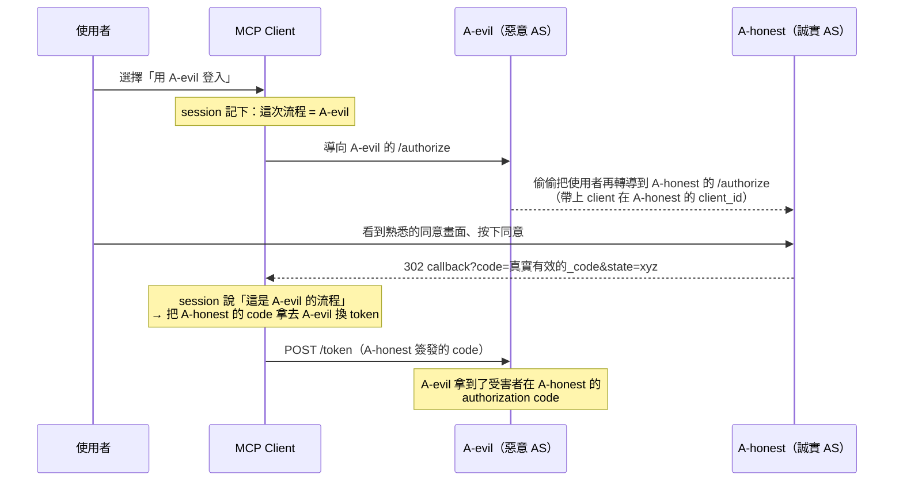

[MCP（Model Context Protocol）][mcp] 的 [Authorization 規範][mcp-auth] 走的是標準 OAuth 2.1 那一套：MCP Server 當 Resource Server、MCP Client 當 OAuth Client、背後再接一個或多個 Authorization Server（以下簡稱 AS）。這套設計最漂亮、也最容易被忽略的一個特性是——**同一個 MCP Client 可以同時對接多個授權伺服器**。MCP 規範裡白紙黑字寫著：Protected Resource Metadata 的 `authorization_servers` 欄位「可以定義多個授權伺服器，由 MCP Client 自己決定要用哪一個」。

一旦「一個 client、多個 AS」成為常態，一種在單一 AS 世界裡幾乎不存在的攻擊就浮上檯面了：**授權伺服器 Mix-Up 攻擊（AS mix-up attack）**。這篇文章要談的，就是這個攻擊怎麼運作、為什麼 IETF 要為它單獨立一份 [RFC 9207][rfc9207]，以及在一台 OAuth 2.0 授權伺服器上要怎麼把它實作起來（附上我實作時踩到的一個 issuer 不一致 bug）。

[mcp]: https://modelcontextprotocol.io
[mcp-auth]: https://modelcontextprotocol.io/specification/2025-11-25/basic/authorization
[rfc9207]: https://www.rfc-editor.org/info/rfc9207/

<!--more-->

## 一、攻擊手法：Mix-Up 到底混淆了什麼？

先講清楚前提，這個攻擊**只在 client 同時信任兩個以上的 AS 時才成立**。只對接單一 AS 的傳統 web app 完全不受影響——但這正好是 MCP 世界的日常：一台 Claude Code 可能同時掛著接 Gitea 的 MCP、接 Jira 的 MCP、接內部資料庫的 MCP，而它們背後的授權伺服器未必是同一台。

### 問題的根：授權回應「沒有署名」

RFC 9207 之前，Authorization Code Flow 成功後，AS 把使用者導回 client 的回應長這樣：

```
https://client.example/callback?code=abc123&state=xyz
```

請注意這個回應裡**完全沒有任何欄位標示「我是誰簽發的」**。`code` 是一串不透明字串、`state` 是 client 自己產的隨機值。client 收到之後，只能靠自己記在 session 裡的「這次流程是對哪一家 AS 發起的」來判斷這顆 code 該拿去哪個 token endpoint 兌換。**而這個判斷，是可以被攻擊者操縱的。**

### 攻擊流程

假設有一個惡意（或被攻陷）的授權伺服器 `A-evil`，和一個誠實的授權伺服器 `A-honest`，而受害的 client 同時信任這兩家：



關鍵的斷點在倒數第二步：**client 收到 code 的當下，無法察覺這顆 code 的真正來源是 A-honest，還是自己以為的 A-evil。** 於是它把 A-honest 簽發的有效 authorization code，送去了 A-evil 的 token endpoint。對 confidential client 而言，這等於把受害者在 A-honest 的授權碼（可進一步換成 access token）雙手奉上給攻擊者。

這不是理論。IETF OAuth 工作組正是因為這類攻擊在多 AS 場景下實際可行，才在 2022 年把 `iss` 參數的解法標準化成 [RFC 9207][rfc9207]。

## 二、為什麼會有 RFC 9207？

你可能會問：這不是已經有 `state`、有 PKCE 了嗎？為什麼還需要一份新 RFC？因為它們防的是**不同的東西**：

| 機制 | 防的是什麼 | 對 Mix-Up 有效嗎？ |
| --- | --- | --- |
| `state` | CSRF——把攻擊者的授權回應綁到受害者的 session | ❌ 攻擊者用的是受害者自己發起的合法流程 |
| PKCE | 授權碼被攔截／注入（code interception） | ❌ code 沒被攔截，是 client 自己送錯地方 |
| **RFC 9207 `iss`** | **授權回應的「來源混淆」** | ✅ 讓 client 能驗證 code 到底哪一家發的 |

`state` 解 CSRF、PKCE 解 code 竊聽，但兩者都預設「client 知道這顆 code 是哪家 AS 發的」。Mix-Up 攻擊打的正是這個假設本身——**它讓 client 對「來源」產生誤判**。這是 `state` 和 PKCE 結構上都補不到的洞，所以需要一個新機制：**讓授權回應自己「署名」。**

RFC 9207 的解法極簡：在**每一個**授權回應（成功與錯誤都要）裡，加上一個 `iss` 參數，值就是這台 AS 的 issuer identifier，而且**必須與該 AS 在 metadata 裡公告的 `issuer` 欄位逐字元相同**。client 收到回應時，拿 `iss` 和「這次流程我預期的那家 AS 的 issuer」做**嚴格字串比對**，不符就直接丟棄。

套回上面的攻擊：第五步時 client 的 session 預期 `iss=https://evil.example`，但 A-honest 回傳的 `iss=https://honest.example` → 比對失敗 → code 被丟棄，永遠不會送到 A-evil 的 token endpoint。攻擊在造成損害前就斷了。

而攻擊者**偽造不了**這個值：`iss` 是 AS 在自己的 server 端加進 redirect 的，A-evil 碰不到 A-honest 的 redirect；client 拿來比對的基準（預期的 issuer）也在 client 自己手上，不是聽 response 說了算。

### 和 MCP 安全模型的關係

[MCP Authorization 規範][mcp-auth] 本身沒有直接點名 RFC 9207，但它整份文件的骨架，正好把 Mix-Up 攻擊推到你必須面對的位置：

- **多授權伺服器是內建假設。** 規範明確允許一個 Protected Resource 對應多個 `authorization_servers`，並把「選哪一家」的責任交給 client。這正是 Mix-Up 攻擊的溫床。
- **它已經強制要求 RFC 8707 Resource Indicators 和 audience 驗證。** 規範白紙黑字要求 client「MUST 在授權與 token 請求帶上 `resource` 參數」、MCP Server「MUST 驗證 token 的 audience 就是自己」。這解的是「token 被跨服務誤用」（confused deputy / token 錯置）。RFC 9207 則是同一條防線的另一段——確保**授權碼在被兌換成 token 之前，來源就已經對齊**。兩者互補：一個管 token 的去向，一個管 code 的來源。
- **它要求 AS metadata discovery（RFC 8414 / OIDC Discovery）。** RFC 9207 的 `iss` 值必須等於 metadata 的 `issuer`——這條規範已經要求你公告的欄位，正好就是 client 拿來比對 `iss` 的可信基準。

換句話說，當你在為 MCP 生態寫一台 OAuth Server 時，RFC 9207 不是「錦上添花」，而是把 MCP 已經鋪好的多 AS 架構，補上它結構上缺的那一塊來源驗證。規範裡對 `resource` 參數與 audience 驗證的高標準，也暗示了同一種思維：**在多方互不信任的環境裡，每一段訊息都要能證明自己的來源與去向。**

### 官方 client 端已經在等這個值了

這不是紙上談兵。官方的 [MCP Go SDK][go-sdk] 早就在 client 端把 `iss` 納入授權結果——它的 `AuthorizationResult` 結構現在包含 `Code`、`State`、`Iss` 三個欄位：

```go
type AuthorizationResult struct {
    // Code 是授權伺服器回傳的授權碼。
    Code string
    // State 是授權伺服器回傳的 state。
    State string
    // Iss 是授權伺服器依 RFC 9207 在授權回應中回傳的 issuer identifier，
    // 從 redirect URI 的 "iss" query 參數取得（若有）。
    Iss string
}
```

更關鍵的是它怎麼用這個值。SDK 裡的 `validateIssuerResponse` 把 RFC 9207 的比對規則寫得清清楚楚，而且**同時交叉檢查了 metadata 的支援旗標**：

```go
func validateIssuerResponse(iss, expectedIssuer string, issParameterSupported bool) error {
    if issParameterSupported {
        if iss == "" {
            // AS 公告支援 iss，卻沒送 iss → 直接判定異常
            return fmt.Errorf("authorization server advertises RFC 9207 iss parameter support but none was received...")
        }
        if iss != expectedIssuer {
            // 嚴格字串比對，不符就中斷整個授權流程
            return fmt.Errorf("authorization response issuer %q does not match expected issuer %q", iss, expectedIssuer)
        }
    } else {
        if iss != "" {
            return fmt.Errorf("authorization server does not advertise RFC 9207 iss parameter support but iss was received...")
        }
    }
    return nil
}
```

那個第三個參數 `issParameterSupported` 又是哪來的？就是 SDK 從你的授權伺服器 metadata 解析出來的。SDK 的 `AuthServerMeta`（對應 RFC 8414 / OIDC discovery 文件）同樣新增了這個欄位：

```go
// AuthorizationResponseIssParameterSupported 表示授權伺服器是否依 RFC 9207
// 在授權回應中提供 "iss" 參數。為 true 時，client 必須驗證 "iss" 存在
// 且與 Issuer 欄位相符。
AuthorizationResponseIssParameterSupported bool `json:"authorization_response_iss_parameter_supported,omitempty"`
```

這樣整條鏈路就閉環了：**你在 server 端 `/.well-known` 公告的旗標 → SDK 解析進 `AuthServerMeta` → 這個 bool 餵進 `validateIssuerResponse` → 決定要不要強制驗證 `iss`。**

這段程式碼直接印證了前面兩件事。第一，`iss != expectedIssuer` 就是那個「嚴格字串比對」——差一個 byte（例如尾斜線）就整個授權流程中斷，這正是我在第三節要特別強調 issuer 必須逐字元對齊的原因。第二，它會讀 `issParameterSupported`（也就是你在 metadata 公告的 `authorization_response_iss_parameter_supported`）：**AS 說支援卻沒送 → 錯誤；AS 說不支援卻送了 → 也錯誤。** 換句話說，metadata 旗標與實際行為只要對不上，官方 client 就會拒絕你。這也是為什麼 server 端「公告支援」這一步絕對不能省、而且必須與真實行為完全一致。

對 server 端的實作者來說，這帶來一個很實際的結論：**你送出的 `iss` 會被真的拿去逐字元比對，不是裝飾用的。** 只要你的 issuer 推導有任何不一致（下一節就會看到一個活生生的例子），官方 MCP client 會第一個把你擋下來。

[go-sdk]: https://github.com/modelcontextprotocol/go-sdk/blob/main/auth/authorization_code.go

## 三、解決方案：實際怎麼實作

以一台 OAuth 2.0 授權伺服器為例——支援 Authorization Code Flow（含 PKCE），也已經實作了 RFC 8707 Resource Indicators，正好是 MCP 場景會用到的那種 AS。要讓它符合 RFC 9207，實際動的東西比想像中少，因為所有的授權回應本來就收斂在兩個函式裡。

### 3-1. 在每個授權回應加上 iss

所有成功導回都經過 `issueCodeAndRedirect`、所有錯誤導回都經過 `redirectWithError`。所以核心改動就是兩行 `q.Set("iss", …)`：

```go
// 成功回應：issueCodeAndRedirect
q := u.Query()
q.Set("code", plainCode)
// RFC 9207：每個授權回應都帶上 issuer identifier，
// 讓對接多個授權伺服器的 client 能偵測 mix-up 攻擊。
q.Set("iss", h.config.Issuer())
if state != "" {
    q.Set("state", state)
}
u.RawQuery = q.Encode()
c.Redirect(http.StatusFound, u.String())
```

錯誤回應同理——這一點特別重要。**RFC 9207 要求連錯誤回應都要帶 `iss`**，否則攻擊者只要改走「錯誤回應」的變體就能繞過防護。至於那些 `redirect_uri` 還沒被證明合法就失敗的情況（例如 client_id 錯誤），正確做法是渲染本地錯誤頁、根本不 redirect，自然也不需要 `iss`——沒有導回，就沒有可被混淆的來源。

### 3-2. metadata 公告支援

接著在兩份 discovery 文件（`/.well-known/openid-configuration` 與 `/.well-known/oauth-authorization-server`）都加上 `authorization_response_iss_parameter_supported: true`。這一步不能省：RFC 9207 要求「有做就要公告」，因為 client 是靠這個旗標決定要不要啟用嚴格 `iss` 驗證的。

```json
{
  "issuer": "https://auth.example.com",
  "authorization_endpoint": "https://auth.example.com/oauth/authorize",
  "...": "...",
  "authorization_response_iss_parameter_supported": true
}
```

### 3-3. 一個真正該講的坑：issuer 的三份分身

這才是整個實作最有價值的部分。功能寫完、測試綠燈之後，我用多 agent 做了一輪高強度 code review，結果挖出一個**既有的、被這次改動放大的 bug**：

「issuer 這個字串」原本散落在**至少三個地方各自推導**，全都是 `strings.TrimRight(cfg.BaseURL, "/")`——discovery 文件一份、ID token 一份、token exchange 一份。而更糟的是，另外三個地方（access token 的 JWT `iss` claim、`/oauth/tokeninfo`、`/oauth/introspect`）用的是**沒有去尾斜線的原始 `BaseURL`**。

平常沒事，但只要營運者把 `BASE_URL` 設成帶尾斜線的 `https://auth.example.com/`，同一次 token 交換就會吐出：

- discovery `issuer` 與新的 redirect `iss`：`https://auth.example.com`（去了斜線）
- ID token 的 `iss`：`https://auth.example.com`（去了斜線）
- **access token 的 `iss`：`https://auth.example.com/`（沒去斜線）**

一個 byte 的差異，就足以讓任何做 [RFC 9068][rfc9068] access token issuer 驗證的 resource server 拒絕每一顆 token。而 RFC 9207 恰恰要求 `iss` 必須與 metadata `issuer` **逐字元相同**——這種「多處各自推導」的寫法，本身就是協議破壞的定時炸彈。

[rfc9068]: https://www.rfc-editor.org/rfc/rfc9068.html

修法是把推導收斂成**單一真相來源**，放進 config：

```go
// Issuer 回傳正規化的 issuer identifier：BaseURL 去掉尾斜線。
// 所有會吐出 issuer 的地方——discovery 文件、JWT / ID token 的 iss、
// tokeninfo / introspection、以及 RFC 9207 的授權回應 iss 參數——
// 都必須用這個唯一推導：RFC 9207 client 會逐字元比對授權回應的
// iss 與 metadata issuer，差一個 byte 就拒絕。
func (c *Config) Issuer() string {
    return strings.TrimRight(c.BaseURL, "/")
}
```

然後把全部六個發射點都改成呼叫 `cfg.Issuer()`。這個 review 教訓值得單獨記一筆：**當一個值的「多份副本必須永遠相等」變成協議正確性的前提時，它就不該有多份副本。** 把它收斂成一個方法，靠型別系統與呼叫點統一來保證一致，比靠一條測試去追六個地方可靠得多。

> 升級提醒：如果你的 `BASE_URL` 帶尾斜線，這個修正會讓 JWT 的 `iss` 從 `https://host/` 變成 `https://host`（與 discovery 對齊）。升級時記得清一次 token cache。

### 3-4. 驗證：三條 e2e + metadata 斷言

RFC 9207 的行為面，我用三條端到端測試釘住：

1. **成功路徑**：使用者同意 → 302 帶 `code`、`state`、`iss`，且 `iss` 與**即時抓下來的 discovery `issuer` 逐字元相同**（含尾斜線 `BASE_URL` 的變體）。
2. **錯誤路徑**：使用者拒絕 → 302 帶 `error=access_denied`、`state`，以及同一個 `iss`。
3. **不導回路徑**：`redirect_uri` 未註冊 → 渲染本地錯誤頁，`Location` 為空（`iss` 不會外洩）。

再加上兩份 discovery 文件都斷言 `authorization_response_iss_parameter_supported: true`。第一條測試裡「拿 redirect 的 `iss` 去比對真正被服務出來的 discovery `issuer`」這個設計是刻意的——它同時守住了 3-3 那個「多份分身必須相等」的不變量。

## 小結

Mix-Up 攻擊不是什麼新把戲，但它一直被「單一 AS」的假設遮住。**MCP 把「一個 client、多個授權伺服器」變成日常，等於把這個沉睡的洞叫醒了。** RFC 9207 的解法優雅到近乎樸素：讓每一個授權回應都帶上一個不可偽造、與 metadata 對齊的 `iss`，把 client 對來源的判斷從「猜」變成「驗」。

如果你正在為 MCP 生態寫或選一台 OAuth Server，我的建議是把它和 MCP 規範已經強制的 RFC 8707 audience 驗證放在一起看：

- **RFC 8707 + audience 驗證**管的是 **token 的去向**——這顆 token 只能被它該去的 resource server 收。
- **RFC 9207 `iss`** 管的是 **code 的來源**——這顆 code 確實是我預期的那家 AS 發的。

兩段防線缺一不可，而且都指向同一種在多方零信任環境下的紀律：**每一段訊息都要能證明自己從哪來、要到哪去。** 這次實作的過程與那個 issuer 一致性的坑，希望能幫你在自己的實作裡少走一段冤枉路。
